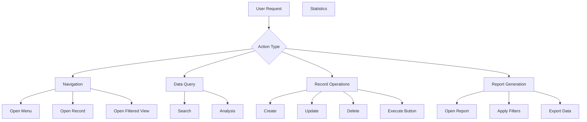

# KAI Action Execution & Navigation System

## Overview

KAI can not only answer questions but also **execute actions**, **navigate**, and **open filtered views/reports**.

## Action Types



## Implementation

### 1. Action Execution Framework

```python
class AkAiActionExecutor(models.AbstractModel):
    _name = 'ak_ai.action.executor'
    _description = 'KAI Action Executor'
    
    # Action registry
    SAFE_ACTIONS = {
        'navigate': True,      # Always safe
        'search': True,        # Safe
        'open_record': True,   # Safe
        'open_report': True,   # Safe
        'create': False,       # Requires confirmation
        'write': False,        # Requires confirmation
        'unlink': False,       # Requires confirmation
        'execute_method': False, # Requires confirmation
    }
    
    def execute_action(self, action_data, conversation_id):
        """Execute an action requested by user"""
        action_type = action_data.get('type')
        
        # Check if action is safe to execute
        if not self.SAFE_ACTIONS.get(action_type, False):
            # Requires confirmation
            return self._request_confirmation(action_data, conversation_id)
        
        # Execute safe action
        return self._execute_safe_action(action_data)
    
    def _execute_safe_action(self, action_data):
        """Execute actions that don't modify data"""
        action_type = action_data['type']
        
        if action_type == 'navigate':
            return self._navigate(action_data)
        elif action_type == 'search':
            return self._search(action_data)
        elif action_type == 'open_record':
            return self._open_record(action_data)
        elif action_type == 'open_report':
            return self._open_report(action_data)
        
        return {'success': False, 'error': 'Unknown action type'}
    
    # ===== NAVIGATION ACTIONS =====
    
    def _navigate(self, action_data):
        """Navigate to a menu/view"""
        target = action_data.get('target')
        
        if target.get('menu_id'):
            # Navigate to menu
            return self._open_menu(target['menu_id'])
        elif target.get('model'):
            # Open model view
            return self._open_model_view(target['model'], target.get('view_type', 'tree'))
        
        return {'success': False, 'error': 'Invalid navigation target'}
    
    def _open_menu(self, menu_id):
        """Open a specific menu"""
        menu = self.env['ir.ui.menu'].browse(menu_id)
        
        if not menu.exists():
            return {'success': False, 'error': 'Menu not found'}
        
        return {
            'success': True,
            'action': {
                'type': 'ir.actions.client',
                'tag': 'menu',
                'params': {'menu_id': menu_id}
            },
            'message': f"Opening: {menu.name}"
        }
    
    def _open_model_view(self, model_name, view_type='tree', domain=None, context=None):
        """Open a model view with optional filters"""
        if model_name not in self.env:
            return {'success': False, 'error': f'Model {model_name} not found'}
        
        action = {
            'type': 'ir.actions.act_window',
            'name': self.env[model_name]._description,
            'res_model': model_name,
            'view_mode': view_type,
            'domain': domain or [],
            'context': context or {},
            'target': 'current',
        }
        
        return {
            'success': True,
            'action': action,
            'message': f"Opening {self.env[model_name]._description}"
        }
    
    # ===== SEARCH ACTIONS =====
    
    def _search(self, action_data):
        """Search for records"""
        model_name = action_data.get('model')
        query = action_data.get('query')
        filters = action_data.get('filters', [])
        limit = action_data.get('limit', 10)
        
        if model_name not in self.env:
            return {'success': False, 'error': 'Invalid model'}
        
        model = self.env[model_name]
        domain = self._build_search_domain(model, query, filters)
        
        records = model.search(domain, limit=limit)
        
        return {
            'success': True,
            'count': len(records),
            'records': [
                {
                    'id': r.id,
                    'display_name': r.display_name,
                }
                for r in records
            ],
            'message': f"Found {len(records)} records"
        }
    
    def _build_search_domain(self, model, query, additional_filters):
        """Build search domain from natural language query"""
        domain = []
        
        # Add text search if query provided
        if query:
            # Search in name, display_name, or reference fields
            or_domain = []
            for field_name, field in model._fields.items():
                if field.type in ['char', 'text'] and field.store:
                    or_domain.append((field_name, 'ilike', query))
            
            if or_domain:
                domain.append('|' * (len(or_domain) - 1))
                domain.extend(or_domain)
        
        # Add additional filters
        domain.extend(additional_filters)
        
        return domain
    
    # ===== RECORD ACTIONS =====
    
    def _open_record(self, action_data):
        """Open a specific record"""
        model_name = action_data.get('model')
        res_id = action_data.get('id')
        view_type = action_data.get('view_type', 'form')
        
        if model_name not in self.env:
            return {'success': False, 'error': 'Invalid model'}
        
        record = self.env[model_name].browse(res_id)
        
        if not record.exists():
            return {'success': False, 'error': 'Record not found'}
        
        action = {
            'type': 'ir.actions.act_window',
            'name': record.display_name,
            'res_model': model_name,
            'res_id': res_id,
            'view_mode': view_type,
            'target': 'current',
        }
        
        return {
            'success': True,
            'action': action,
            'message': f"Opening: {record.display_name}"
        }
    
    # ===== REPORT ACTIONS =====
    
    def _open_report(self, action_data):
        """Open a report with filters"""
        report_type = action_data.get('report')
        model_name = action_data.get('model')
        filters = action_data.get('filters', {})
        
        # Map report types to actions
        report_actions = {
            'sales_analysis': self._open_sales_analysis,
            'invoice_report': self._open_invoice_report,
            'partner_ledger': self._open_partner_ledger,
            'inventory_report': self._open_inventory_report,
            'pivot_analysis': self._open_pivot_analysis,
        }
        
        report_func = report_actions.get(report_type)
        
        if not report_func:
            # Generic report opening
            return self._open_generic_report(model_name, filters)
        
        return report_func(filters)
    
    def _open_sales_analysis(self, filters):
        """Open sales analysis report with filters"""
        domain = []
        context = {'search_default_Sales': 1}
        
        # Apply date filter
        if 'date_from' in filters:
            domain.append(('date', '>=', filters['date_from']))
        if 'date_to' in filters:
            domain.append(('date', '<=', filters['date_to']))
        
        # Apply partner filter
        if 'partner_id' in filters:
            domain.append(('partner_id', '=', filters['partner_id']))
        
        # Apply user/salesperson filter
        if 'user_id' in filters:
            domain.append(('user_id', '=', filters['user_id']))
        
        action = {
            'type': 'ir.actions.act_window',
            'name': 'Sales Analysis',
            'res_model': 'sale.report',
            'view_mode': 'graph,pivot,tree',
            'domain': domain,
            'context': context,
            'target': 'current',
        }
        
        return {
            'success': True,
            'action': action,
            'message': 'Opening Sales Analysis with your filters'
        }
    
    def _open_invoice_report(self, filters):
        """Open invoice analysis/report"""
        domain = [('move_type', 'in', ['out_invoice', 'out_refund'])]
        
        # Apply filters
        if 'state' in filters:
            domain.append(('state', '=', filters['state']))
        
        if 'partner_id' in filters:
            domain.append(('partner_id', '=', filters['partner_id']))
        
        if 'date_from' in filters:
            domain.append(('invoice_date', '>=', filters['date_from']))
        
        if 'date_to' in filters:
            domain.append(('invoice_date', '<=', filters['date_to']))
        
        # Group by options
        context = {}
        if 'group_by' in filters:
            context['group_by'] = [filters['group_by']]
        
        action = {
            'type': 'ir.actions.act_window',
            'name': 'Invoice Analysis',
            'res_model': 'account.move',
            'view_mode': 'tree,pivot,graph,form',
            'domain': domain,
            'context': context,
            'target': 'current',
        }
        
        return {
            'success': True,
            'action': action,
            'message': 'Opening Invoice Report with filters applied'
        }
    
    def _open_pivot_analysis(self, filters):
        """Open pivot view for analysis"""
        model_name = filters.get('model', 'sale.order')
        
        if model_name not in self.env:
            return {'success': False, 'error': 'Invalid model'}
        
        domain = filters.get('domain', [])
        group_by = filters.get('group_by', ['partner_id', 'user_id'])
        measures = filters.get('measures', ['amount_total'])
        
        context = {
            'pivot_measures': measures,
            'pivot_column_groupby': [group_by[0]] if group_by else [],
            'pivot_row_groupby': [group_by[1]] if len(group_by) > 1 else [],
        }
        
        action = {
            'type': 'ir.actions.act_window',
            'name': f'{self.env[model_name]._description} Analysis',
            'res_model': model_name,
            'view_mode': 'pivot,graph,tree',
            'domain': domain,
            'context': context,
            'target': 'current',
        }
        
        return {
            'success': True,
            'action': action,
            'message': 'Opening pivot analysis'
        }
```

### 2. AI Response with Actions

```python
class AkAiMessage(models.Model):
    _inherit = 'ak_ai.message'
    
    # Action-related fields
    action_data = fields.Text('Action Data (JSON)')
    action_executed = fields.Boolean('Action Executed')
    action_result = fields.Text('Action Result (JSON)')
    
    def execute_suggested_action(self):
        """Execute the action suggested in this message"""
        if not self.action_data:
            return {'error': 'No action data'}
        
        action_data = json.loads(self.action_data)
        executor = self.env['ak_ai.action.executor']
        
        result = executor.execute_action(action_data, self.conversation_id.id)
        
        self.write({
            'action_executed': True,
            'action_result': json.dumps(result)
        })
        
        return result
```

### 3. AI Service Integration

```python
class AkAiService(models.AbstractModel):
    _inherit = 'ak_ai.service'
    
    def _enhance_response_with_actions(self, response_text, context):
        """Enhance AI response with executable actions"""
        
        # Parse AI response for action suggestions
        actions = self._extract_actions_from_response(response_text)
        
        if actions:
            # Add action buttons to response
            response_text += "\n\n**Actions:**\n"
            for action in actions:
                response_text += f"• {action['label']} [Execute]\n"
        
        return response_text, actions
    
    def _extract_actions_from_response(self, response_text):
        """Extract structured actions from AI response"""
        # This would use function calling / tool use from OpenAI/Anthropic
        # Example with OpenAI function calling:
        
        tools = [
            {
                "type": "function",
                "function": {
                    "name": "open_report",
                    "description": "Open a report with specific filters",
                    "parameters": {
                        "type": "object",
                        "properties": {
                            "report_type": {
                                "type": "string",
                                "enum": ["sales_analysis", "invoice_report", "partner_ledger"]
                            },
                            "filters": {
                                "type": "object",
                                "properties": {
                                    "date_from": {"type": "string"},
                                    "date_to": {"type": "string"},
                                    "partner_id": {"type": "integer"},
                                }
                            }
                        }
                    }
                }
            },
            {
                "type": "function",
                "function": {
                    "name": "navigate_to",
                    "description": "Navigate to a specific view or record",
                    "parameters": {
                        "type": "object",
                        "properties": {
                            "model": {"type": "string"},
                            "view_type": {"type": "string"},
                            "domain": {"type": "array"},
                        }
                    }
                }
            }
        ]
        
        # AI will return tool calls when appropriate
        return []
```

## Example Use Cases

### Use Case 1: Top Customers Report
```
User: "Show me top 5 customers this month"

KAI Processing:
1. Analyzes request → wants sales analysis
2. Determines filters:
   - date_from: 2024-12-01
   - date_to: 2024-12-31
   - group_by: partner_id
   - measure: amount_total
   - limit: 5

KAI Response:
"Here are your top customers for December 2024:

1. Acme Corp - $125,000 (15 orders)
2. Tech Solutions - $89,500 (8 orders)  
3. Global Trading - $67,200 (12 orders)
4. Digital Plus - $45,300 (7 orders)
5. Metro Services - $38,900 (9 orders)

**Actions:**
• [📊 Open Sales Analysis] - View detailed report
• [👤 View Customer Details] - See customer profiles
• [📈 View Trend Graph] - See sales trends

Which would you like to explore?"

[User clicks "Open Sales Analysis"]

KAI Executes:
{
  "type": "open_report",
  "report": "sales_analysis",
  "filters": {
    "date_from": "2024-12-01",
    "date_to": "2024-12-31",
    "group_by": "partner_id"
  },
  "context": {
    "pivot_measures": ["amount_total", "qty_delivered"],
    "pivot_row_groupby": ["partner_id"]
  }
}

→ Opens Sales Analysis pivot view with filters applied
→ User can now interact with the report directly
```

### Use Case 2: Invoice Report with Filters
```
User: "Show me unpaid invoices for Acme Corp"

KAI Response:
"I found 3 unpaid invoices for Acme Corp:

1. INV/2024/0123 - $15,000 (Due: 2024-12-15) - Overdue!
2. INV/2024/0145 - $8,500 (Due: 2024-12-28)
3. INV/2024/0167 - $12,200 (Due: 2025-01-05)

Total Outstanding: $35,700

**Actions:**
• [📋 Open Invoice List] - View in list view
• [📊 Open Aged Receivable] - See aging report
• [✉️ Send Reminder] - Email customer
• [💰 Register Payment] - Record payment

What would you like to do?"

[User clicks "Open Invoice List"]

→ Opens account.move list view with:
   domain: [
     ('partner_id', '=', acme_corp_id),
     ('state', '=', 'posted'),
     ('payment_state', 'in', ['not_paid', 'partial'])
   ]
```

### Use Case 3: Navigate to Specific Screen
```
User: "Take me to purchase orders from last week"

KAI Response:
"Opening purchase orders from the last week...

Found: 12 purchase orders (Dec 20-27, 2024)
• 5 RFQs  
• 4 Confirmed
• 3 Received

[Opening filtered view...]"

KAI Executes:
{
  "type": "navigate",
  "target": {
    "model": "purchase.order",
    "view_type": "tree",
    "domain": [
      ('date_order', '>=', '2024-12-20'),
      ('date_order', '<=', '2024-12-27')
    ]
  }
}

→ Opens purchase.order list with date filter applied
```

### Use Case 4: Complex Analysis
```
User: "Compare sales performance: this quarter vs last quarter, by salesperson"

KAI Response:
"I'll create a comparison analysis for you...

**Q4 2024 vs Q3 2024 - Sales by Salesperson:**

| Salesperson    | Q3 2024  | Q4 2024  | Change   |
|----------------|----------|----------|----------|
| John Smith     | $245K    | $298K    | +21.6% ↗ |
| Sarah Johnson  | $189K    | $206K    | +9.0% ↗  |
| Mike Williams  | $156K    | $142K    | -9.0% ↘  |

**Actions:**
• [📊 Open Pivot Analysis] - Interactive pivot table
• [📈 View Trend Graph] - Visual comparison
• [💾 Export to Excel] - Download data

Where would you like to dive deeper?"

[User clicks "Open Pivot Analysis"]

→ Opens sale.order in pivot mode with:
   - Row groupby: user_id
   - Column groupby: create_date:quarter
   - Measure: amount_total
   - Comparison enabled
```

## Implementation in Frontend

### Message Component with Action Buttons

```javascript
// kai_message.js
class KaiMessage extends Component {
    static template = 'ak_ai.KaiMessage';
    
    onActionClick(action) {
        // Execute the action
        this.rpc({
            model: 'ak_ai.message',
            method: 'execute_suggested_action',
            args: [[this.props.message.id]],
        }).then(result => {
            if (result.success && result.action) {
                // Execute Odoo action
                this.env.services.action.doAction(result.action);
            }
        });
    }
}
```

### XML Template with Action Buttons

```xml
<templates>
    <t t-name="ak_ai.KaiMessage">
        <div class="kai-message" t-att-class="message.role">
            <div class="message-content" t-esc="message.content"/>
            
            <!-- Action buttons if available -->
            <t t-if="message.actions">
                <div class="message-actions">
                    <t t-foreach="message.actions" t-as="action">
                        <button class="btn btn-sm btn-primary"
                                t-on-click="() => this.onActionClick(action)">
                            <i t-att-class="action.icon"/>
                            <t t-esc="action.label"/>
                        </button>
                    </t>
                </div>
            </t>
        </div>
    </t>
</templates>
```

## Summary

With this action execution system, KAI can:

✅ **Navigate** to any view, menu, or record  
✅ **Open Reports** with pre-applied filters  
✅ **Search & Filter** data based on natural language  
✅ **Create Views** (pivot, graph, tree) on demand  
✅ **Execute Actions** with user confirmation  
✅ **Provide Clickable Buttons** for suggested actions  

This makes KAI not just an information provider, but an **action-oriented assistant** that can actually help users accomplish tasks!
