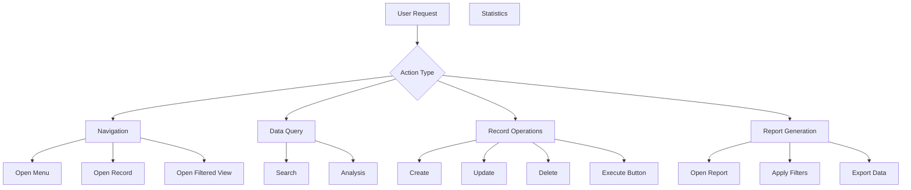

# KAI Action Execution & Navigation System

## Overview

KAI can not only answer questions but also **execute actions**, **navigate**, and **open filtered views/reports**.

## Action Types



## Implementation Status

### 1. Action Execution Framework
✅ **Status: Implemented**
KAI can execute safe actions (navigation, search) and request confirmation for data-modifying actions.

### 2. Semantic Verification & Safety
✅ **Status: Implemented**
- **Verification Step**: KAI automatically checks created/updated records to ensure data integrity.
- **Semantic Checks**: Prevents logical errors like zero-price records or missing mandatory fields.
- **Post-Execution Summary**: Provides a detailed report of what was changed and verifies the final state.

### 3. AI Response with Actions
✅ **Status: Implemented**
AI responses can include structured action data that triggers Odoo client actions or server-side methods.

### 4. AI Service Integration (Function Calling)
✅ **Status: Implemented**
Uses OpenAI/Anthropic function calling to extract structured actions from natural language.

## Example Use Cases

### Use Case 1: Task Automation with Safety
```
User: "Create a new offer for Kardan Digital for 11,000 USD"

KAI Action:
1. Generates Python code to create purchase.order
2. Includes semantic check: if price_unit == 0: raise Warning
3. Executes code after user confirmation
4. Verifies: Reads the new record and confirms price is 11,000 USD

KAI Response:
"Yeni teklif (P00042) Kardan Dijital için 11.000 USD tutarında başarıyla oluşturuldu. 
Doğrulama: Birim fiyat ve para birimi kontrol edildi, veriler doğru."
```
