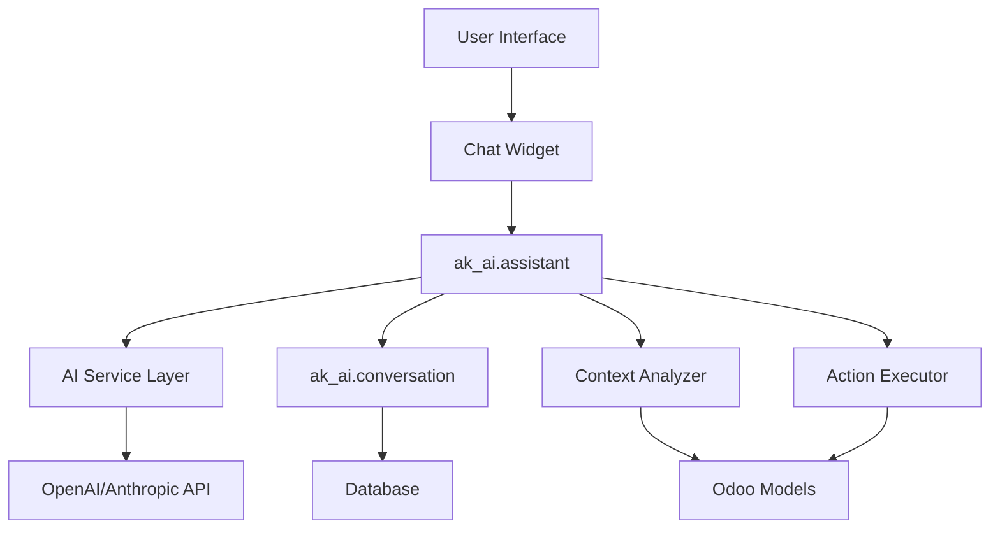
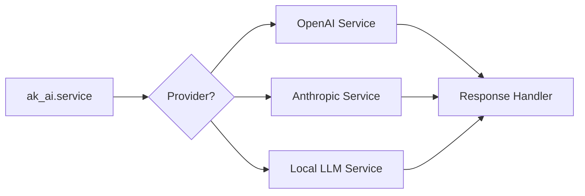

# AK AI - Odoo AI Assistant Design Document

## Overview
**AK AI** is an intelligent AI-powered assistant addon for Odoo 18 that provides conversational help, guidance, and task automation directly within the Odoo interface. Similar to how Roo Code assists developers, AK AI will help Odoo users perform tasks more efficiently.

## Core Objectives
1. **User Assistance**: Provide contextual help and guidance for Odoo users
2. **Task Automation**: Help users complete common tasks through natural language
3. **Knowledge Base**: Answer questions about Odoo functionality and business processes
4. **Learning System**: Improve responses based on usage patterns
5. **Multi-lingual Support**: Support Turkish and English languages

## System Architecture



## Database Models

### 1. ak_ai.assistant
Main AI assistant configuration model

**Fields:**
- `name` (Char): Assistant name
- `description` (Text): Description
- `ai_provider` (Selection): openai, anthropic, local
- `api_key` (Char): Encrypted API key
- `model` (Char): Model name (e.g., gpt-4, claude-3)
- `temperature` (Float): Response creativity (0-1)
- `max_tokens` (Integer): Maximum response length
- `system_prompt` (Text): Base system instructions
- `active` (Boolean): Active status
- `conversation_ids` (One2many): Related conversations
- `allowed_user_ids` (Many2many): Users who can use this assistant
- `allowed_group_ids` (Many2many): Groups with access

**Methods:**
- `generate_response(message, context)`: Main AI interaction method
- `_prepare_context(conversation)`: Prepare context from Odoo data
- `_execute_action(action_data)`: Execute suggested actions

### 2. ak_ai.conversation
Stores conversation history

**Fields:**
- `name` (Char): Conversation title (auto-generated)
- `user_id` (Many2one): res.users
- `assistant_id` (Many2one): ak_ai.assistant
- `state` (Selection): active, archived, completed
- `message_ids` (One2many): ak_ai.message
- `context_model` (Char): Related model name
- `context_res_id` (Integer): Related record ID
- `created_date` (Datetime): Creation timestamp
- `last_message_date` (Datetime): Last activity
- `message_count` (Integer): Total messages

**Methods:**
- `add_message(role, content)`: Add new message
- `archive_conversation()`: Archive conversation
- `get_context_data()`: Retrieve related Odoo data

### 3. ak_ai.message
Individual messages in conversations

**Fields:**
- `conversation_id` (Many2one): ak_ai.conversation
- `role` (Selection): user, assistant, system
- `content` (Text): Message content
- `tokens_used` (Integer): Token count
- `model` (Char): Model used for response
- `metadata` (Json): Additional data (actions, suggestions)
- `created_date` (Datetime): Timestamp
- `processing_time` (Float): Response generation time

### 4. ak_ai.prompt_template
Reusable prompt templates

**Fields:**
- `name` (Char): Template name
- `code` (Char): Unique identifier
- `template` (Text): Prompt template with variables
- `category` (Selection): help, automation, analysis, reporting
- `model_ids` (Many2many): Applicable models
- `active` (Boolean): Active status

### 5. ak_ai.usage_log
Track API usage and costs

**Fields:**
- `user_id` (Many2one): res.users
- `assistant_id` (Many2one): ak_ai.assistant
- `conversation_id` (Many2one): ak_ai.conversation
- `tokens_prompt` (Integer): Input tokens
- `tokens_completion` (Integer): Output tokens
- `cost` (Float): Estimated cost
- `log_date` (Datetime): Timestamp

## User Interface Design

### 1. Chat Widget (Floating)
- **Position**: Bottom-right corner (similar to live chat)
- **Toggle Button**: AI icon to show/hide
- **Features**:
  - Minimizable/Maximizable
  - Conversation history
  - Context awareness (knows current page/record)
  - Quick actions panel
  - File attachment support

### 2. Conversations View
- **Tree View**: List of all conversations
  - Filters: Active, Archived, By Date
  - Search: By content, date, user
- **Form View**: Detailed conversation view
  - Message thread
  - Context information
  - Usage statistics

### 3. Settings Page
- **AI Configuration**:
  - Provider selection
  - API credentials (encrypted)
  - Model parameters
  - System prompts
- **Access Control**:
  - User/Group permissions
  - Rate limiting
- **Templates**:
  - Manage prompt templates

### 4. Dashboard/Analytics
- **Usage Metrics**:
  - Messages per day/week/month
  - Most active users
  - Token usage and costs
  - Common queries
- **Performance Metrics**:
  - Average response time
  - Success rate
  - User satisfaction (thumbs up/down)

## AI Service Integration

### Multi-Provider Support



### Service Classes

#### BaseAIService (Abstract)
- `send_message(messages, config)`
- `validate_config()`
- `estimate_cost(tokens)`

#### OpenAIService (BaseAIService)
- OpenAI API integration
- GPT-3.5/GPT-4 support
- Function calling for actions

#### AnthropicService (BaseAIService)
- Claude API integration
- Tool use support

#### LocalLLMService (BaseAIService)
- Ollama/LMStudio integration
- For on-premise deployments

## Context Awareness System

### Context Collection
The AI will be aware of:
1. **Current Page**: Form/List/Kanban view
2. **Active Model**: Current Odoo model
3. **Active Record**: Current record data
4. **User Context**: User info, preferences, permissions
5. **Recent Actions**: User's recent activity
6. **Related Records**: Connected data (SO, PO, invoices, etc.)

### Context Structure
```python
{
    "user": {
        "id": 1,
        "name": "Admin",
        "lang": "tr_TR",
        "tz": "Europe/Istanbul"
    },
    "view": {
        "model": "sale.order",
        "record_id": 42,
        "view_type": "form"
    },
    "record_data": {
        "name": "SO001",
        "partner_id": {"id": 5, "name": "Customer Name"},
        "amount_total": 1000.00
    },
    "permissions": ["read", "write"],
    "recent_activity": [...]
}
```

## Capabilities & Use Cases

### 1. Help & Guidance
- **Q&A**: "How do I create a sales order?"
- **Navigation**: "Show me the purchase orders"
- **Explanations**: "What does this field do?"

### 2. Data Operations
- **Search**: "Find all invoices for Customer X"
- **Create**: "Create a new customer contact for ABC Company"
- **Update**: "Change the delivery date to next Monday"
- **Reports**: "Show me sales summary for last month"

### 3. Automation Suggestions
- **Workflow**: "What's the next step for this order?"
- **Actions**: "Send this invoice to customer"
- **Reminders**: "Remind me to follow up in 3 days"

### 4. Analysis
- **Insights**: "Which products are selling best?"
- **Trends**: "Show sales trend for Q4"
- **Comparisons**: "Compare this quarter vs last quarter"

## Security & Privacy

### Access Control
1. **User-based**: Permission per user
2. **Group-based**: Permission per security group
3. **Model-based**: Access only to permitted models
4. **Record rules**: Respect existing record rules

### Data Privacy
1. **Context Filtering**: Only send necessary context
2. **PII Protection**: Mask sensitive fields option
3. **Audit Trail**: Log all AI interactions
4. **Data Encryption**: Encrypt API keys and sensitive data
5. **GDPR Compliance**: Data retention policies

### Rate Limiting
- Messages per minute: 10
- Messages per hour: 100
- Token budget per user: Configurable
- Cost limits: Alert when threshold reached

## Technical Stack

### Backend (Python)
- **Models**: Odoo ORM models
- **Controllers**: HTTP/JsonRPC endpoints
- **Services**: AI provider integrations
- **Libraries**:
  - `openai` - OpenAI API
  - `anthropic` - Anthropic API
  - `tiktoken` - Token counting
  - `cryptography` - Encryption

### Frontend (JavaScript/Owl)
- **Widget**: Chat interface component
- **Views**: Conversation management
- **Templates**: Owl templates
- **Assets**: CSS styling

## Implementation Phases

### Phase 1: Core Foundation
- Basic chat interface
- OpenAI integration
- Conversation storage
- Simple Q&A capability

### Phase 2: Context Awareness
- Model/record context
- User context
- Odoo knowledge base
- Navigation assistance

### Phase 3: Action Execution
- Safe action framework
- CRUD operations
- Workflow suggestions
- Confirmation dialogs

### Phase 4: Advanced Features
- Multi-provider support
- Analytics dashboard
- Template management
- Learning/feedback system

### Phase 5: Enterprise Features
- Advanced analytics
- Team collaboration
- Custom training
- White-label options

## Configuration Examples

### System Prompt Template
```
You are AK AI, an intelligent assistant for Odoo ERP system.

Context:
- User: {user_name} ({user_lang})
- Company: {company_name}
- Current Module: {active_model}

Guidelines:
1. Be helpful and concise
2. Provide step-by-step instructions when needed
3. Use the user's language preference
4. Respect data access permissions
5. Suggest actions but always confirm before executing
6. If unsure, ask for clarification

Available context:
{odoo_context}
```

### Action Execution Safety
```python
SAFE_ACTIONS = {
    'search': True,    # Always safe
    'read': True,      # Respects record rules
    'create': False,   # Requires confirmation
    'write': False,    # Requires confirmation
    'unlink': False,   # Requires confirmation
    'action_*': False  # Requires confirmation
}
```

## Cost Estimation

### Per Message Cost (GPT-4)
- Input: ~$0.03 per 1K tokens
- Output: ~$0.06 per 1K tokens
- Average message: 500 input + 300 output tokens
- Cost per message: ~$0.033

### Monthly Estimates (100 users, 10 msg/day)
- Total messages: 30,000
- Estimated cost: ~$1,000/month
- Cost optimization: Use GPT-3.5 for simple queries

## Advantages Over External Solutions

1. **Data Privacy**: Data stays within Odoo
2. **Context Awareness**: Full access to Odoo data
3. **Action Execution**: Can directly modify records
4. **Customization**: Tailored to business processes
5. **Integration**: Native Odoo experience
6. **Cost Control**: Usage tracking and limits

## Success Metrics

1. **Adoption Rate**: % of users actively using
2. **Query Success Rate**: % of successful resolutions
3. **Time Saved**: Average time saved per task
4. **User Satisfaction**: Ratings/feedback
5. **ROI**: Time saved vs. API costs

## Future Enhancements

1. **Voice Interface**: Speech-to-text integration
2. **Proactive Suggestions**: AI-initiated recommendations
3. **Custom Models**: Fine-tuned on company data
4. **Workflow Automation**: Multi-step process automation
5. **Predictive Analytics**: ML-based predictions
6. **Mobile App**: Native mobile support
7. **Integration Hub**: Connect external AI tools

## Risk Mitigation

| Risk | Mitigation Strategy |
|------|-------------------|
| High API costs | Rate limiting, caching, model selection |
| Data leakage | Context filtering, encryption, audit logs |
| Incorrect actions | Confirmation dialogs, action restrictions |
| Performance impact | Async processing, queue system |
| API dependency | Fallback providers, local LLM option |
| User over-reliance | Training, documentation, limitations notice |

## Conclusion

AK AI will transform how users interact with Odoo by providing intelligent, context-aware assistance that significantly improves productivity and user experience. The modular architecture allows for gradual implementation and future expansion while maintaining security and cost control.
