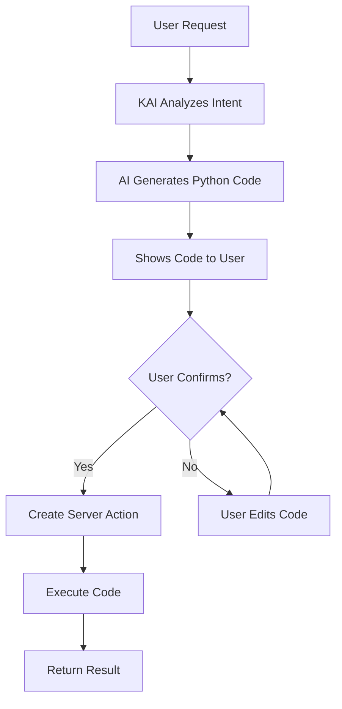

# KAI Dynamic Code Execution - Ultimate Flexibility

## Revolutionary Concept

Instead of predefined tools, KAI can:
1. **Understand** user request
2. **Generate** Python code dynamically
3. **Show code** for user confirmation
4. **Execute** via Server Action
5. **Handle** any Odoo operation!

## Why This Is Brilliant



### Traditional Approach (Limited)
```
Predefined Tools → Limited to what we coded
```

### Dynamic Code Approach (Unlimited) ⭐
```
AI Generates Code → Can do ANYTHING User is Authorized to do!
```

**CRITICAL SECURITY PRINCIPLE**:
- ✅ KAI executes with **current user's permissions**
- ❌ **NO sudo()** - respects user access rights
- ✅ If user can't do it manually, KAI can't automate it
- ✅ Full audit trail with user attribution

## Implementation

### 1. Dynamic Code Generator Tool

```python
class AkAiCodeGenerator(models.AbstractModel):
    _name = 'ak_ai.code.generator'
    _description = 'KAI Dynamic Code Generator'
    
    def generate_and_execute_code(self, arguments):
        """Generate Python code for user's request"""
        
        user_request = arguments.get('request')
        context = arguments.get('context', {})
        auto_execute = arguments.get('auto_execute', False)
        
        # Generate code using AI
        generated_code = self._generate_python_code(user_request, context)
        
        if auto_execute and self._is_safe_code(generated_code):
            # Execute directly if safe
            return self._execute_code_safely(generated_code, context)
        else:
            # Show for confirmation
            return {
                'success': True,
                'requires_confirmation': True,
                'generated_code': generated_code,
                'explanation': self._explain_code(generated_code),
                'estimated_impact': self._estimate_impact(generated_code),
            }
    
    def _generate_python_code(self, user_request, context):
        """Use AI to generate Python code"""
        
        system_prompt = f"""You are an expert Odoo developer. Generate Python code to accomplish the user's request.

Context:
- Current Model: {context.get('model', 'N/A')}
- Current Record ID: {context.get('res_id', 'N/A')}
- User: {self.env.user.name}
- Company: {self.env.company.name}

Available in scope:
- env: Odoo environment (as current user, NO sudo!)
- records: Current recordset (if applicable)
- model: Current model (if applicable)
- log: Logging function
- user: Current user record

CRITICAL RULES:
1. **NEVER use sudo()** - respect user permissions
2. Use proper Odoo ORM methods with user's access rights
3. Check permissions before operations (check_access_rights)
4. Handle AccessError gracefully
5. Return result in 'result' variable
6. Add comments explaining each step
7. Use Turkish for user-facing messages
8. If operation requires higher permissions, inform user

Generate clean, production-ready code.
"""
        
        user_prompt = f"""Generate Python code for this request:
"{user_request}"

Context: {json.dumps(context, indent=2)}

Return ONLY the code, no explanations."""
        
        response = openai.ChatCompletion.create(
            model="gpt-4-turbo",
            messages=[
                {"role": "system", "content": system_prompt},
                {"role": "user", "content": user_prompt}
            ],
            temperature=0.3,  # Lower for more consistent code
        )
        
        code = response.choices[0].message.content
        
        # Clean up code (remove markdown formatting if present)
        code = self._clean_generated_code(code)
        
        return code
    
    def _clean_generated_code(self, code):
        """Remove markdown formatting from generated code"""
        # Remove ```python and ``` markers
        code = code.replace('```python', '').replace('```', '')
        return code.strip()
    
    def _explain_code(self, code):
        """Generate human-readable explanation of code"""
        
        prompt = f"""Explain this Odoo Python code in simple Turkish:

{code}

Explain:
1. What it does
2. Which records it affects
3. What changes it makes
4. Any risks

Keep it simple and clear."""
        
        response = openai.ChatCompletion.create(
            model="gpt-4-turbo",
            messages=[{"role": "user", "content": prompt}],
            temperature=0.5
        )
        
        return response.choices[0].message.content
    
    def _estimate_impact(self, code):
        """Estimate impact of code execution"""
        
        impact = {
            'risk_level': 'low',
            'affected_models': [],
            'operations': [],
            'requires_sudo': False,
        }
        
        # Detect operations
        if 'create(' in code:
            impact['operations'].append('create')
        if 'write(' in code or 'update(' in code:
            impact['operations'].append('update')
            impact['risk_level'] = 'medium'
        if 'unlink(' in code:
            impact['operations'].append('delete')
            impact['risk_level'] = 'high'
        if 'sudo()' in code:
            impact['requires_sudo'] = True
            impact['risk_level'] = 'high'
        
        # Extract models being accessed
        import re
        models = re.findall(r"env\['([^']+)'\]", code)
        impact['affected_models'] = list(set(models))
        
        return impact
    
    def _is_safe_code(self, code):
        """Check if code is safe to auto-execute"""
        
        # STRICTLY FORBIDDEN operations
        forbidden = [
            'sudo(',           # ❌ NEVER bypass security
            '.sudo()',         # ❌ NEVER bypass security
            'unlink(',         # ❌ Deletions require confirmation
            'DROP',            # ❌ SQL operations forbidden
            'DELETE',          # ❌ SQL operations forbidden
            'TRUNCATE',        # ❌ SQL operations forbidden
            'execute(',        # ❌ Direct SQL execution forbidden
            'cr.execute',      # ❌ Cursor access forbidden
            'os.',             # ❌ OS operations forbidden
            'subprocess',      # ❌ System commands forbidden
            'eval(',           # ❌ Dynamic evaluation forbidden
            'exec(',           # ❌ Dynamic execution forbidden
            '__import__',      # ❌ Dynamic imports forbidden
            'open(',           # ❌ File operations forbidden
            'file(',           # ❌ File operations forbidden
        ]
        
        for forbidden_item in forbidden:
            if forbidden_item in code:
                return False
        
        # Check if it only reads data
        write_operations = ['create(', 'write(', 'update(']
        has_write = any(op in code for op in write_operations)
        
        # Safe if no write operations
        return not has_write
    
    def _execute_code_safely(self, code, context):
        """Execute generatedcode safely"""
        
        try:
            # Prepare SECURE execution environment
            # ВАЖНО: env уже имеет права текущего пользователя, sudo ЗАПРЕЩЕН!
            exec_env = {
                'env': self.env,  # Current user's environment - NO SUDO!
                'user': self.env.user,  # Current user
                'company': self.env.company,  # Current company
                'log': _logger.info,
                'datetime': datetime,
                'timedelta': timedelta,
                'json': json,
                'fields': fields,
                'models': models,
                '_': _,  # Translation function
                'Warning': Warning,
                'UserError': UserError,
                'AccessError': AccessError,
            }
            
            # FORBIDDEN in execution environment
            # These are deliberately excluded to prevent security bypass:
            # - sudo: Would bypass user permissions
            # - os, sys: Would allow system access
            # - open, file: Would allow file access
            # - exec, eval: Would allow code injection
            
            # Add context-specific variables
            if context.get('model') and context.get('res_id'):
                exec_env['records'] = self.env[context['model']].browse(context['res_id'])
                exec_env['record'] = exec_env['records'][0] if exec_env['records'] else None
            
            if context.get('model'):
                exec_env['model'] = self.env[context['model']]
            
            # Execute code
            exec(code, exec_env)
            
            # Get result
            result = exec_env.get('result', {'success': True, 'message': 'İşlem başarıyla tamamlandı'})
            
            # Log execution
            self._log_execution(code, result, success=True)
            
            return result
            
        except Exception as e:
            error_msg = str(e)
            _logger.error(f"Code execution error: {error_msg}\nCode:\n{code}")
            
            # Log failure
            self._log_execution(code, {'error': error_msg}, success=False)
            
            return {
                'success': False,
                'error': error_msg,
                'message': f'Kod çalıştırılırken hata oluştu: {error_msg}'
            }
    
    def _log_execution(self, code, result, success):
        """Log code execution for audit"""
        self.env['ak_ai.code.execution.log'].create({
            'user_id': self.env.user.id,
            'code': code,
            'result': json.dumps(result),
            'success': success,
            'execution_date': fields.Datetime.now()
        })
```

### 2. Code Execution Log Model

```python
class AkAiCodeExecutionLog(models.Model):
    _name = 'ak_ai.code.execution.log'
    _description = 'KAI Code Execution Log'
    _order = 'execution_date desc'
    
    user_id = fields.Many2one('res.users', 'User', required=True)
    code = fields.Text('Executed Code', required=True)
    result = fields.Text('Result (JSON)')
    success = fields.Boolean('Success')
    execution_date = fields.Datetime('Execution Date', default=fields.Datetime.now)
    conversation_id = fields.Many2one('ak_ai.conversation', 'Conversation')
    
    # Security
    model_ids = fields.Char('Affected Models')
    operation_type = fields.Selection([
        ('read', 'Read'),
        ('create', 'Create'),
        ('update', 'Update'),
        ('delete', 'Delete'),
        ('mixed', 'Mixed')
    ], 'Operation Type')
```

### 3. Server Action Integration

```python
def execute_via_server_action(self, code, context):
    """Create and execute server action"""
    
    # Create temporary server action
    action = self.env['ir.actions.server'].create({
        'name': f'KAI Dynamic Action - {fields.Datetime.now()}',
        'model_id': self.env['ir.model'].search([('model', '=', context.get('model', 'res.users'))], limit=1).id,
        'state': 'code',
        'code': code,
    })
    
    try:
        # Execute action
        if context.get('res_id'):
            records = self.env[context['model']].browse(context['res_id'])
            action.with_context(active_id=records.id, active_ids=records.ids).run()
        else:
            action.run()
        
        result = {
            'success': True,
            'message': 'İşlem başarıyla tamamlandı'
        }
        
    except Exception as e:
        result = {
            'success': False,
            'error': str(e)
        }
    
    finally:
        # Clean up - delete temporary action
        action.sudo().unlink()
    
    return result
```

## Real Examples

### Example 1: Create PR from Text (Your Use Case)

**User Request:**
```
[Pastes 15-item list]
Buna göre PR oluştur
```

**AI Generates:**
```python
# Satın alma talebi oluştur
# Extract data from request

request_data = {
    'request_date': '2024-12-27',
    'department': 'İDARİ İŞLER',
    'lines': [
        {'product': 'A4 VE-GE', 'qty': 150, 'uom': 'PAKET'},
        # ... 14 more items
    ]
}

# Create PR
pr = env['purchase.requisition'].create({
    'name': '/',
    'ordering_date': request_data['request_date'],
    'user_id': env.user.id,
})

# Create lines
for line in request_data['lines']:
    # Find product
    product = env['product.product'].search([
        ('name', 'ilike', line['product'])
    ], limit=1)
    
    if product:
        env['purchase.requisition.line'].create({
            'requisition_id': pr.id,
            'product_id': product.id,
            'product_qty': line['qty'],
            'product_uom_id': product.uom_id.id,
        })

result = {
    'success': True,
    'pr_id': pr.id,
    'pr_name': pr.name,
    'message': f'Satın alma talebi {pr.name} oluşturuldu. {len(request_data["lines"])} kalem eklendi.'
}
```

**KAI Shows:**
```
✅ Kod hazır!

📋 Ne yapacak:
• Yeni satın alma talebi oluşturacak
• 15 ürün kalemi ekleyecek
• Tarihi: 27.12.2024 olarak ayarlayacak

⚠️ Risk Seviyesi: DÜŞÜK
📊 Etkilenen Model: purchase.requisition
🔧 İşlem: Create

🔍 Kodu İncele:
[Kod burada gösteriliyor]

[✅ Kodu Çalıştır] [✏️ Kodu Düzenle] [❌ İptal]
```

### Example 2: Bulk Update Prices

**User:**
```
"Tüm ABC tedarikçisinden alınan ürünlerin fiyatlarını %10 artır"
```

**Generated Code:**
```python
# ABC tedarikçisinin ürünlerinin fiyatlarını %10 artır

# Find supplier
supplier = env['res.partner'].search([
    ('name', 'ilike', 'ABC'),
    ('supplier_rank', '>', 0)
], limit=1)

if not supplier:
    result = {
        'success': False,
        'message': 'ABC tedarikçisi bulunamadı'
    }
else:
    # Find products from this supplier
    supplier_info = env['product.supplierinfo'].search([
        ('partner_id', '=', supplier.id)
    ])
    
    updated_count = 0
    for info in supplier_info:
        old_price = info.price
        new_price = old_price * 1.10
        info.write({'price': new_price})
        updated_count += 1
        
        log(f'Updated {info.product_tmpl_id.name}: {old_price} -> {new_price}')
    
    result = {
        'success': True,
        'updated_count': updated_count,
        'supplier': supplier.name,
        'message': f'{updated_count} ürünün fiyatı %10 artırıldı'
    }
```

### Example 3: Complex Workflow Automation

**User:**
```
"Onaylanmış ve faturalanmamış tüm satış siparişleri için fatura oluştur ve müşterilere mail gönder"
```

**Generated Code:**
```python
# Onaylanmış, faturalanmamış SO'lar için fatura oluştur

# Find eligible sale orders
orders = env['sale.order'].search([
    ('state', '=', 'sale'),
    ('invoice_status', '=', 'to invoice')
])

created_invoices = []
errors = []

for order in orders:
    try:
        # Create invoice
        invoice = order._create_invoices()
        
        # Validate invoice
        invoice.action_post()
        
        # Send email
        template = env.ref('account.email_template_edi_invoice')
        template.send_mail(invoice.id, force_send=True)
        
        created_invoices.append({
            'order': order.name,
            'invoice': invoice.name,
            'customer': order.partner_id.name,
            'amount': invoice.amount_total
        })
        
        log(f'Invoice {invoice.name} created and sent for {order.name}')
        
    except Exception as e:
        errors.append({
            'order': order.name,
            'error': str(e)
        })

result = {
    'success': len(errors) == 0,
    'created_count': len(created_invoices),
    'error_count': len(errors),
    'invoices': created_invoices,
    'errors': errors,
    'message': f'{len(created_invoices)} fatura oluşturuldu ve gönderildi. {len(errors)} hata.'
}
```

## User Confirmation Interface

```xml
<!-- Confirmation Dialog -->
<div class="kai-code-confirmation">
    <div class="code-header">
        <h4>🤖 KAI Kod Hazırladı</h4>
        <span class="risk-badge" t-att-class="risk_level">
            <t t-if="risk_level == 'low'">✅ Düşük Risk</t>
            <t t-elif="risk_level == 'medium'">⚠️ Orta Risk</t>
            <t t-else="">🔴 Yüksek Risk</t>
        </span>
    </div>
    
    <div class="code-explanation">
        <h5>📋 Ne yapacak:</h5>
        <p t-esc="explanation"/>
    </div>
    
    <div class="code-impact">
        <h5>📊 Etki Analizi:</h5>
        <ul>
            <li>Etkilenen Modeller: <t t-esc="', '.join(affected_models)"/></li>
            <li>İşlemler: <t t-esc="', '.join(operations)"/></li>
            <li t-if="affected_count">Etkilenecek Kayıt: <t t-esc="affected_count"/></li>
        </ul>
    </div>
    
    <div class="code-viewer">
        <h5>🔍 Kod:</h5>
        <pre><code t-esc="generated_code"/></pre>
    </div>
    
    <div class="code-actions">
        <button class="btn btn-primary" name="execute_code">
            ✅ Kodu Çalıştır
        </button>
        <button class="btn btn-secondary" name="edit_code">
            ✏️ Düzenle
        </button>
        <button class="btn btn-danger" name="cancel_code">
            ❌ İptal
        </button>
    </div>
</div>
```

## Safety Features

### 1. Pre-Execution Validation
```python
def validate_code_safety(self, code):
    """Validate code before execution"""
    
    checks = {
        'has_dangerous_imports': self._check_dangerous_imports(code),
        'has_sql_injection_risk': self._check_sql_injection(code),
        'has_file_operations': self._check_file_operations(code),
        'complexity_score': self._calculate_complexity(code),
    }
    
    if any(checks.values()):
        return false, checks
    
    return True, checks
```

### 2. Execution Limits
```python
# Add timeout
import signal

def timeout_handler(signum, frame):
    raise TimeoutError('Code execution timeout')

signal.signal(signal.SIGALRM, timeout_handler)
signal.alarm(30)  # 30 second timeout

try:
    exec(code, exec_env)
finally:
    signal.alarm(0)  # Disable alarm
```

### 3. Rollback Support
```python
def execute_with_rollback(self, code, context):
    """Execute with automatic rollback on error"""
    
    with self.env.cr.savepoint():
        result = self._execute_code_safely(code, context)
        
        if not result.get('success'):
            # Rollback happens automatically
            pass
        
        return result
```

## Advantages of This Approach

### ✅ Unlimited Flexibility
- Can do ANYTHING Odoo can do
- Not limited to predefined tools
- Adapts to any business need

### ✅ Transparent
- User sees exactly what will happen
- Code is visible and editable
- Full audit trail

### ✅ Safe
- Requires confirmation
- Risk analysis before execution
- Rollback support
- Timeout protection

### ✅ Learning System
- Successful codes can be saved as templates
- Build library of proven scripts
- Improve over time

### ✅ Expert-Level Automation
- Complex multi-step workflows
- Bulk operations
- Data transformations
- Integrations

## Tool Definition for Dynamic Code Execution

```xml
<record id="tool_execute_dynamic_code" model="ak_ai.tool">
    <field name="name">Dynamic Code Execution</field>
    <field name="code">execute_dynamic_code</field>
    <field name="description">Generate and execute Python code dynamically for ANY Odoo operation. Use when no specific tool exists for the request.</field>
    <field name="tool_type">custom</field>
    <field name="sequence">999</field>  <!-- Lowest priority - fallback -->
    <field name="function_schema">{
  "type": "object",
  "properties": {
    "request": {
      "type": "string",
      "description": "What the user wants to accomplish"
    },
    "auto_execute": {
      "type": "boolean",
      "default": false,
      "description": "Auto-execute if code is safe (read-only)"
    }
  },
  "required": ["request"]
}</field>
    <field name="execution_model">ak_ai.code.generator</field>
    <field name="execution_method">generate_and_execute_code</field>
</record>
```

## Summary

This approach gives KAI **ULTIMATE FLEXIBILITY**:

1. **AI understands** what user wants
2. **Generates Python code** to accomplish it
3. **Shows code + explanation** to user
4. **User confirms** (or edits)
5. **KAI executes** safely
6. **Returns result**

### Can handle:
- ✅ Any CRUD operation
- ✅ Complex workflows
- ✅ Bulk updates
- ✅ Data migrations
- ✅ Custom calculations
- ✅ Multi-model operations
- ✅ Integrations
- ✅ Reports
- ✅ Automations
- ✅ **ANYTHING!**

This is the **MOST POWERFUL** approach! 🚀

Combined with predefined tools (for common operations) and dynamic code generation (for everything else), KAI becomes truly limitless!
