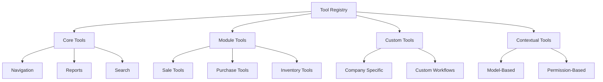

# KAI Dynamic Tool System - Extensible AI Capabilities

## Problem

Having a hardcoded list of tools in `_get_available_tools()` is limiting. We want:
- ✅ Automatic tool discovery
- ✅ Extensible by other modules
- ✅ Context-aware tool availability
- ✅ User/permission-based tools
- ✅ Custom business logic tools

## Solution: Dynamic Tool Registry



## Implementation

### 1. Tool Registry Model

```python
class AkAiTool(models.Model):
    _name = 'ak_ai.tool'
    _description = 'KAI Tool Registry'
    _order = 'sequence, name'
    
    name = fields.Char('Tool Name', required=True)
    code = fields.Char('Unique Code', required=True, index=True)
    description = fields.Text('Description', required=True,
                              help='Describe when AI should use this tool')
    
    # Tool type
    tool_type = fields.Selection([
        ('navigation', 'Navigation'),
        ('report', 'Report/Analysis'),
        ('data', 'Data Operation'),
        ('action', 'Record Action'),
        ('export', 'Export Data'),
        ('custom', 'Custom'),
    ], required=True, default='custom')
    
    # Availability
    active = fields.Boolean('Active', default=True)
    sequence = fields.Integer('Sequence', default=10)
    
    # Context filters
    model_ids = fields.Many2many('ir.model', string='Available for Models',
                                help='Empty = available for all models')
    group_ids = fields.Many2many('res.groups', string='Required Groups',
                                 help='Empty = available for all users')
    
    # Function definition (JSON Schema)
    function_schema = fields.Text('Function Schema (JSON)', required=True,
                                  help='OpenAI function calling schema')
    
    # Execution
    execution_model = fields.Char('Execution Model',
                                  help='Model that handles execution')
    execution_method = fields.Char('Execution Method',
                                   help='Method to call for execution')
    python_code = fields.Text('Python Code',
                             help='Direct Python code to execute (advanced)')
    
    # Usage stats
    usage_count = fields.Integer('Times Used', readonly=True)
    success_count = fields.Integer('Successful Executions', readonly=True)
    last_used = fields.Datetime('Last Used', readonly=True)
    
    _sql_constraints = [
        ('code_unique', 'UNIQUE(code)', 'Tool code must be unique!')
    ]
    
    def get_available_tools(self, context=None):
        """Get all available tools based on context"""
        domain = [('active', '=', True)]
        
        # Filter by model if provided
        if context and context.get('model'):
            domain.append(
                '|',
                ('model_ids', '=', False),  # Available for all
                ('model_ids.model', '=', context['model'])
            )
        
        tools = self.search(domain, order='sequence, name')
        
        # Filter by user permissions
        user_tools = []
        for tool in tools:
            if self._user_has_access(tool):
                user_tools.append(tool)
        
        return user_tools
    
    def _user_has_access(self, tool):
        """Check if current user can access this tool"""
        if not tool.group_ids:
            return True  # No group restriction
        
        return bool(set(self.env.user.groups_id.ids) & set(tool.group_ids.ids))
    
    def to_openai_schema(self):
        """Convert to OpenAI function schema"""
        self.ensure_one()
        
        schema = json.loads(self.function_schema)
        
        return {
            "type": "function",
            "function": {
                "name": self.code,
                "description": self.description,
                "parameters": schema
            }
        }
    
    def execute_tool(self, arguments):
        """Execute the tool with given arguments"""
        self.ensure_one()
        
        try:
            if self.python_code:
                # Execute Python code
                result = self._execute_python_code(arguments)
            elif self.execution_model and self.execution_method:
                # Call model method
                result = self._execute_model_method(arguments)
            else:
                result = {'success': False, 'error': 'No execution method defined'}
            
            # Update stats
            self.sudo().write({
                'usage_count': self.usage_count + 1,
                'success_count': self.success_count + (1 if result.get('success') else 0),
                'last_used': fields.Datetime.now()
            })
            
            return result
            
        except Exception as e:
            _logger.error(f"Tool execution error ({self.code}): {e}")
            return {'success': False, 'error': str(e)}
    
    def _execute_python_code(self, arguments):
        """Execute Python code safely"""
        self.ensure_one()
        
        # Safe execution context
        safe_globals = {
            'env': self.env,
            'self': self,
            'arguments': arguments,
            'json': json,
            'fields': fields,
            'datetime': datetime,
            'timedelta': timedelta,
        }
        
        try:
            exec(self.python_code, safe_globals)
            return safe_globals.get('result', {'success': True})
        except Exception as e:
            return {'success': False, 'error': str(e)}
    
    def _execute_model_method(self, arguments):
        """Execute model method"""
        self.ensure_one()
        
        if self.execution_model not in self.env:
            return {'success': False, 'error': 'Model not found'}
        
        model = self.env[self.execution_model]
        
        if not hasattr(model, self.execution_method):
            return {'success': False, 'error': 'Method not found'}
        
        method = getattr(model, self.execution_method)
        return method(arguments)
```

### 2. Dynamic Tool Loading

```python
class AkAiService(models.AbstractModel):
    _inherit = 'ak_ai.service'
    
    @api.model
    def _get_available_tools(self, conversation=None):
        """Dynamically get available tools"""
        
        context = {}
        if conversation:
            context = {
                'model': conversation.context_model,
                'user_id': self.env.user.id,
            }
        
        # Get tools from registry
        tool_model = self.env['ak_ai.tool']
        tools = tool_model.get_available_tools(context)
        
        # Convert to OpenAI schema
        tool_schemas = [tool.to_openai_schema() for tool in tools]
        
        return tool_schemas
    
    def _execute_tool_call(self, tool_code, arguments):
        """Execute a tool by code"""
        tool = self.env['ak_ai.tool'].search([('code', '=', tool_code)], limit=1)
        
        if not tool:
            return {'success': False, 'error': 'Tool not found'}
        
        return tool.execute_tool(arguments)
```

### 3. Core Tools Data

```xml
<!-- data/ak_ai_core_tools.xml -->
<odoo>
    <!-- Sales Analysis Tool -->
    <record id="tool_sales_analysis" model="ak_ai.tool">
        <field name="name">Sales Analysis Report</field>
        <field name="code">open_sales_analysis</field>
        <field name="description">Open sales analysis report with pivot/graph views. Use when user asks about sales data, top customers, sales performance, or revenue analysis.</field>
        <field name="tool_type">report</field>
        <field name="sequence">10</field>
        <field name="function_schema">{
  "type": "object",
  "properties": {
    "view_type": {
      "type": "string",
      "enum": ["pivot", "graph", "tree"],
      "description": "View type to open"
    },
    "date_from": {
      "type": "string",
      "format": "date",
      "description": "Start date (YYYY-MM-DD)"
    },
    "date_to": {
      "type": "string", 
      "format": "date",
      "description": "End date (YYYY-MM-DD)"
    },
    "partner_id": {
      "type": "integer",
      "description": "Customer ID filter"
    },
    "group_by": {
      "type": "array",
      "items": {"type": "string"},
      "description": "Group by fields"
    }
  }
}</field>
        <field name="execution_model">ak_ai.action.executor</field>
        <field name="execution_method">execute_sales_analysis</field>
    </record>
    
    <!-- Invoice Report Tool -->
    <record id="tool_invoice_report" model="ak_ai.tool">
        <field name="name">Invoice Report</field>
        <field name="code">open_invoice_report</field>
        <field name="description">Open invoice analysis. Use for invoice-related queries, payment status, outstanding amounts.</field>
        <field name="tool_type">report</field>
        <field name="sequence">11</field>
        <field name="function_schema">{
  "type": "object",
  "properties": {
    "payment_state": {
      "type": "string",
      "enum": ["not_paid", "paid", "partial"],
      "description": "Payment status filter"
    },
    "partner_id": {
      "type": "integer"
    },
    "date_from": {
      "type": "string"
    },
    "date_to": {
      "type": "string"
    }
  }
}</field>
        <field name="execution_model">ak_ai.action.executor</field>
        <field name="execution_method">execute_invoice_report</field>
    </record>
    
    <!-- Navigate to Records Tool -->
    <record id="tool_navigate_records" model="ak_ai.tool">
        <field name="name">Navigate to Records</field>
        <field name="code">navigate_to_records</field>
        <field name="description">Navigate to any Odoo model with filters. Use for "show me", "open", "view" requests.</field>
        <field name="tool_type">navigation</field>
        <field name="sequence">5</field>
        <field name="function_schema">{
  "type": "object",
  "properties": {
    "model": {
      "type": "string",
      "description": "Odoo model name (e.g., sale.order, res.partner)"
    },
    "domain": {
      "type": "array",
      "description": "Odoo domain filter"
    },
    "view_mode": {
      "type": "string",
      "default": "tree"
    }
  },
  "required": ["model"]
}</field>
        <field name="execution_model">ak_ai.action.executor</field>
        <field name="execution_method">execute_navigation</field>
    </record>
    
    <!-- Export Data Tool -->
    <record id="tool_export_data" model="ak_ai.tool">
        <field name="name">Export Data</field>
        <field name="code">export_data</field>
        <field name="description">Export data to Excel/CSV. Use when user wants to download or export data.</field>
        <field name="tool_type">export</field>
        <field name="sequence">50</field>
        <field name="function_schema">{
  "type": "object",
  "properties": {
    "model": {
      "type": "string",
      "description": "Model to export from"
    },
    "domain": {
      "type": "array",
      "description": "Filter for records"
    },
    "fields": {
      "type": "array",
      "items": {"type": "string"},
      "description": "Fields to export"
    },
    "format": {
      "type": "string",
      "enum": ["xlsx", "csv"],
      "default": "xlsx"
    }
  },
  "required": ["model"]
}</field>
        <field name="execution_model">ak_ai.action.executor</field>
        <field name="execution_method">execute_export</field>
    </record>
    
    <!-- Create Pivot Analysis Tool -->
    <record id="tool_pivot_analysis" model="ak_ai.tool">
        <field name="name">Custom Pivot Analysis</field>
        <field name="code">create_pivot_analysis</field>
        <field name="description">Create custom pivot table for data analysis. Use for comparative analysis, grouping, aggregations.</field>
        <field name="tool_type">report</field>
        <field name="sequence">20</field>
        <field name="function_schema">{
  "type": "object",
  "properties": {
    "model": {
      "type": "string",
      "description": "Model for analysis"
    },
    "rows": {
      "type": "array",
      "items": {"type": "string"},
      "description": "Row dimensions"
    },
    "columns": {
      "type": "array",
      "items": {"type": "string"},
      "description": "Column dimensions"
    },
    "measures": {
      "type": "array",
      "items": {"type": "string"},
      "description": "Measure fields"
    },
    "domain": {
      "type": "array"
    }
  },
  "required": ["model"]
}</field>
        <field name="execution_model">ak_ai.action.executor</field>
        <field name="execution_method">execute_pivot_analysis</field>
    </record>
</odoo>
```

### 4. Module-Specific Tools

Other modules can add their own tools:

```xml
<!-- ak_tender/data/kai_tools.xml -->
<odoo>
    <record id="tool_tender_analysis" model="ak_ai.tool">
        <field name="name">Tender Analysis</field>
        <field name="code">analyze_tender</field>
        <field name="description">Analyze tender data, compare bids, show supplier comparison</field>
        <field name="tool_type">custom</field>
        <field name="model_ids" eval="[(4, ref('ak_tender.model_ak_tender'))]"/>
        <field name="function_schema">{
  "type": "object",
  "properties": {
    "tender_id": {
      "type": "integer",
      "description": "Tender ID to analyze"
    },
    "analysis_type": {
      "type": "string",
      "enum": ["supplier_comparison", "price_analysis", "timeline"],
      "description": "Type of analysis to perform"
    }
  }
}</field>
        <field name="execution_model">ak.tender</field>
        <field name="execution_method">kai_analyze_tender</field>
    </record>
</odoo>
```

```python
# ak_tender/models/ak_tender.py
class AkTender(models.Model):
    _inherit = 'ak.tender'
    
    def kai_analyze_tender(self, arguments):
        """KAI tool for tender analysis"""
        tender_id = arguments.get('tender_id')
        analysis_type = arguments.get('analysis_type', 'supplier_comparison')
        
        tender = self.browse(tender_id)
        
        if analysis_type == 'supplier_comparison':
            return self._kai_supplier_comparison(tender)
        elif analysis_type == 'price_analysis':
            return self._kai_price_analysis(tender)
        
        return {'success': False, 'error': 'Unknown analysis type'}
    
    def _kai_supplier_comparison(self, tender):
        """Generate supplier comparison action"""
        return {
            'success': True,
            'action': {
                'type': 'ir.actions.act_window',
                'name': f'Supplier Comparison - {tender.name}',
                'res_model': 'ak.tender.line',
                'view_mode': 'pivot,tree',
                'domain': [('tender_id', '=', tender.id)],
                'context': {
                    'pivot_row_groupby': ['partner_id'],
                    'pivot_column_groupby': ['product_id'],
                    'pivot_measures': ['price_unit'],
                }
            }
        }
```

### 5. Custom Company Tools

Companies can add their own tools:

```python
# Through UI or code
self.env['ak_ai.tool'].create({
    'name': 'Monthly Report',
    'code': 'company_monthly_report',
    'description': 'Generate monthly management report',
    'tool_type': 'custom',
    'function_schema': json.dumps({
        "type": "object",
        "properties": {
            "month": {"type": "string"},
            "year": {"type": "integer"}
        }
    }),
    'python_code': '''
# Custom Python code
month = arguments.get('month')
year = arguments.get('year')

# Your custom logic here
report_data = env['custom.report'].generate_monthly_report(month, year)

result = {
    'success': True,
    'action': {
        'type': 'ir.actions.act_window',
        'name': f'Monthly Report - {month}/{year}',
        'res_model': 'custom.report',
        'view_mode': 'form',
        'res_id': report_data.id
    }
}
'''
})
```

### 6. Context-Aware Tool Filtering

```python
def _get_contextual_tools(self, conversation):
    """Get tools relevant to current context"""
    
    all_tools = self.env['ak_ai.tool'].get_available_tools({
        'model': conversation.context_model
    })
    
    # If on a specific record, add model-specific tools
    if conversation.context_model:
        model_tools = all_tools.filtered(
            lambda t: not t.model_ids or 
            conversation.context_model in t.model_ids.mapped('model')
        )
    else:
        model_tools = all_tools.filtered(lambda t: not t.model_ids)
    
    return model_tools
```

### 7. Tool Management UI

```xml
<!-- views/ak_ai_tool_views.xml -->
<record id="view_ak_ai_tool_tree" model="ir.ui.view">
    <field name="name">ak.ai.tool.tree</field>
    <field name="model">ak_ai.tool</field>
    <field name="arch" type="xml">
        <tree>
            <field name="sequence" widget="handle"/>
            <field name="name"/>
            <field name="code"/>
            <field name="tool_type"/>
            <field name="usage_count"/>
            <field name="success_count"/>
            <field name="active"/>
        </tree>
    </field>
</record>

<record id="view_ak_ai_tool_form" model="ir.ui.view">
    <field name="name">ak.ai.tool.form</field>
    <field name="model">ak_ai.tool</field>
    <field name="arch" type="xml">
        <form>
            <header>
                <button name="test_tool" type="object" string="Test Tool" class="btn-primary"/>
            </header>
            <sheet>
                <group>
                    <group>
                        <field name="name"/>
                        <field name="code"/>
                        <field name="tool_type"/>
                        <field name="active"/>
                        <field name="sequence"/>
                    </group>
                    <group>
                        <field name="usage_count"/>
                        <field name="success_count"/>
                        <field name="last_used"/>
                    </group>
                </group>
                
                <group string="Description">
                    <field name="description" nolabel="1"/>
                </group>
                
                <notebook>
                    <page string="Function Schema">
                        <field name="function_schema" widget="ace" options="{'mode': 'json'}"/>
                    </page>
                    
                    <page string="Execution">
                        <group>
                            <field name="execution_model"/>
                            <field name="execution_method"/>
                        </group>
                        <group string="Or Python Code">
                            <field name="python_code" widget="ace" options="{'mode': 'python'}" nolabel="1"/>
                        </group>
                    </page>
                    
                    <page string="Availability">
                        <group>
                            <field name="model_ids" widget="many2many_tags"/>
                            <field name="group_ids" widget="many2many_tags"/>
                        </group>
                    </page>
                </notebook>
            </sheet>
        </form>
    </field>
</record>
```

## Summary

### Dynamic Tool System Benefits:

1. **✅ Not Limited**: Tools stored in database, not hardcoded
2. **✅ Extensible**: Any module can add tools via XML data
3. **✅ Customizable**: Companies can create custom tools via UI
4. **✅ Context-Aware**: Tools filtered by model, user, permissions
5. **✅ Trackable**: Usage statistics for each tool
6. **✅ Testable**: Test tools before activating
7. **✅ Secure**: Permission-based access control

### How to Add New Tools:

**Method 1: Via Data File** (Module developers)
```xml
<record id="my_custom_tool" model="ak_ai.tool">
    <field name="name">My Tool</field>
    <field name="code">my_tool</field>
    <field name="description">...</field>
    <field name="function_schema">{...}</field>
    <field name="execution_model">my.model</field>
    <field name="execution_method">my_method</field>
</record>
```

**Method 2: Via UI** (Administrators)
- Go to KAI → Tools
- Click Create
- Fill in schema and execution details

**Method 3: Via Python** (Developers)
```python
self.env['ak_ai.tool'].create({...})
```

AI automatically discovers and uses all registered tools!
