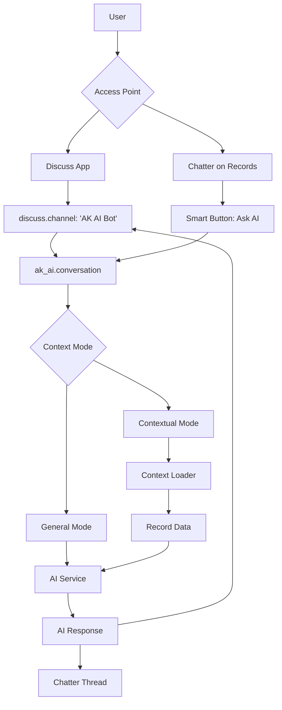

# AK AI Final Design: Dual Integration (Chatter + Discuss)

## Unified Architecture - Best of Both Worlds



## How Both Integrations Work Together

### Scenario 1: Start from Discuss, Continue in Context

```
1. User opens Discuss → AK AI Bot channel
2. User: "Show me details about SO001"
3. AI responds with summary
4. AI offers: "Would you like to open this order with full context?"
5. User clicks → Opens SO001 form with AI panel already loaded
6. Conversation continues with full record context
```

### Scenario 2: Start from Chatter, Share in Discuss

```
1. User viewing Sale Order SO001
2. Clicks "Ask AI" button in chatter
3. Asks: "Why is this order delayed?"
4. AI analyzes with full context
5. AI suggests: "Share this analysis with team?"
6. Creates Discuss thread with context link
7. Team can view and continue discussion
```

### Scenario 3: Seamless Context Switching

```
1. In Discuss: "Compare SO001 and SO002"
2. AI loads data from both orders
3. AI: "Would you like to dive into SO001 details?"
4. User clicks link → Opens SO001 with AI ready
5. Full context analysis available
```

## Technical Implementation

### 1. Unified Conversation Model

```python
class AkAiConversation(models.Model):
    _name = 'ak_ai.conversation'
    _inherit = ['mail.thread', 'mail.activity.mixin']
    _description = 'AI Conversation'
    
    name = fields.Char('Title', compute='_compute_name', store=True)
    user_id = fields.Many2one('res.users', 'User', default=lambda self: self.env.user)
    
    # Dual Mode Support
    access_mode = fields.Selection([
        ('discuss', 'Discuss Channel'),
        ('chatter', 'Chatter/Form'),
        ('both', 'Both')
    ], default='discuss', string='Access Mode')
    
    # Discuss Integration
    channel_id = fields.Many2one('discuss.channel', 'Discuss Channel')
    
    # Context Integration
    context_mode = fields.Selection([
        ('general', 'General Chat'),
        ('record', 'Single Record'),
        ('multi', 'Multiple Records'),
        ('search', 'Search Results')
    ], default='general', string='Context Mode')
    
    context_model = fields.Char('Context Model')
    context_res_id = fields.Integer('Context Record ID')
    context_res_ids = fields.Char('Multiple Record IDs (JSON)')
    
    # Messages
    message_ids = fields.One2many('ak_ai.message', 'conversation_id', 'Messages')
    message_count = fields.Integer(compute='_compute_message_count')
    
    # State
    state = fields.Selection([
        ('active', 'Active'),
        ('archived', 'Archived'),
    ], default='active')
    
    last_message_date = fields.Datetime('Last Message')
    
    def switch_to_context(self, model, res_id):
        """Switch conversation from general to contextual mode"""
        self.write({
            'context_mode': 'record',
            'context_model': model,
            'context_res_id': res_id,
            'access_mode': 'both'
        })
        
        # Add system message about context switch
        self.env['ak_ai.message'].create({
            'conversation_id': self.id,
            'role': 'system',
            'content': f'Context switched to {model} (ID: {res_id})',
            'metadata': json.dumps({'context_loaded': True})
        })
        
        return self._prepare_context()
    
    def _prepare_context(self):
        """Prepare context based on mode"""
        if self.context_mode == 'general':
            return self._prepare_general_context()
        elif self.context_mode == 'record':
            return self._prepare_record_context()
        elif self.context_mode == 'multi':
            return self._prepare_multi_record_context()
        return {}
    
    def _prepare_record_context(self):
        """Load full record context"""
        if not self.context_model or not self.context_res_id:
            return {}
        
        try:
            model = self.env[self.context_model]
            record = model.browse(self.context_res_id)
            
            if not record.exists():
                return {}
            
            # Check access rights
            record.check_access_rights('read')
            record.check_access_rule('read')
            
            # Get record-specific context
            if hasattr(record, '_prepare_ai_context'):
                return record._prepare_ai_context()
            
            # Generic context preparation
            return self._prepare_generic_context(record)
            
        except Exception as e:
            _logger.error(f"Error preparing context: {e}")
            return {}
    
    def _prepare_generic_context(self, record):
        """Generic context preparation for any model"""
        return {
            'model': record._name,
            'model_description': record._description,
            'id': record.id,
            'display_name': record.display_name,
            'fields': self._get_accessible_fields(record),
            'user_permissions': {
                'read': True,
                'write': record.check_access_rights('write', raise_exception=False),
                'create': record.check_access_rights('create', raise_exception=False),
                'unlink': record.check_access_rights('unlink', raise_exception=False),
            }
        }
    
    def _get_accessible_fields(self, record):
        """Get all accessible fields for the record"""
        accessible_fields = {}
        
        for field_name, field in record._fields.items():
            # Skip computed fields without store, binary, and technical fields
            if field_name.startswith('_') or field.type == 'binary':
                continue
            
            try:
                value = record[field_name]
                
                # Format different field types
                if field.type in ['many2one']:
                    accessible_fields[field_name] = {
                        'id': value.id,
                        'name': value.display_name
                    } if value else None
                elif field.type in ['one2many', 'many2many']:
                    accessible_fields[field_name] = [{
                        'id': r.id,
                        'name': r.display_name
                    } for r in value[:10]]  # Limit to 10
                elif field.type in ['date', 'datetime']:
                    accessible_fields[field_name] = str(value) if value else None
                elif field.type == 'selection':
                    accessible_fields[field_name] = dict(field.selection).get(value, value)
                else:
                    accessible_fields[field_name] = value
                    
            except Exception:
                continue
        
        return accessible_fields
```

### 2. Discuss Channel Integration

```python
class DiscussChannel(models.Model):
    _inherit = 'discuss.channel'
    
    is_ai_channel = fields.Boolean('AI Bot Channel', default=False)
    ai_conversation_id = fields.Many2one('ak_ai.conversation', 'AI Conversation')
    
    @api.model
    def _get_ai_bot_channel(self):
        """Get or create AI bot channel for current user"""
        channel = self.search([
            ('is_ai_channel', '=', True),
            ('channel_member_ids.partner_id', '=', self.env.user.partner_id.id)
        ], limit=1)
        
        if not channel:
            channel = self._create_ai_bot_channel()
        
        return channel
    
    def _create_ai_bot_channel(self):
        """Create AI bot channel"""
        bot_partner = self.env.ref('ak_ai.partner_ai_bot')
        
        channel = self.create({
            'name': '🤖 AK AI Assistant',
            'description': 'Your personal AI assistant for Odoo',
            'channel_type': 'chat',
            'is_ai_channel': True,
            'channel_member_ids': [
                (0, 0, {'partner_id': self.env.user.partner_id.id}),
                (0, 0, {'partner_id': bot_partner.id})
            ]
        })
        
        # Create linked conversation
        conversation = self.env['ak_ai.conversation'].create({
            'channel_id': channel.id,
            'user_id': self.env.user.id,
            'access_mode': 'discuss',
            'context_mode': 'general'
        })
        
        channel.ai_conversation_id = conversation.id
        
        # Send welcome message
        channel.message_post(
            body="👋 Hi! I'm AK AI, your Odoo assistant. How can I help you today?",
            author_id=bot_partner.id,
            message_type='comment'
        )
        
        return channel
    
    def _notify_thread(self, message, msg_vals=False, **kwargs):
        """Intercept messages to trigger AI response"""
        res = super()._notify_thread(message, msg_vals=msg_vals, **kwargs)
        
        if self.is_ai_channel and message.author_id != self.env.ref('ak_ai.partner_ai_bot'):
            # User sent a message, generate AI response
            self._generate_ai_response(message)
        
        return res
    
    def _generate_ai_response(self, message):
        """Generate and post AI response"""
        conversation = self.ai_conversation_id
        
        if not conversation:
            return
        
        # Add user message to conversation
        self.env['ak_ai.message'].create({
            'conversation_id': conversation.id,
            'role': 'user',
            'content': message.body,
        })
        
        # Generate AI response
        response = conversation._generate_ai_response(message.body)
        
        # Post response in channel
        bot_partner = self.env.ref('ak_ai.partner_ai_bot')
        self.message_post(
            body=response['content'],
            author_id=bot_partner.id,
            message_type='comment'
        )
```

### 3. Chatter Integration with Smart Button

```python
# Mixin to add AI capabilities to any model
class AiAssistantMixin(models.AbstractModel):
    _name = 'ak_ai.assistant.mixin'
    _description = 'AI Assistant Mixin'
    
    ai_conversation_count = fields.Integer(
        compute='_compute_ai_conversation_count',
        string='AI Conversations'
    )
    
    def _compute_ai_conversation_count(self):
        for record in self:
            record.ai_conversation_count = self.env['ak_ai.conversation'].search_count([
                ('context_model', '=', record._name),
                ('context_res_id', '=', record.id)
            ])
    
    def action_ask_ai(self):
        """Open AI assistant with current record context"""
        # Check if there's an existing conversation
        conversation = self.env['ak_ai.conversation'].search([
            ('context_model', '=', self._name),
            ('context_res_id', '=', self.id),
            ('user_id', '=', self.env.user.id),
            ('state', '=', 'active')
        ], limit=1)
        
        if not conversation:
            # Create new conversation with context
            conversation = self.env['ak_ai.conversation'].create({
                'user_id': self.env.user.id,
                'access_mode': 'chatter',
                'context_mode': 'record',
                'context_model': self._name,
                'context_res_id': self.id,
            })
            
            # Add welcome message with context summary
            context_summary = self._get_ai_context_summary()
            self.env['ak_ai.message'].create({
                'conversation_id': conversation.id,
                'role': 'assistant',
                'content': f"""Hi! I'm ready to help with this {self._description}.

**Current Context Loaded:**
{context_summary}

What would you like to know or do?""",
            })
        
        # Open conversation in a dialog or side panel
        return {
            'type': 'ir.actions.act_window',
            'name': f'AI Assistant - {self.display_name}',
            'res_model': 'ak_ai.conversation',
            'res_id': conversation.id,
            'view_mode': 'form',
            'target': 'new',
            'context': {
                'default_context_model': self._name,
                'default_context_res_id': self.id,
            }
        }
    
    def _get_ai_context_summary(self):
        """Get a summary of the current context for AI"""
        if hasattr(self, '_prepare_ai_context_summary'):
            return self._prepare_ai_context_summary()
        
        return f"• Record: {self.display_name}\n• ID: {self.id}"
    
    def _prepare_ai_context(self):
        """Override this method in models to provide custom context"""
        return {
            'model': self._name,
            'description': self._description,
            'id': self.id,
            'display_name': self.display_name,
        }

# Apply to key models
class SaleOrder(models.Model):
    _name = 'sale.order'
    _inherit = ['sale.order', 'ak_ai.assistant.mixin']
    
    def _prepare_ai_context_summary(self):
        return f"""• Customer: {self.partner_id.name}
• Amount: {self.amount_total} {self.currency_id.name}
• Status: {dict(self._fields['state'].selection)[self.state]}
• {len(self.order_line)} order line(s)"""
    
    def _prepare_ai_context(self):
        """Full context for AI"""
        return {
            'model': 'sale.order',
            'id': self.id,
            'name': self.name,
            'fields': {
                'customer': {
                    'id': self.partner_id.id,
                    'name': self.partner_id.name,
                    'phone': self.partner_id.phone,
                    'email': self.partner_id.email,
                },
                'date_order': str(self.date_order),
                'state': dict(self._fields['state'].selection)[self.state],
                'amount_total': self.amount_total,
                'currency': self.currency_id.name,
                'salesperson': self.user_id.name,
                'payment_term': self.payment_term_id.name if self.payment_term_id else None,
            },
            'order_lines': [
                {
                    'product': line.product_id.display_name,
                    'quantity': line.product_uom_qty,
                    'price_unit': line.price_unit,
                    'subtotal': line.price_subtotal,
                }
                for line in self.order_line
            ],
            'related_records': {
                'invoices': [
                    {'name': inv.name, 'state': inv.state, 'amount': inv.amount_total}
                    for inv in self.invoice_ids
                ],
                'deliveries': [
                    {'name': pick.name, 'state': pick.state}
                    for pick in self.picking_ids
                ],
            },
            'next_actions': self._get_ai_suggested_actions(),
        }
    
    def _get_ai_suggested_actions(self):
        """Suggest next actions based on state"""
        actions = []
        if self.state == 'draft':
            actions.append({'action': 'send_quote', 'label': 'Send quotation to customer'})
            actions.append({'action': 'confirm', 'label': 'Confirm order'})
        elif self.state == 'sale' and not self.invoice_ids:
            actions.append({'action': 'create_invoice', 'label': 'Create invoice'})
        elif self.invoice_ids.filtered(lambda i: i.state == 'draft'):
            actions.append({'action': 'post_invoices', 'label': 'Validate invoices'})
        return actions
```

### 4. Unified AI Service

```python
class AkAiService(models.AbstractModel):
    _name = 'ak_ai.service'
    _description = 'AI Service Layer'
    
    def generate_response(self, conversation_id, user_message):
        """Generate AI response based on conversation context"""
        conversation = self.env['ak_ai.conversation'].browse(conversation_id)
        
        # Prepare context
        context = conversation._prepare_context()
        
        # Build message history
        messages = self._build_message_history(conversation)
        
        # Add user message
        messages.append({
            'role': 'user',
            'content': user_message
        })
        
        # Get AI configuration
        config = self.env['ir.config_parameter'].sudo()
        provider = config.get_param('ak_ai.provider', 'openai')
        
        # Generate response based on provider
        if provider == 'openai':
            response = self._generate_openai_response(messages, context)
        elif provider == 'anthropic':
            response = self._generate_anthropic_response(messages, context)
        else:
            response = {'content': 'AI provider not configured.'}
        
        # Save AI response
        self.env['ak_ai.message'].create({
            'conversation_id': conversation.id,
            'role': 'assistant',
            'content': response['content'],
            'tokens_used': response.get('tokens_used', 0),
            'metadata': json.dumps(response.get('metadata', {}))
        })
        
        return response
    
    def _build_message_history(self, conversation):
        """Build message history for AI"""
        messages = [{
            'role': 'system',
            'content': self._get_system_prompt(conversation)
        }]
        
        for msg in conversation.message_ids.sorted('create_date'):
            if msg.role != 'system':
                messages.append({
                    'role': msg.role,
                    'content': msg.content
                })
        
        return messages
    
    def _get_system_prompt(self, conversation):
        """Generate system prompt with context"""
        base_prompt = """You are AK AI, an intelligent assistant for Odoo ERP system.

Your capabilities:
- Answer questions about Odoo functionality
- Help users complete tasks
- Analyze data and provide insights
- Suggest next actions
- Navigate the system

Guidelines:
- Be helpful, concise, and professional
- Use the user's language preference
- Always respect data access permissions
- Confirm before executing any actions
- Provide step-by-step instructions when needed
"""
        
        # Add context if available
        if conversation.context_mode != 'general':
            context = conversation._prepare_context()
            context_summary = json.dumps(context, indent=2)
            base_prompt += f"\n\nCurrent Context:\n```json\n{context_summary}\n```"
        
        return base_prompt
```

## View Definitions

### Smart Button in Form Views

```xml
<!-- Add to any form view where you want AI assistance -->
<button name="action_ask_ai" 
        type="object" 
        class="oe_stat_button" 
        icon="fa-robot"
        help="Ask AI Assistant">
    <field name="ai_conversation_count" widget="statinfo" string="AI Chats"/>
</button>
```

### Conversation Form View

```xml
<record id="view_ak_ai_conversation_form" model="ir.ui.view">
    <field name="name">ak.ai.conversation.form</field>
    <field name="model">ak_ai.conversation</field>
    <field name="arch" type="xml">
        <form string="AI Conversation">
            <header>
                <field name="state" widget="statusbar"/>
            </header>
            <sheet>
                <div class="oe_button_box" name="button_box">
                    <button name="action_open_context_record" 
                            type="object" 
                            class="oe_stat_button" 
                            icon="fa-external-link"
                            invisible="context_mode == 'general'">
                        <span>Open Record</span>
                    </button>
                </div>
                
                <group>
                    <group>
                        <field name="user_id"/>
                        <field name="access_mode"/>
                        <field name="context_mode"/>
                    </group>
                    <group>
                        <field name="context_model" invisible="context_mode == 'general'"/>
                        <field name="context_res_id" invisible="context_mode == 'general'"/>
                        <field name="message_count"/>
                    </group>
                </group>
                
                <notebook>
                    <page string="Conversation">
                        <field name="message_ids" mode="tree,form">
                            <tree>
                                <field name="role"/>
                                <field name="content"/>
                                <field name="create_date"/>
                            </tree>
                        </field>
                        
                        <!-- Chat Interface -->
                        <group>
                            <field name="new_message_content" 
                                   placeholder="Type your message..."
                                   nolabel="1"/>
                            <button name="send_message" 
                                    string="Send" 
                                    type="object" 
                                    class="btn-primary"/>
                        </group>
                    </page>
                    
                    <page string="Context" invisible="context_mode == 'general'">
                        <field name="context_data" widget="json"/>
                    </page>
                </notebook>
            </sheet>
            <div class="oe_chatter">
                <field name="message_ids"/>
            </div>
        </form>
    </field>
</record>
```

## User Experience Flow

### Flow 1: Discuss → Chatter Integration

```
1. User opens Discuss
2. Clicks "🤖 AK AI Assistant" channel
3. Types: "Show me sales order SO042"
4. AI responds with summary
5. AI adds button: [📋 Open SO042 with Full Context]
6. User clicks button
7. SO042 opens with AI panel showing detailed context
8. Conversation continues with record-specific help
```

### Flow 2: Chatter → Discuss Integration

```
1. User viewing Invoice INV/2024/0001
2. Clicks "Ask AI" smart button
3. Asks: "Why hasn't customer paid this invoice?"
4. AI analyzes: payment terms, due date, customer history
5. AI suggests: "Would you like to share this analysis with team?"
6. User confirms
7. Creates Discuss thread with team members
8. Analysis shared, team can discuss and take action
```

## Implementation TODO List

```markdown
### Phase 1: Core Infrastructure
- [ ] Create base models (ak_ai.conversation, ak_ai.message)
- [ ] Create AI bot user and partner
- [ ] Implement basic AI service integration (OpenAI)
- [ ] Add encryption for API keys

### Phase 2: Discuss Integration
- [ ] Create AI bot channel on user login
- [ ] Implement message interception and response
- [ ] Add slash commands (/ai, /context, /help)
- [ ] Create channel UI enhancements

### Phase 3: Chatter Integration
- [ ] Create ak_ai.assistant.mixin
- [ ] Add smart buttons to key models (sale.order, purchase.order, account.move)
- [ ] Implement context preparation methods
- [ ] Create conversation dialog/panel

### Phase 4: Context Intelligence
- [ ] Implement context switching
- [ ] Add multi-record context support
- [ ] Create context caching system
- [ ] Add related records traversal

### Phase 5: Advanced Features
- [ ] Action execution framework
- [ ] Confirmation dialogs
- [ ] Usage analytics
- [ ] Cost tracking
- [ ] Rate limiting

### Phase 6: Polish & Testing
- [ ] UI/UX refinements
- [ ] Security audit
- [ ] Performance optimization
- [ ] Documentation
- [ ] Demo data
```

## Summary

This dual integration approach provides:

✅ **Flexibility**: Access AI from anywhere  
✅ **Context Awareness**: Full record data when needed  
✅ **Seamless Transition**: Switch between modes effortlessly  
✅ **Team Collaboration**: Share insights via Discuss  
✅ **Natural UX**: Familiar Odoo patterns  
✅ **Powerful**: Best of both approaches  

The system intelligently manages context, allowing users to:
- Ask general questions in Discuss
- Get specific help on records via Chatter  
- Switch between modes naturally
- Share AI insights with teams
- Execute actions safely with confirmation

This creates a truly integrated AI experience in Odoo!
