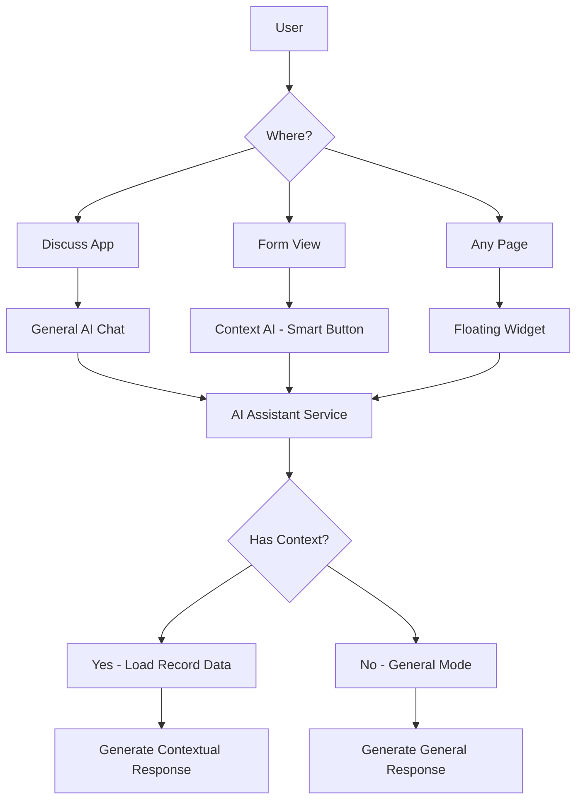

# AK AI Integration Strategy: Chatter vs Discuss vs Both

## Integration Options Analysis

### Option 1: Chatter Integration Only
**Concept**: AI assistant appears as a special "bot" user in the Chatter of each record

#### Advantages
- ✅ **Full Context Access**: Can read all fields of the current record
- ✅ **Model Awareness**: Knows exactly which model/record is being viewed
- ✅ **Related Records**: Can access related data (SO lines, invoices, contacts, etc.)
- ✅ **Natural UX**: Users already familiar with Chatter interface
- ✅ **Targeted Help**: Context-specific assistance
- ✅ **Activity Integration**: Can create activities, send emails from context

#### Disadvantages
- ❌ **Limited to Forms**: Only works when viewing a record
- ❌ **No General Chat**: Can't ask general questions without a record
- ❌ **Multiple Instances**: Each record has separate conversation

#### Technical Implementation
```python
# Inherit mail.thread in target models
class SaleOrder(models.Model):
    _inherit = 'sale.order'
    
    def action_ask_ai(self):
        """Opens AI assistant in chatter"""
        context = {
            'default_res_model': self._name,
            'default_res_id': self.id,
            'ai_context': self._prepare_ai_context()
        }
        return {
            'type': 'ir.actions.act_window',
            'res_model': 'ak_ai.conversation',
            'view_mode': 'form',
            'context': context,
            'target': 'new',
        }
    
    def _prepare_ai_context(self):
        """Prepare record context for AI"""
        return {
            'model': self._name,
            'record': {
                'id': self.id,
                'name': self.name,
                'partner': self.partner_id.name,
                'state': self.state,
                'amount_total': self.amount_total,
                'order_lines': [
                    {
                        'product': line.product_id.name,
                        'qty': line.product_uom_qty,
                        'price': line.price_unit
                    }
                    for line in self.order_line
                ]
            }
        }
```

### Option 2: Discuss Integration Only
**Concept**: AI as a persistent chat bot in Discuss app

#### Advantages
- ✅ **Persistent Conversations**: Long-running discussions
- ✅ **General Questions**: Can ask anything, not record-specific
- ✅ **Team Collaboration**: Share AI conversations with team
- ✅ **Cross-model Queries**: Ask about multiple records/models
- ✅ **Mobile Friendly**: Discuss works well on mobile

#### Disadvantages
- ❌ **No Auto-Context**: User must explain what they're looking at
- ❌ **Less Targeted**: Can't automatically see current record
- ❌ **Manual Context**: User has to provide record references

#### Technical Implementation
```python
# Create AI bot as a special user
class AkAiBot(models.Model):
    _name = 'ak_ai.bot'
    _inherit = 'mail.thread'
    
    def _message_post_process(self, message):
        """Process incoming messages and respond"""
        if message.author_id != self.env.ref('ak_ai.bot_user'):
            # User sent a message
            response = self._generate_ai_response(message.body)
            self.message_post(
                body=response,
                message_type='comment',
                subtype_xmlid='mail.mt_comment',
                author_id=self.env.ref('ak_ai.bot_user').id
            )
```

### Option 3: **RECOMMENDED - Both (Hybrid Approach)** ⭐

**Concept**: Combine both approaches for maximum flexibility

#### How It Works

1. **Global AI Assistant (Discuss)**
   - Always available in Discuss
   - For general questions and multi-record queries
   - Persistent conversation history
   - Can switch context on demand

2. **Context-Aware AI (Chatter Integration)**
   - Smart button on forms: "Ask AI"
   - Opens chat with full record context
   - Can still access general knowledge
   - Links back to Discuss conversation if needed

3. **Floating Widget (Bonus)**
   - Quick access from anywhere
   - Knows current page context
   - Can switch between general/contextual modes



## Recommended Implementation: Hybrid Approach

### Architecture

```python
class AkAiAssistant(models.Model):
    _name = 'ak_ai.assistant'
    _inherit = ['mail.thread', 'mail.activity.mixin']
    
    name = fields.Char('Assistant Name', default='AK AI')
    mode = fields.Selection([
        ('general', 'General Assistant'),
        ('contextual', 'Contextual Assistant')
    ], default='general')
    
class AkAiConversation(models.Model):
    _name = 'ak_ai.conversation'
    _inherit = ['mail.thread', 'mail.activity.mixin']
    
    # Link to Discuss channel
    channel_id = fields.Many2one('discuss.channel', 'Discuss Channel')
    
    # Context linking
    context_model = fields.Char('Context Model')
    context_res_id = fields.Integer('Context Record ID')
    context_mode = fields.Selection([
        ('general', 'General'),
        ('record', 'Record Context'),
        ('multi', 'Multi-Record')
    ], default='general')
    
    def _get_context_data(self):
        """Dynamically fetch context based on mode"""
        if self.context_mode == 'record' and self.context_model:
            model = self.env[self.context_model]
            if model and self.context_res_id:
                record = model.browse(self.context_res_id)
                return record._prepare_ai_context()
        return {}
```

### UI/UX Design

#### 1. Discuss Integration

**Channel: "AK AI Assistant"**
```
Discuss App
├── Inbox
├── Starred
├── Channels
│   ├── General
│   └── 🤖 AK AI Assistant (Always available)
└── Direct Messages
```

**Features**:
- Pre-created channel for AI
- Users can mention @ak_ai
- Supports slash commands: `/ai help`, `/ai search sales orders`
- Can attach context: `/ai analyze sale.order:42`

#### 2. Chatter Integration

**Smart Button on Forms**:
```xml
<button name="action_ask_ai" 
        type="object" 
        string="Ask AI" 
        icon="fa-robot"
        class="oe_stat_button"/>
```

**Context Panel**:
```
┌─────────────────────────────────────┐
│ 🤖 AI Assistant - Sale Order SO001  │
├─────────────────────────────────────┤
│ Context Loaded:                      │
│ • Customer: Acme Corp                │
│ • Total: $1,234.56                   │
│ • Status: To Invoice                 │
│ • 5 Order Lines                      │
├─────────────────────────────────────┤
│ What would you like to know?         │
│ [                                ] 📤 │
└─────────────────────────────────────┘
```

#### 3. Floating Widget

**Bottom-right Corner Widget**:
```
┌──────────────┐
│ 🤖 AI        │ ← Minimized
└──────────────┘

┌────────────────────────────────────┐
│ 🤖 AK AI Assistant      [−] [×]    │
├────────────────────────────────────┤
│ 📍 You're viewing: Sale Order       │
│    SO001 - Acme Corp                │
├────────────────────────────────────┤
│ Hi! How can I help?                 │
│                                     │
│ 💡 Suggestions:                     │
│ • Create invoice for this order     │
│ • Show payment status               │
│ • Find similar orders               │
├────────────────────────────────────┤
│ [Type your question...        ] 📤  │
└────────────────────────────────────┘
```

### Context Reading Capabilities

#### What AI Can Read from Chatter Integration

```python
class SaleOrder(models.Model):
    _inherit = 'sale.order'
    
    def _prepare_ai_context(self):
        """Prepare comprehensive context for AI"""
        return {
            # Basic Info
            'model': 'sale.order',
            'id': self.id,
            'name': self.name,
            
            # Record Data
            'fields': {
                'customer': self.partner_id.name,
                'date': self.date_order,
                'state': dict(self._fields['state'].selection)[self.state],
                'amount_total': self.amount_total,
                'currency': self.currency_id.name,
                'salesperson': self.user_id.name,
            },
            
            # Related Records
            'order_lines': [
                {
                    'product': line.product_id.display_name,
                    'description': line.name,
                    'quantity': line.product_uom_qty,
                    'uom': line.product_uom.name,
                    'price_unit': line.price_unit,
                    'subtotal': line.price_subtotal,
                }
                for line in self.order_line
            ],
            
            'invoices': [
                {
                    'number': inv.name,
                    'state': inv.state,
                    'amount': inv.amount_total,
                    'due_date': inv.invoice_date_due,
                }
                for inv in self.invoice_ids
            ],
            
            'deliveries': [
                {
                    'name': pick.name,
                    'state': pick.state,
                    'scheduled_date': pick.scheduled_date,
                }
                for pick in self.picking_ids
            ],
            
            # Chatter History (Optional)
            'messages': [
                {
                    'author': msg.author_id.name,
                    'date': msg.date,
                    'body': msg.body,
                }
                for msg in self.message_ids[:10]  # Last 10 messages
            ],
            
            # Activities
            'activities': [
                {
                    'type': act.activity_type_id.name,
                    'summary': act.summary,
                    'due_date': act.date_deadline,
                    'assigned_to': act.user_id.name,
                }
                for act in self.activity_ids
            ],
            
            # Workflow Info
            'next_actions': self._get_next_actions(),
            'available_actions': self._get_available_actions(),
            
            # Permissions
            'user_can': {
                'read': self.check_access_rights('read', raise_exception=False),
                'write': self.check_access_rights('write', raise_exception=False),
                'create': self.check_access_rights('create', raise_exception=False),
                'unlink': self.check_access_rights('unlink', raise_exception=False),
            }
        }
    
    def _get_next_actions(self):
        """Suggest next steps based on current state"""
        if self.state == 'sale' and not self.invoice_ids:
            return ['create_invoice', 'create_down_payment']
        elif self.state == 'draft':
            return ['send_email', 'confirm_order']
        return []
```

### Example Use Cases

#### Use Case 1: Contextual Help (Chatter)
```
User (on Sale Order SO001):
"Can I create an invoice for this order?"

AI Response:
"Yes! This sale order is confirmed and ready for invoicing. 
I can see:
• Total Amount: $1,234.56
• No invoices created yet
• All products are available

Would you like me to:
1. Create a full invoice (100%)
2. Create a down payment invoice
3. Show me how to do it manually

Which option would you prefer?"
```

#### Use Case 2: General Query (Discuss)
```
User (in Discuss):
"How many pending invoices do we have?"

AI Response:
"Let me check... 👔

I found 23 pending invoices:
• Draft: 12 invoices ($45,678)
• Awaiting Payment: 11 invoices ($32,100)

Top customers with pending invoices:
1. Acme Corp - 5 invoices ($15,000)
2. Tech Solutions - 3 invoices ($8,500)
3. Global Trading - 2 invoices ($6,200)

Would you like me to show you a specific category 
or create a detailed report?"
```

#### Use Case 3: Cross-Model Analysis
```
User:
"/ai analyze customer Acme Corp"

AI Response:
"📊 Customer Analysis: Acme Corp

💰 Financial Overview:
• Total Sales (YTD): $125,450
• Outstanding: $15,000
• Credit Limit: $50,000
• Payment Terms: 30 days

📦 Recent Orders:
• SO001 - $1,234 (To Invoice)
• SO105 - $8,500 (Confirmed)
• SO098 - $3,200 (Delivered)

⚠️ Alerts:
• 2 overdue invoices ($4,500)
• 1 pending quote from 15 days ago

🎯 Suggested Actions:
1. Follow up on overdue invoices
2. Send reminder for pending quote
3. Schedule customer review meeting

What would you like to do?"
```

## Implementation Recommendation

### Phase 1: Discuss Integration
- Create AI bot in Discuss
- Basic Q&A functionality
- Slash commands
- Search capabilities

### Phase 2: Chatter Integration
- Smart button on forms
- Context reading system
- Record-specific help
- Action suggestions

### Phase 3: Floating Widget
- Always-accessible widget
- Auto-context detection
- Quick actions panel

### Phase 4: Advanced Features
- Multi-modal (voice, images)
- Proactive suggestions
- Team collaboration
- Learning from usage

## Security Considerations

### Context Access Control
```python
def _prepare_ai_context(self):
    """Prepare context with security"""
    # Check if user can access this record
    self.check_access_rights('read')
    self.check_access_rule('read')
    
    # Filter fields based on groups
    allowed_fields = self._get_allowed_fields()
    
    # Mask sensitive data
    context = {}
    for field in allowed_fields:
        value = self[field]
        if field in SENSITIVE_FIELDS:
            value = self._mask_sensitive(value)
        context[field] = value
    
    return context
```

### Data Privacy Options
- **Full Context**: Send all accessible fields
- **Filtered Context**: Only non-sensitive fields
- **Minimal Context**: Only basic identifiers
- **Ask User**: Prompt before sending specific data

## Conclusion

**Recommended Approach**: **Hybrid (Both Chatter and Discuss)**

This provides:
1. ✅ **Flexibility**: Use where most convenient
2. ✅ **Context Awareness**: Full record access when needed
3. ✅ **General Capability**: Not limited to records
4. ✅ **Best UX**: Natural integration in existing workflows
5. ✅ **Scalability**: Can add more integration points later

The AI can read and understand:
- Current record data (all fields user can access)
- Related records (lines, invoices, deliveries, etc.)
- Chatter history and activities
- User permissions and available actions
- Business workflow state

This makes the AI truly contextual and helpful, similar to having an expert assistant who can see what you're working on!
