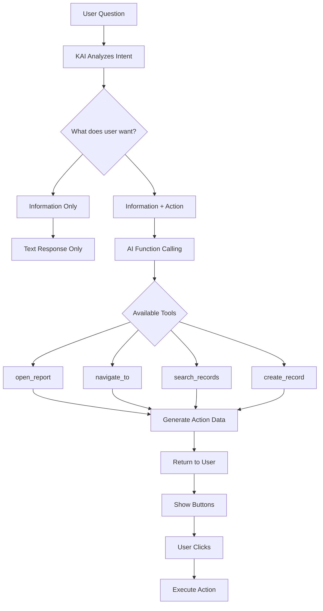

# KAI Intelligent Action Suggestions - How They're Generated

## Overview

KAI uses **AI Function Calling** (OpenAI) or **Tool Use** (Anthropic) to intelligently suggest and generate actions based on user queries.

## How It Works



## 1. Function Calling / Tool Use

### System Prompt with Available Tools

```python
def _build_system_prompt_with_tools(self, conversation):
    """Build system prompt that includes available tools/functions"""
    
    base_prompt = """You are KAI (Kardan AI), an intelligent assistant for Odoo ERP.

You can help users by:
1. Answering questions
2. Navigating to screens/records
3. Opening filtered reports
4. Executing actions (with confirmation)

When users ask for data or reports, you should:
- First provide a summary/answer
- Then suggest relevant actions they can take

Available tools will be provided separately.
"""
    
    return base_prompt


def _get_available_tools(self):
    """Define tools/functions available to AI"""
    
    return [
        {
            "type": "function",
            "function": {
                "name": "open_sales_report",
                "description": "Open sales analysis report with filters. Use when user wants to see sales data, top customers, sales trends, or sales performance.",
                "parameters": {
                    "type": "object",
                    "properties": {
                        "view_type": {
                            "type": "string",
                            "enum": ["pivot", "graph", "tree"],
                            "description": "Type of view to open"
                        },
                        "date_from": {
                            "type": "string",
                            "description": "Start date in YYYY-MM-DD format"
                        },
                        "date_to": {
                            "type": "string",
                            "description": "End date in YYYY-MM-DD format"
                        },
                        "partner_id": {
                            "type": "integer",
                            "description": "Customer ID to filter by"
                        },
                        "user_id": {
                            "type": "integer",
                            "description": "Salesperson ID to filter by"
                        },
                        "group_by": {
                            "type": "array",
                            "items": {"type": "string"},
                            "description": "Fields to group by (e.g., partner_id, user_id, product_id)"
                        },
                        "limit": {
                            "type": "integer",
                            "description": "Number of top results to show"
                        }
                    }
                }
            }
        },
        {
            "type": "function",
            "function": {
                "name": "open_invoice_report",
                "description": "Open invoice report/analysis. Use for invoice-related queries.",
                "parameters": {
                    "type": "object",
                    "properties": {
                        "view_type": {
                            "type": "string",
                            "enum": ["tree", "pivot", "graph"]
                        },
                        "state": {
                            "type": "string",
                            "enum": ["draft", "posted", "cancel"],
                            "description": "Invoice state filter"
                        },
                        "payment_state": {
                            "type": "string",
                            "enum": ["not_paid", "in_payment", "paid", "partial"],
                            "description": "Payment status filter"
                        },
                        "partner_id": {
                            "type": "integer"
                        },
                        "date_from": {
                            "type": "string"
                        },
                        "date_to": {
                            "type": "string"
                        }
                    }
                }
            }
        },
        {
            "type": "function",
            "function": {
                "name": "navigate_to_records",
                "description": "Navigate to a list of records with filters",
                "parameters": {
                    "type": "object",
                    "properties": {
                        "model": {
                            "type": "string",
                            "description": "Odoo model name (e.g., sale.order, purchase.order)"
                        },
                        "domain": {
                            "type": "array",
                            "description": "Odoo domain filter"
                        },
                        "view_mode": {
                            "type": "string",
                            "default": "tree"
                        }
                    },
                    "required": ["model"]
                }
            }
        },
        {
            "type": "function",
            "function": {
                "name": "export_data",
                "description": "Export data to Excel/CSV",
                "parameters": {
                    "type": "object",
                    "properties": {
                        "model": {"type": "string"},
                        "domain": {"type": "array"},
                        "fields": {
                            "type": "array",
                            "items": {"type": "string"}
                        },
                        "format": {
                            "type": "string",
                            "enum": ["xlsx", "csv"]
                        }
                    },
                    "required": ["model"]
                }
            }
        },
        {
            "type": "function",
            "function": {
                "name": "open_pivot_analysis",
                "description": "Create a custom pivot table analysis",
                "parameters": {
                    "type": "object",
                    "properties": {
                        "model": {"type": "string"},
                        "rows": {
                            "type": "array",
                            "items": {"type": "string"},
                            "description": "Fields for rows"
                        },
                        "columns": {
                            "type": "array",
                            "items": {"type": "string"},
                            "description": "Fields for columns"
                        },
                        "measures": {
                            "type": "array",
                            "items": {"type": "string"},
                            "description": "Measure fields to aggregate"
                        },
                        "domain": {"type": "array"}
                    },
                    "required": ["model"]
                }
            }
        }
    ]
```

## 2. AI Query Processing

### Example: "Show me top 5 customers this month"

```python
def generate_response_with_tools(self, user_query, context):
    """Generate response using OpenAI with function calling"""
    
    messages = [
        {
            "role": "system",
            "content": self._build_system_prompt_with_tools(context)
        },
        {
            "role": "user",
            "content": user_query
        }
    ]
    
    # Call OpenAI with tools
    response = openai.ChatCompletion.create(
        model="gpt-4-turbo",
        messages=messages,
        tools=self._get_available_tools(),
        tool_choice="auto",  # Let AI decide when to use tools
    )
    
    message = response.choices[0].message
    
    # Check if AI wants to use tools
    if message.tool_calls:
        # AI suggested using one or more tools!
        return self._process_tool_calls(message, user_query, context)
    else:
        # No tools needed, just text response
        return {
            'content': message.content,
            'actions': []
        }


def _process_tool_calls(self, message, user_query, context):
    """Process AI's tool call suggestions"""
    
    actions = []
    
    for tool_call in message.tool_calls:
        function_name = tool_call.function.name
        function_args = json.loads(tool_call.function.arguments)
        
        # Map function to action
        action = self._create_action_from_tool_call(
            function_name, 
            function_args,
            context
        )
        
        if action:
            actions.append(action)
    
    # Also include the text response
    text_response = message.content or self._generate_summary_from_actions(actions, user_query, context)
    
    return {
        'content': text_response,
        'actions': actions,
        'tool_calls': message.tool_calls  # For reference
    }
```

### What AI Response Looks Like

When user asks: **"Show me top 5 customers this month"**

AI detects this is a sales query and calls:
```json
{
  "tool_calls": [
    {
      "function": {
        "name": "open_sales_report",
        "arguments": {
          "view_type": "pivot",
          "date_from": "2024-12-01",
          "date_to": "2024-12-31",
          "group_by": ["partner_id"],
          "limit": 5
        }
      }
    },
    {
      "function": {
        "name": "export_data",
        "arguments": {
          "model": "sale.order",
          "format": "xlsx"
        }
      }
    }
  ]
}
```

## 3. Action Generation

```python
def _create_action_from_tool_call(self, function_name, args, context):
    """Convert tool call to executable action"""
    
    if function_name == "open_sales_report":
        return {
            'type': 'open_report',
            'icon': 'fa-chart-bar',
            'label': 'Open Sales Analysis',
            'description': self._build_action_description(function_name, args),
            'data': {
                'report': 'sales_analysis',
                'view_type': args.get('view_type', 'pivot'),
                'filters': {
                    'date_from': args.get('date_from'),
                    'date_to': args.get('date_to'),
                    'partner_id': args.get('partner_id'),
                    'user_id': args.get('user_id'),
                },
                'context': {
                    'group_by': args.get('group_by', []),
                    'pivot_measures': ['amount_total', 'qty_delivered'],
                }
            send_reminder
        }
    
    elif function_name == "open_invoice_report":
        return {
            'type': 'open_report',
            'icon': 'fa-file-invoice-dollar',
            'label': 'Open Invoice Report',
            'description': 'View detailed invoices',
            'data': {
                'report': 'invoice_report',
                'filters': args
            }
        }
    
    elif function_name == "export_data":
        return {
            'type': 'export',
            'icon': 'fa-download',
            'label': 'Export to Excel',
            'description': 'Download data as Excel file',
            'data': {
                'model': args.get('model'),
                'format': args.get('format', 'xlsx')
            }
        }
    
    elif function_name == "navigate_to_records":
        return {
            'type': 'navigate',
            'icon': 'fa-external-link',
            'label': f"View {args.get('model', 'Records')}",
            'description': 'Open records in Odoo',
            'data': args
        }
    
    elif function_name == "open_pivot_analysis":
        return {
            'type': 'pivot',
            'icon': 'fa-table',
            'label': 'Create Pivot Table',
            'description': 'Interactive pivot analysis',
            'data': args
        }
    
    return None


def _build_action_description(self, function_name, args):
    """Build human-readable description"""
    
    desc = []
    
    if 'date_from' in args or 'date_to' in args:
        date_range = f"{args.get('date_from', '')} to {args.get('date_to', '')}"
        desc.append(f"Date: {date_range}")
    
    if 'partner_id' in args:
        partner = self.env['res.partner'].browse(args['partner_id'])
        desc.append(f"Customer: {partner.name}")
    
    if 'group_by' in args:
        desc.append(f"Grouped by: {', '.join(args['group_by'])}")
    
    return " | ".join(desc) if desc else "View detailed report"
```

## 4. Complete Example Flow

### User Query:
```
"Show me top 5 customers this month"
```

### AI Processing:

**Step 1**: AI analyzes intent
- User wants: Sales data
- Time period: This month (December 2024)
- Grouping: By customer
- Limit: Top 5

**Step 2**: AI decides to call tools
```json
{
  "tool_calls": [
    {
      "id": "call_1",
      "function": {
        "name": "open_sales_report",
        "arguments": {
          "view_type": "pivot",
          "date_from": "2024-12-01",
          "date_to": "2024-12-31",
          "group_by": ["partner_id"],
          "limit": 5
        }
      }
    }
  ],
  "content": "I'll show you the top 5 customers for December 2024..."
}
```

**Step 3**: KAI queries actual data
```python
# Execute search to get actual data for summary
domain = [
    ('date_order', '>=', '2024-12-01'),
    ('date_order', '<=', '2024-12-31'),
    ('state', 'in', ['sale', 'done'])
]

orders = self.env['sale.order'].read_group(
    domain=domain,
    fields=['partner_id', 'amount_total:sum'],
    groupby=['partner_id'],
    orderby='amount_total desc',
    limit=5
)
```

**Step 4**: Build response with actions
```python
response = {
    'content': f"""Here are your top customers for December 2024:

1. Acme Corp - ${orders[0]['amount_total']:,.0f} (15 orders)
2. Tech Solutions - ${orders[1]['amount_total']:,.0f} (8 orders) 
3. Global Trading - ${orders[2]['amount_total']:,.0f} (12 orders)
4. Digital Plus - ${orders[3]['amount_total']:,.0f} (7 orders)
5. Metro Services - ${orders[4]['amount_total']:,.0f} (9 orders)

**What would you like to do?**""",
    
    'actions': [
        {
            'id': 'action_1',
            'type': 'open_report',
            'icon': 'fa-chart-bar',
            'label': 'Open Sales Analysis',
            'description': 'Pivot view with detailed breakdown',
            'data': {
                'report': 'sales_analysis',
                'view_type': 'pivot',
                'filters': {
                    'date_from': '2024-12-01',
                    'date_to': '2024-12-31',
                },
                'context': {
                    'pivot_row_groupby': ['partner_id'],
                    'pivot_measures': ['amount_total'],
                }
            }
        },
        {
            'id': 'action_2',
            'type': 'open_report',
            'icon': 'fa-chart-line',
            'label': 'View Trend Graph',
            'description': 'Sales trend over time',
            'data': {
                'report': 'sales_analysis',
                'view_type': 'graph',
                'filters': {
                    'date_from': '2024-12-01',
                    'date_to': '2024-12-31',
                },
                'context': {
                    'graph_groupbys': ['date_order:day'],
                }
            }
        },
        {
            'id': 'action_3',
            'type': 'export',
            'icon': 'fa-download',
            'label': 'Export to Excel',
            'description': 'Download customer sales data',
            'data': {
                'model': 'sale.order',
                'domain': domain,
                'fields': ['partner_id', 'name', 'date_order', 'amount_total'],
                'format': 'xlsx'
            }
        }
    ]
}
```

**Step 5**: Frontend displays with buttons

```
┌────────────────────────────────────────────┐
│ 🤖 KAI                                     │
├────────────────────────────────────────────┤
│ Here are your top customers for Dec 2024:  │
│                                             │
│ 1. Acme Corp - $125,000 (15 orders)        │
│ 2. Tech Solutions - $89,500 (8 orders)     │
│ 3. Global Trading - $67,200 (12 orders)    │
│ 4. Digital Plus - $45,300 (7 orders)       │
│ 5. Metro Services - $38,900 (9 orders)     │
│                                             │
│ **What would you like to do?**             │
│                                             │
│ ┌──────────────────────────────────────┐  │
│ │ 📊 Open Sales Analysis               │  │
│ │ Pivot view with detailed breakdown   │  │
│ └──────────────────────────────────────┘  │
│                                             │
│ ┌──────────────────────────────────────┐  │
│ │ 📈 View Trend Graph                  │  │
│ │ Sales trend over time                │  │
│ └──────────────────────────────────────┘  │
│                                             │
│ ┌──────────────────────────────────────┐  │
│ │ 💾 Export to Excel                   │  │
│ │ Download customer sales data         │  │
│ └──────────────────────────────────────┘  │
└────────────────────────────────────────────┘
```

## 5. Multiple Suggestions for Different Contexts

### Context-Aware Suggestions

```python
def _get_contextual_actions(self, query, context):
    """Generate actions based on context"""
    
    actions = []
    
    # On sale order form
    if context.get('model') == 'sale.order':
        if 'invoice' in query.lower():
            actions.extend([
                {'label': 'Create Invoice', 'type': 'create_invoice'},
                {'label': 'View Invoices', 'type': 'view_invoices'},
            ])
        
        if 'delivery' in query.lower() or 'ship' in query.lower():
            actions.extend([
                {'label': 'View Deliveries', 'type': 'view_deliveries'},
                {'label': 'Check Stock', 'type': 'check_stock'},
            ])
    
    # On partner form
    elif context.get('model') == 'res.partner':
        if 'sales' in query.lower() or 'orders' in query.lower():
            actions.extend([
                {'label': 'View Sales Orders', 'type': 'view_partner_sales'},
                {'label': 'Sales Analytics', 'type': 'partner_sales_analysis'},
            ])
        
        if 'invoice' in query.lower() or 'payment' in query.lower():
            actions.extend([
                {'label': 'View Invoices', 'type': 'view_partner_invoices'},
                {'label': 'Payment History', 'type': 'payment_history'},
            ])
    
    return actions
```

## 6. Learning from Usage

```python
def _track_action_usage(self, action_id, was_helpful):
    """Track which actions users actually use"""
    
    # Store feedback
    self.env['ak_ai.action.feedback'].create({
        'action_id': action_id,
        'user_id': self.env.user.id,
        'was_used': True,
        'was_helpful': was_helpful,
    })
    
    # Over time, prioritize frequently used actions
```

## Summary

### How Suggestions Are Generated:

1. **AI Understanding**: GPT-4/Claude analyzes user query
2. **Function Calling**: AI automatically calls relevant tools
3. **Data Fetching**: System queries actual Odoo data
4. **Action Building**: Converts tool calls to executable actions
5. **Smart Display**: Shows relevant, clickable action buttons
6. **Execution**: User clicks → action executes

### Key Technologies:

- **OpenAI Function Calling**: AI chooses which tools to use
- **Anthropic Tool Use**: Similar capability
- **Dynamic Context**: Actions change based on current screen
- **Learning System**: Improves suggestions over time

This makes KAI truly intelligent - it doesn't just chat, it **understands intent** and **suggests relevant actions**!
