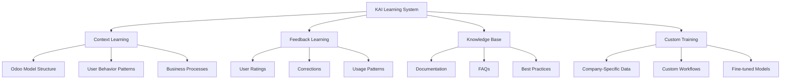

# KAI Learning Strategy - How KAI Learns

## Learning Approaches for KAI



## 1. Context Learning (Real-time)

### 1.1 Odoo Metadata Learning

KAI automatically learns from Odoo's structure:

```python
class AkAiKnowledgeBuilder(models.Model):
    _name = 'ak_ai.knowledge.builder'
    _description = 'KAI Knowledge Builder'
    
    def build_odoo_knowledge(self):
        """Build comprehensive knowledge from Odoo metadata"""
        knowledge = {
            # Core Structure
            'models': self._learn_models(),
            'fields': self._learn_fields(),
            'views': self._learn_views(),
            'workflows': self._learn_workflows(),
            'menus': self._learn_menus(),
            
            # Security & Access
            'users': self._learn_users(),
            'groups': self._learn_groups(),
            'permissions': self._learn_permissions(),
            'record_rules': self._learn_record_rules(),
            
            # Organization
            'companies': self._learn_companies(),
            'teams': self._learn_teams(),
            'departments': self._learn_departments(),
            
            # Configuration
            'settings': self._learn_settings(),
            'parameters': self._learn_system_parameters(),
            
            # Business Data
            'partners': self._learn_partners(),
            'products': self._learn_products(),
            'currencies': self._learn_currencies(),
            'languages': self._learn_languages(),
            
            # Integrations
            'external_apis': self._learn_external_apis(),
            'webhooks': self._learn_webhooks(),
            'cron_jobs': self._learn_cron_jobs(),
            
            # Custom Modules
            'installed_modules': self._learn_installed_modules(),
            'custom_modules': self._learn_custom_modules(),
        }
        
        return knowledge
    
    def _learn_models(self):
        """Learn about all models in the system"""
        models_info = {}
        
        for model_name in self.env.registry models():
            try:
                model = self.env[model_name]
                
                # Skip internal models
                if model_name.startswith('_'):
                    continue
                
                models_info[model_name] = {
                    'name': model_name,
                    'description': model._description,
                    'table': model._table if hasattr(model, '_table') else None,
                    'fields': list(model._fields.keys()),
                    'inherits': model._inherits if hasattr(model, '_inherits') else {},
                    'is_transient': model._transient,
                }
            except:
                continue
        
        return models_info
    
    def _learn_fields(self):
        """Learn about fields and their purposes"""
        field_info = {}
        
        for model_name in self.env.registry.models():
            try:
                model = self.env[model_name]
                if model_name.startswith('_'):
                    continue
                
                for fname, field in model._fields.items():
                    field_key = f"{model_name}.{fname}"
                    field_info[field_key] = {
                        'model': model_name,
                        'name': fname,
                        'type': field.type,
                        'string': field.string,
                        'help': field.help or '',
                        'required': field.required,
                        'readonly': field.readonly,
                        'related': field.related if hasattr(field, 'related') else None,
                    }
            except:
                continue
        
        return field_info
    
    def _learn_workflows(self):
        """Learn state transitions and workflows"""
        workflows = {}
        
        # Find models with state fields
        for model_name in self.env.registry.models():
            try:
                model = self.env[model_name]
                if 'state' in model._fields:
                    field = model._fields['state']
                    if field.type == 'selection':
                        workflows[model_name] = {
                            'states': dict(field.selection),
                            'default': field.default,
                        }
            except:
                continue
        
        return workflows
```

### 1.2 User Behavior Learning

Track how users interact with the system:

```python
class AkAiUserBehavior(models.Model):
    _name = 'ak_ai.user.behavior'
    _description = 'KAI User Behavior Tracking'
    
    user_id = fields.Many2one('res.users', 'User', required=True, index=True)
    model_name = fields.Char('Model', index=True)
    action_type = fields.Selection([
        ('view', 'Viewed'),
        ('create', 'Created'),
        ('edit', 'Edited'),
        ('delete', 'Deleted'),
        ('search', 'Searched'),
    ], 'Action Type')
    
    frequency = fields.Integer('Frequency')
    last_access = fields.Datetime('Last Access')
    
    @api.model
    def track_action(self, model_name, action_type):
        """Track user action"""
        record = self.search([
            ('user_id', '=', self.env.user.id),
            ('model_name', '=', model_name),
            ('action_type', '=', action_type)
        ], limit=1)
        
        if record:
            record.write({
                'frequency': record.frequency + 1,
                'last_access': fields.Datetime.now()
            })
        else:
            self.create({
                'user_id': self.env.user.id,
                'model_name': model_name,
                'action_type': action_type,
                'frequency': 1,
                'last_access': fields.Datetime.now()
            })
    
    def get_user_patterns(self, user_id):
        """Get user's most common actions"""
        behaviors = self.search([
            ('user_id', '=', user_id)
        ], order='frequency desc', limit=20)
        
        return [{
            'model': b.model_name,
            'action': b.action_type,
            'frequency': b.frequency
        } for b in behaviors]
```

## 2. Feedback Learning

### 2.1 Message Rating System

```python
class AkAiMessage(models.Model):
    _inherit = 'ak_ai.message'
    
    # User feedback
    rating = fields.Selection([
        ('helpful', '👍 Helpful'),
        ('not_helpful', '👎 Not Helpful'),
        ('incorrect', '❌ Incorrect'),
    ], 'User Rating')
    
    rating_comment = fields.Text('Rating Comment')
    corrected_response = fields.Text('Corrected Response')
    was_executed = fields.Boolean('Action Was Executed')
    execution_success = fields.Boolean('Execution Successful')
    
    def action_rate_helpful(self):
        """User found this helpful"""
        self.write({'rating': 'helpful'})
        self._learn_from_positive_feedback()
    
    def action_rate_not_helpful(self):
        """User didn't find this helpful"""
        return {
            'type': 'ir.actions.act_window',
            'name': 'Why wasn\'t this helpful?',
            'res_model': 'ak_ai.feedback.wizard',
            'view_mode': 'form',
            'target': 'new',
            'context': {'default_message_id': self.id}
        }
    
    def _learn_from_positive_feedback(self):
        """Store successful patterns"""
        # Store this as a positive example
        self.env['ak_ai.learning.example'].create({
            'message_id': self.id,
            'conversation_id': self.conversation_id.id,
            'user_prompt': self._get_user_prompt(),
            'ai_response': self.content,
            'context': self.conversation_id.context_data,
            'rating': 'positive',
            'used_for_training': False
        })
    
    def _learn_from_negative_feedback(self, comment, correction=None):
        """Store failed patterns"""
        self.env['ak_ai.learning.example'].create({
            'message_id': self.id,
            'conversation_id': self.conversation_id.id,
            'user_prompt': self._get_user_prompt(),
            'ai_response': self.content,
            'corrected_response': correction,
            'feedback_comment': comment,
            'context': self.conversation_id.context_data,
            'rating': 'negative',
            'used_for_training': False
        })
```

### 2.2 Learning Examples Database

```python
class AkAiLearningExample(models.Model):
    _name = 'ak_ai.learning.example'
    _description = 'KAI Learning Examples'
    _order = 'create_date desc'
    
    message_id = fields.Many2one('ak_ai.message', 'Original Message')
    conversation_id = fields.Many2one('ak_ai.conversation', 'Conversation')
    
    # The learning example
    user_prompt = fields.Text('User Prompt', required=True)
    ai_response = fields.Text('AI Response', required=True)
    corrected_response = fields.Text('Corrected Response')
    
    # Context
    context_model = fields.Char('Context Model')
    context_data = fields.Text('Context Data (JSON)')
    
    # Rating
    rating = fields.Selection([
        ('positive', 'Positive'),
        ('negative', 'Negative'),
        ('neutral', 'Neutral')
    ], 'Rating', required=True)
    
    feedback_comment = fields.Text('Feedback Comment')
    
    # Learning metadata
    category = fields.Selection([
        ('help', 'Help & Guidance'),
        ('search', 'Search & Find'),
        ('create', 'Create Records'),
        ('update', 'Update Records'),
        ('analysis', 'Data Analysis'),
        ('navigate', 'Navigation'),
        ('workflow', 'Workflow'),
    ], 'Category')
    
    tags = fields.Char('Tags (comma-separated)')
    used_for_training = fields.Boolean('Used for Training')
    training_date = fields.Datetime('Training Date')
    
    def action_use_for_training(self):
        """Mark as training data"""
        self.write({
            'used_for_training': True,
            'training_date': fields.Datetime.now()
        })
```

## 3. Knowledge Base System

### 3.1 Company-Specific Knowledge

```python
class AkAiKnowledgeArticle(models.Model):
    _name = 'ak_ai.knowledge.article'
    _description = 'KAI Knowledge Article'
    _inherit = ['mail.thread', 'mail.activity.mixin']
    
    name = fields.Char('Title', required=True, tracking=True)
    content = fields.Html('Content', required=True, tracking=True)
    
    category = fields.Selection([
        ('process', 'Business Process'),
        ('policy', 'Company Policy'),
        ('tutorial', 'Tutorial'),
        ('faq', 'FAQ'),
        ('best_practice', 'Best Practice'),
    ], 'Category', required=True, tracking=True)
    
    model_ids = fields.Many2many('ir.model', string='Related Models')
    keywords = fields.Char('Keywords (comma-separated)')
    
    active = fields.Boolean('Active', default=True)
    priority = fields.Integer('Priority', default=10)
    
    # Usage tracking
    view_count = fields.Integer('View Count', default=0)
    helpful_count = fields.Integer('Helpful Count', default=0)
    
    def search_knowledge(self, query, model_name=None, limit=5):
        """Search knowledge base"""
        domain = [('active', '=', True)]
        
        # Add model filter if provided
        if model_name:
            model_id = self.env['ir.model'].search([('model', '=', model_name)], limit=1)
            if model_id:
                domain.append(('model_ids', 'in', model_id.ids))
        
        # Simple keyword search (can be enhanced with vector search)
        articles = self.search(domain, order='priority desc, helpful_count desc')
        
        # Score and rank articles
        scored_articles = []
        query_lower = query.lower()
        
        for article in articles:
            score = 0
            
            # Title match
            if query_lower in article.name.lower():
                score += 10
            
            # Keyword match
            if article.keywords:
                keywords = [k.strip().lower() for k in article.keywords.split(',')]
                for keyword in keywords:
                    if keyword in query_lower or query_lower in keyword:
                        score += 5
            
            # Content match (simplified)
            if query_lower in (article.content or '').lower():
                score += 3
            
            # Priority boost
            score += article.priority
            
            if score > 0:
                scored_articles.append((article, score))
        
        # Sort by score
        scored_articles.sort(key=lambda x: x[1], reverse=True)
        
        return [article for article, score in scored_articles[:limit]]
```

### 3.2 Auto-Generate Knowledge from Conversations

```python
def _generate_knowledge_from_conversations(self):
    """Auto-generate knowledge articles from successful conversations"""
    
    # Find highly-rated conversations
    examples = self.env['ak_ai.learning.example'].search([
        ('rating', '=', 'positive'),
        ('used_for_training', '=', False),
    ], limit=100)
    
    # Group by similarity (simplified - could use embeddings)
    grouped = {}
    for example in examples:
        key = (example.category, example.context_model)
        if key not in grouped:
            grouped[key] = []
        grouped[key].append(example)
    
    # Create knowledge articles for frequent patterns
    for (category, model), examples_list in grouped.items():
        if len(examples_list) >= 5:  # Threshold
            # Create article
            self.env['ak_ai.knowledge.article'].create({
                'name': f'Common {category} questions for {model}',
                'content': self._format_examples_as_article(examples_list),
                'category': 'faq',
                'keywords': category,
            })
            
            # Mark as used
            for ex in examples_list:
                ex.write({'used_for_training': True})
```

## 4. Custom Training & Fine-tuning

### 4.1 Prompt Engineering with Context

```python
class AkAiPromptTemplate(models.Model):
    _inherit = 'ak_ai.prompt.template'
    
    learning_examples = fields.Many2many('ak_ai.learning.example', 'Learning Examples')
    
    def enhance_with_examples(self):
        """Add few-shot learning examples to prompt"""
        if not self.learning_examples:
            return self.template
        
        examples_text = "\n\nHere are some examples of good responses:\n\n"
        
        for idx, example in enumerate(self.learning_examples[:3], 1):
            examples_text += f"Example {idx}:\n"
            examples_text += f"User: {example.user_prompt}\n"
            examples_text += f"Assistant: {example.ai_response}\n\n"
        
        return self.template + examples_text
```

### 4.2 RAG (Retrieval Augmented Generation)

```python
class AkAiRag(models.AbstractModel):
    _name = 'ak_ai.rag'
    _description = 'Retrieval Augmented Generation'
    
    def enhance_prompt_with_knowledge(self, user_query, context=None):
        """Enhance prompt with relevant knowledge"""
        
        # 1. Search knowledge base
        knowledge_articles = self.env['ak_ai.knowledge.article'].search_knowledge(
            user_query,
            model_name=context.get('model') if context else None
        )
        
        # 2. Find similar past conversations
        similar_examples = self._find_similar_conversations(user_query, context)
        
        # 3. Get Odoo documentation relevant snippets
        odoo_docs = self._search_odoo_docs(user_query, context)
        
        # 4. Build enhanced context
        enhanced_context = {
            'original_query': user_query,
            'knowledge_articles': [
                {'title': art.name, 'content': art.content[:500]}
                for art in knowledge_articles
            ],
            'similar_examples': [
                {'question': ex.user_prompt, 'answer': ex.ai_response}
                for ex in similar_examples
            ],
            'odoo_docs': odoo_docs,
            'current_context': context
        }
        
        return enhanced_context
    
    def _find_similar_conversations(self, query, context, limit=3):
        """Find similar past conversations"""
        # Simple version - can be enhanced with embeddings
        examples = self.env['ak_ai.learning.example'].search([
            ('rating', '=', 'positive')
        ], order='create_date desc', limit=100)
        
        # Score by keyword overlap (simplified)
        query_words = set(query.lower().split())
        scored = []
        
        for ex in examples:
            prompt_words = set(ex.user_prompt.lower().split())
            overlap = len(query_words & prompt_words)
            if overlap > 0:
                scored.append((ex, overlap))
        
        scored.sort(key=lambda x: x[1], reverse=True)
        return [ex for ex, score in scored[:limit]]
```

## 5. Continuous Improvement System

### 5.1 Automated Learning Pipeline

```python
class AkAiLearningPipeline(models.Model):
    _name = 'ak_ai.learning.pipeline'
    _description = 'KAI Learning Pipeline'
    
    @api.model
    def _cron_process_feedback(self):
        """Daily job to process feedback and learn"""
        
        # 1. Analyze ratings
        self._analyze_ratings()
        
        # 2. Identify patterns
        self._identify_patterns()
        
        # 3. Update knowledge base
        self._update_knowledge_base()
        
        # 4. Optimize prompts
        self._optimize_prompts()
        
        # 5. Generate report
        self._generate_learning_report()
    
    def _analyze_ratings(self):
        """Analyze message ratings"""
        yesterday = fields.Date.today() - timedelta(days=1)
        
        messages = self.env['ak_ai.message'].search([
            ('create_date', '>=', yesterday),
            ('role', '=', 'assistant')
        ])
        
        stats = {
            'total': len(messages),
            'helpful': len(messages.filtered(lambda m: m.rating == 'helpful')),
            'not_helpful': len(messages.filtered(lambda m: m.rating == 'not_helpful')),
            'no_rating': len(messages.filtered(lambda m: not m.rating)),
        }
        
        # Store stats
        self.env['ak_ai.daily.stats'].create({
            'date': yesterday,
            'messages_count': stats['total'],
            'helpful_count': stats['helpful'],
            'not_helpful_count': stats['not_helpful'],
            'no_rating_count': stats['no_rating'],
            'helpfulness_rate': (stats['helpful'] / stats['total'] * 100) if stats['total'] > 0 else 0
        })
    
    def _identify_patterns(self):
        """Identify common questions and issues"""
        # Find frequently asked questions without good answers
        negative_examples = self.env['ak_ai.learning.example'].search([
            ('rating', '=', 'negative'),
            ('used_for_training', '=', False)
        ])
        
        # Group by similarity
        pattern_groups = {}
        for ex in negative_examples:
            # Simple grouping by context_model
            key = (ex.category, ex.context_model)
            if key not in pattern_groups:
                pattern_groups[key] = []
            pattern_groups[key].append(ex)
        
        # Create improvement tasks for patterns
        for key, examples in pattern_groups.items():
            if len(examples) >= 3:  # Threshold
                self._create_improvement_task(key, examples)
    
    def _create_improvement_task(self, pattern_key, examples):
        """Create task for KAI manager to improve responses"""
        category, model = pattern_key
        
        activity = self.env['mail.activity'].create({
            'res_model': 'ak_ai.knowledge.article',
            'res_id': 0,  # New article
            'activity_type_id': self.env.ref('mail.mail_activity_data_todo').id,
            'summary': f'Improve KAI responses for {model} - {category}',
            'note': f"""
                KAI needs improvement in this area:
                
                Category: {category}
                Model: {model}
                Failed attempts: {len(examples)}
                
                Common questions:
                {chr(10).join([f"- {ex.user_prompt[:100]}" for ex in examples[:5]])}
                
                Please create a knowledge article or update prompts to handle these cases better.
            """,
            'user_id': self.env.ref('ak_ai.group_kai_manager').users[0].id if self.env.ref('ak_ai.group_kai_manager').users else self.env.user.id
        })
```

### 5.2 A/B Testing for Prompts

```python
class AkAiPromptVersion(models.Model):
    _name = 'ak_ai.prompt.version'
    _description = 'Prompt A/B Testing'
    
    template_id = fields.Many2one('ak_ai.prompt.template', 'Template')
    version_name = fields.Char('Version Name', required=True)
    prompt_content = fields.Text('Prompt Content', required=True)
    
    is_active = fields.Boolean('Active', default=True)
    is_default = fields.Boolean('Default Version')
    
    # Stats
    usage_count = fields.Integer('Times Used')
    helpful_count = fields.Integer('Helpful Ratings')
    not_helpful_count = fields.Integer('Not Helpful Ratings')
    avg_rating = fields.Float('Average Rating', compute='_compute_avg_rating')
    
    @api.depends('helpful_count', 'not_helpful_count')
    def _compute_avg_rating(self):
        for record in self:
            total = record.helpful_count + record.not_helpful_count
            if total > 0:
                record.avg_rating = (record.helpful_count / total) * 5.0
            else:
                record.avg_rating = 0.0
```

## 6. Export Training Data

```python
def export_training_data(self, format='jsonl'):
    """Export training data for fine-tuning"""
    examples = self.env['ak_ai.learning.example'].search([
        ('rating', '=', 'positive'),
        ('used_for_training', '=', True)
    ])
    
    if format == 'jsonl':
        data = []
        for ex in examples:
            data.append({
                'messages': [
                    {'role': 'system', 'content': 'You are KAI, Odoo assistant.'},
                    {'role': 'user', 'content': ex.user_prompt},
                    {'role': 'assistant', 'content': ex.ai_response}
                ]
            })
        return data
```

## Summary: How KAI Learns

1. **Automatic Context Learning**: Learns Odoo structure, models, fields, workflows
2. **User Feedback**: Learns from thumbs up/down, corrections, comments
3. **Behavior Tracking**: Understands user patterns and preferences
4. **Knowledge Base**: Company-specific articles, FAQs, best practices
5. **RAG**: Retrieves relevant knowledge to enhance responses
6. **Continuous Improvement**: Daily analysis, pattern detection, A/B testing
7. **Fine-tuning Ready**: Export data for custom model training

This creates a continuously improving AI that gets smarter over time!
