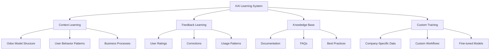

# KAI Learning Strategy - How KAI Learns

## Learning Approaches for KAI

## 1. Context Learning (Real-time)

### 1.1 Odoo Metadata Learning
✅ **Status: Implemented**
KAI automatically learns from Odoo's structure:
- Models, fields, and views
- Security and access rules
- Workflows and state transitions

### 1.2 User Behavior Learning
[ ] **Status: Planned**
Track how users interact with the system to provide more relevant suggestions.

## 2. Feedback Learning

### 2.1 Message Rating System
✅ **Status: Implemented**
Users can rate responses as helpful or not helpful, providing direct feedback to the system.

### 2.2 Learning Examples Database
✅ **Status: Implemented**
Successful and failed patterns are stored to improve future responses.

## 3. Knowledge Base System

### 3.1 Company-Specific Knowledge
✅ **Status: Implemented**
Admins can create articles and FAQs specific to their company's processes.

### 3.2 Auto-Generate Knowledge from Conversations
[ ] **Status: Planned**
Automatically create knowledge articles from highly-rated conversations.

## 4. Custom Training & Fine-tuning

### 4.1 Prompt Engineering with Context
✅ **Status: Implemented**
Dynamic prompt generation based on current record context and user permissions.

### 4.2 RAG (Retrieval Augmented Generation)
[ ] **Status: Planned**
Enhance prompts with relevant snippets from the knowledge base and Odoo documentation.
