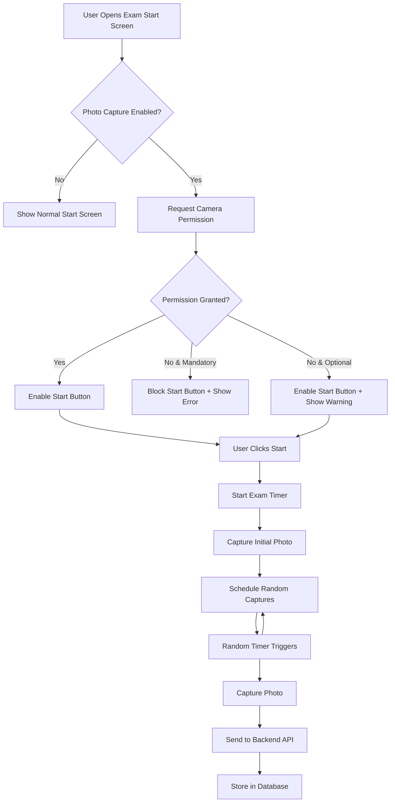
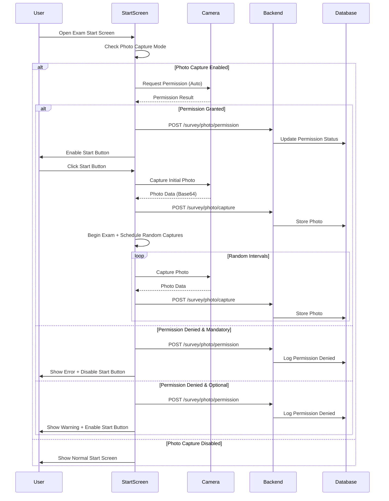

# Ak_Exams Random Photo Capture Feature - Implementation Plan

## Overview
This plan outlines the implementation of a random photo capture feature for the ak_exams module. The system will capture photos of exam participants at random intervals during the exam to ensure exam integrity and prevent cheating.

## Requirements Summary

### Functional Requirements
1. **Camera Permission Request**: Request camera access on exam start screen (before clicking "Start" button)
2. **Permission Validation**: Validate camera permission before allowing exam to start
3. **Initial Photo**: Capture photo immediately when exam starts (after clicking "Start")
4. **Random Photos**: Capture photos at random intervals during the exam
5. **Storage**: Store photos in Odoo database as binary fields linked to survey user input
6. **Configuration**: Make camera requirement configurable per survey (disabled/optional/mandatory)
7. **Access Control**: Only authorized users (exam administrators) can view captured photos

### Non-Functional Requirements
1. **Privacy**: Comply with data protection regulations (GDPR, KVKK)
2. **Performance**: Minimize impact on exam performance
3. **Browser Compatibility**: Support modern browsers (Chrome, Firefox, Safari, Edge)
4. **Security**: Encrypt photos, secure API endpoints
5. **User Experience**: Non-intrusive capture process

## Technical Architecture

### System Components



### Data Flow



## Database Schema Design

### New Model: survey.user_input.photo

```python
class SurveyUserInputPhoto(models.Model):
    _name = 'survey.user_input.photo'
    _description = 'Survey User Input Photo Capture'
    _order = 'capture_datetime desc'
    
    # Relations
    user_input_id = fields.Many2one(
        'survey.user_input',
        string='Survey User Input',
        required=True,
        ondelete='cascade',
        index=True
    )
    
    # Photo Data
    photo = fields.Binary(
        string='Photo',
        required=True,
        attachment=True  # Store in ir.attachment for better performance
    )
    photo_filename = fields.Char(
        string='Filename',
        compute='_compute_photo_filename',
        store=True
    )
    
    # Metadata
    capture_datetime = fields.Datetime(
        string='Capture Date/Time',
        required=True,
        default=fields.Datetime.now,
        index=True
    )
    capture_type = fields.Selection([
        ('initial', 'Initial Capture'),
        ('random', 'Random Capture'),
        ('manual', 'Manual Capture')
    ], string='Capture Type', required=True, default='random')
    
    # Technical Info
    browser_info = fields.Char(string='Browser Info')
    ip_address = fields.Char(string='IP Address')
    capture_success = fields.Boolean(string='Capture Success', default=True)
    error_message = fields.Text(string='Error Message')
    
    # Security
    company_id = fields.Many2one(
        'res.company',
        string='Company',
        related='user_input_id.survey_id.company_id',
        store=True,
        index=True
    )
    
    @api.depends('user_input_id', 'capture_datetime')
    def _compute_photo_filename(self):
        for record in self:
            if record.user_input_id and record.capture_datetime:
                timestamp = record.capture_datetime.strftime('%Y%m%d_%H%M%S')
                record.photo_filename = f"exam_photo_{record.user_input_id.id}_{timestamp}.jpg"
            else:
                record.photo_filename = "exam_photo.jpg"
```

### Extension: survey.survey

```python
class SurveySurvey(models.Model):
    _inherit = 'survey.survey'
    
    # Photo Capture Settings
    photo_capture_mode = fields.Selection([
        ('disabled', 'Disabled'),
        ('optional', 'Optional'),
        ('mandatory', 'Mandatory')
    ], string='Photo Capture Mode',
       default='disabled',
       help='Photo capture mode:\n'
            '- Disabled: No photo capture\n'
            '- Optional: Camera permission requested but not required to start exam\n'
            '- Mandatory: Camera permission required to start exam')
    
    photo_capture_min_interval = fields.Integer(
        string='Minimum Interval (seconds)',
        default=120,  # 2 minutes
        help='Minimum time between random photo captures'
    )
    photo_capture_max_interval = fields.Integer(
        string='Maximum Interval (seconds)',
        default=600,  # 10 minutes
        help='Maximum time between random photo captures'
    )
    photo_capture_initial = fields.Boolean(
        string='Capture Initial Photo',
        default=True,
        help='Capture photo when exam starts'
    )
```

### Extension: survey.user_input

```python
class SurveyUserInput(models.Model):
    _inherit = 'survey.user_input'
    
    # Photo Capture Relations
    photo_ids = fields.One2many(
        'survey.user_input.photo',
        'user_input_id',
        string='Captured Photos'
    )
    photo_count = fields.Integer(
        string='Photo Count',
        compute='_compute_photo_count',
        store=True
    )
    camera_permission_granted = fields.Boolean(
        string='Camera Permission Granted',
        default=False
    )
    camera_permission_datetime = fields.Datetime(
        string='Camera Permission Date/Time'
    )
    
    @api.depends('photo_ids')
    def _compute_photo_count(self):
        for record in self:
            record.photo_count = len(record.photo_ids)
```

## Backend API Design

### New Controller: survey_photo_controller.py

```python
from odoo import http
from odoo.http import request
import base64
import logging

_logger = logging.getLogger(__name__)

class SurveyPhotoController(http.Controller):
    
    @http.route('/survey/photo/capture', type='json', auth='public', website=True, csrf=False)
    def capture_photo(self, access_token, photo_data, capture_type='random', **kwargs):
        """
        Capture and store exam photo
        
        Args:
            access_token: Survey user input access token
            photo_data: Base64 encoded photo data
            capture_type: Type of capture (initial/random/manual)
            
        Returns:
            dict: Success status and photo ID
        """
        try:
            # Find user input
            user_input = request.env['survey.user_input'].sudo().search([
                ('access_token', '=', access_token)
            ], limit=1)
            
            if not user_input:
                return {
                    'success': False,
                    'error': 'Invalid access token'
                }
            
            # Check if photo capture is enabled
            if not user_input.survey_id.enable_photo_capture:
                return {
                    'success': False,
                    'error': 'Photo capture not enabled for this survey'
                }
            
            # Validate photo data
            if not photo_data or not photo_data.startswith('data:image'):
                return {
                    'success': False,
                    'error': 'Invalid photo data'
                }
            
            # Extract base64 data (remove data:image/jpeg;base64, prefix)
            photo_base64 = photo_data.split(',')[1] if ',' in photo_data else photo_data
            
            # Get request metadata
            browser_info = request.httprequest.headers.get('User-Agent', '')
            ip_address = request.httprequest.remote_addr
            
            # Create photo record
            photo = request.env['survey.user_input.photo'].sudo().create({
                'user_input_id': user_input.id,
                'photo': photo_base64,
                'capture_type': capture_type,
                'browser_info': browser_info,
                'ip_address': ip_address,
                'capture_success': True
            })
            
            _logger.info(f"Photo captured for user_input {user_input.id}, photo_id: {photo.id}")
            
            return {
                'success': True,
                'photo_id': photo.id,
                'message': 'Photo captured successfully'
            }
            
        except Exception as e:
            _logger.error(f"Error capturing photo: {str(e)}")
            return {
                'success': False,
                'error': str(e)
            }
    
    @http.route('/survey/photo/permission', type='json', auth='public', website=True, csrf=False)
    def update_camera_permission(self, access_token, permission_granted, **kwargs):
        """
        Update camera permission status
        
        Args:
            access_token: Survey user input access token
            permission_granted: Boolean indicating if permission was granted
            
        Returns:
            dict: Success status
        """
        try:
            user_input = request.env['survey.user_input'].sudo().search([
                ('access_token', '=', access_token)
            ], limit=1)
            
            if not user_input:
                return {
                    'success': False,
                    'error': 'Invalid access token'
                }
            
            user_input.sudo().write({
                'camera_permission_granted': permission_granted,
                'camera_permission_datetime': fields.Datetime.now()
            })
            
            return {
                'success': True,
                'message': 'Permission status updated'
            }
            
        except Exception as e:
            _logger.error(f"Error updating camera permission: {str(e)}")
            return {
                'success': False,
                'error': str(e)
            }
```

## Frontend Implementation

### JavaScript Module: survey_photo_capture.js

```javascript
/** @odoo-module **/

class SurveyPhotoCapture {
    constructor(accessToken, config) {
        this.accessToken = accessToken;
        this.config = {
            enabled: config.enabled || false,
            mandatory: config.mandatory || false,
            minInterval: config.minInterval || 120000, // 2 minutes in ms
            maxInterval: config.maxInterval || 600000, // 10 minutes in ms
            captureInitial: config.captureInitial || true
        };
        this.stream = null;
        this.videoElement = null;
        this.captureTimer = null;
        this.permissionGranted = false;
    }
    
    /**
     * Request camera permission
     */
    async requestCameraPermission() {
        try {
            console.log('Requesting camera permission...');
            
            this.stream = await navigator.mediaDevices.getUserMedia({
                video: {
                    width: { ideal: 1280 },
                    height: { ideal: 720 },
                    facingMode: 'user'
                },
                audio: false
            });
            
            this.permissionGranted = true;
            console.log('Camera permission granted');
            
            // Update permission status on server
            await this.updatePermissionStatus(true);
            
            return true;
            
        } catch (error) {
            console.error('Camera permission denied:', error);
            this.permissionGranted = false;
            
            // Update permission status on server
            await this.updatePermissionStatus(false);
            
            if (this.config.mandatory) {
                this.showPermissionDeniedModal();
            }
            
            return false;
        }
    }
    
    /**
     * Update camera permission status on server
     */
    async updatePermissionStatus(granted) {
        try {
            const response = await fetch('/survey/photo/permission', {
                method: 'POST',
                headers: {
                    'Content-Type': 'application/json',
                },
                body: JSON.stringify({
                    jsonrpc: '2.0',
                    method: 'call',
                    params: {
                        access_token: this.accessToken,
                        permission_granted: granted
                    }
                })
            });
            
            const data = await response.json();
            console.log('Permission status updated:', data);
            
        } catch (error) {
            console.error('Error updating permission status:', error);
        }
    }
    
    /**
     * Capture photo from camera
     */
    async capturePhoto(captureType = 'random') {
        if (!this.permissionGranted || !this.stream) {
            console.warn('Cannot capture photo: permission not granted or stream not available');
            return null;
        }
        
        try {
            // Create hidden video element if not exists
            if (!this.videoElement) {
                this.videoElement = document.createElement('video');
                this.videoElement.style.display = 'none';
                this.videoElement.autoplay = true;
                this.videoElement.srcObject = this.stream;
                document.body.appendChild(this.videoElement);
                
                // Wait for video to be ready
                await new Promise(resolve => {
                    this.videoElement.onloadedmetadata = resolve;
                });
            }
            
            // Create canvas to capture frame
            const canvas = document.createElement('canvas');
            canvas.width = this.videoElement.videoWidth;
            canvas.height = this.videoElement.videoHeight;
            
            const context = canvas.getContext('2d');
            context.drawImage(this.videoElement, 0, 0, canvas.width, canvas.height);
            
            // Convert to base64
            const photoData = canvas.toDataURL('image/jpeg', 0.8);
            
            console.log(`Photo captured (${captureType}), size: ${photoData.length} bytes`);
            
            // Send to server
            await this.sendPhotoToServer(photoData, captureType);
            
            return photoData;
            
        } catch (error) {
            console.error('Error capturing photo:', error);
            return null;
        }
    }
    
    /**
     * Send captured photo to server
     */
    async sendPhotoToServer(photoData, captureType) {
        try {
            const response = await fetch('/survey/photo/capture', {
                method: 'POST',
                headers: {
                    'Content-Type': 'application/json',
                },
                body: JSON.stringify({
                    jsonrpc: '2.0',
                    method: 'call',
                    params: {
                        access_token: this.accessToken,
                        photo_data: photoData,
                        capture_type: captureType
                    }
                })
            });
            
            const data = await response.json();
            
            if (data.result && data.result.success) {
                console.log('Photo sent successfully:', data.result.photo_id);
            } else {
                console.error('Failed to send photo:', data.result?.error || 'Unknown error');
            }
            
        } catch (error) {
            console.error('Error sending photo to server:', error);
        }
    }
    
    /**
     * Start random photo capture
     */
    startRandomCapture() {
        if (!this.permissionGranted) {
            console.warn('Cannot start random capture: permission not granted');
            return;
        }
        
        const scheduleNextCapture = () => {
            // Calculate random interval
            const interval = Math.floor(
                Math.random() * (this.config.maxInterval - this.config.minInterval) + 
                this.config.minInterval
            );
            
            console.log(`Next photo capture scheduled in ${interval / 1000} seconds`);
            
            this.captureTimer = setTimeout(async () => {
                await this.capturePhoto('random');
                scheduleNextCapture(); // Schedule next capture
            }, interval);
        };
        
        scheduleNextCapture();
    }
    
    /**
     * Stop random photo capture
     */
    stopRandomCapture() {
        if (this.captureTimer) {
            clearTimeout(this.captureTimer);
            this.captureTimer = null;
            console.log('Random photo capture stopped');
        }
    }
    
    /**
     * Release camera resources
     */
    releaseCamera() {
        if (this.stream) {
            this.stream.getTracks().forEach(track => track.stop());
            this.stream = null;
        }
        
        if (this.videoElement) {
            this.videoElement.remove();
            this.videoElement = null;
        }
        
        this.stopRandomCapture();
        console.log('Camera resources released');
    }
    
    /**
     * Show permission denied modal
     */
    showPermissionDeniedModal() {
        const overlay = document.createElement('div');
        overlay.id = 'camera-permission-denied-overlay';
        Object.assign(overlay.style, {
            position: 'fixed',
            top: '0',
            left: '0',
            width: '100vw',
            height: '100vh',
            backgroundColor: 'rgba(0,0,0,0.95)',
            zIndex: '200000',
            display: 'flex',
            justifyContent: 'center',
            alignItems: 'center',
            color: 'white',
            textAlign: 'center'
        });
        
        overlay.innerHTML = `
            <div style="background: #fff; color: #333; padding: 40px; border-radius: 8px; 
                        box-shadow: 0 5px 20px rgba(0,0,0,0.3); max-width: 500px;">
                <i class="fa fa-camera" style="font-size: 48px; color: #dc3545; margin-bottom: 20px;"></i>
                <h2>Camera Permission Required</h2>
                <p style="font-size: 1.1em; margin-top: 15px;">
                    This exam requires camera access for identity verification. 
                    Please grant camera permission to continue.
                </p>
                <p style="font-size: 0.9em; margin-top: 20px; color: #777;">
                    If you've denied permission, please refresh the page and allow camera access.
                </p>
                <button onclick="location.reload()" 
                        style="margin-top: 20px; padding: 10px 20px; font-size: 1em; 
                               background-color: #007bff; color: white; border: none; 
                               border-radius: 5px; cursor: pointer;">
                    Refresh Page
                </button>
            </div>
        `;
        
        document.body.appendChild(overlay);
    }
}

// Initialize photo capture when exam starts
document.addEventListener('DOMContentLoaded', function() {
    const formElement = document.querySelector('form.o_survey_form');
    
    if (!formElement) return;
    
    const enablePhotoCapture = formElement.getAttribute('data-enable-photo-capture') === 'true';
    const photoCaptureConfig = {
        enabled: enablePhotoCapture,
        mandatory: formElement.getAttribute('data-photo-capture-mandatory') === 'true',
        minInterval: parseInt(formElement.getAttribute('data-photo-capture-min-interval') || '120') * 1000,
        maxInterval: parseInt(formElement.getAttribute('data-photo-capture-max-interval') || '600') * 1000,
        captureInitial: formElement.getAttribute('data-photo-capture-initial') === 'true'
    };
    
    if (!enablePhotoCapture) {
        console.log('Photo capture is disabled for this survey');
        return;
    }
    
    const accessToken = formElement.getAttribute('data-access-token');
    
    if (!accessToken) {
        console.error('Access token not found');
        return;
    }
    
    console.log('Photo capture enabled, config:', photoCaptureConfig);
    
    const photoCapture = new SurveyPhotoCapture(accessToken, photoCaptureConfig);
    
    // Store instance globally for cleanup
    window.surveyPhotoCapture = photoCapture;
    
    // Find start button
    const startButton = formElement.querySelector('button[type="submit"][value="start"]');
    
    if (startButton) {
        startButton.addEventListener('click', async function(e) {
            console.log('Start button clicked, requesting camera permission...');
            
            // Request camera permission
            const permissionGranted = await photoCapture.requestCameraPermission();
            
            if (!permissionGranted && photoCaptureConfig.mandatory) {
                // Block exam start if permission denied and mandatory
                e.preventDefault();
                e.stopPropagation();
                console.log('Exam start blocked: camera permission denied');
                return false;
            }
            
            // Capture initial photo if enabled
            if (permissionGranted && photoCaptureConfig.captureInitial) {
                setTimeout(async () => {
                    await photoCapture.capturePhoto('initial');
                    
                    // Start random captures
                    photoCapture.startRandomCapture();
                }, 1000);
            }
        });
    }
    
    // Cleanup on page unload
    window.addEventListener('beforeunload', function() {
        if (window.surveyPhotoCapture) {
            window.surveyPhotoCapture.releaseCamera();
        }
    });
});
```

## Security & Privacy Considerations

### 1. Data Protection
- Store photos encrypted in database
- Implement access control (only admins can view)
- Add audit log for photo access
- Comply with GDPR/KVKK requirements

### 2. User Consent
- Display clear privacy notice before requesting camera permission
- Allow users to review privacy policy
- Store consent timestamp

### 3. API Security
- Validate access tokens
- Rate limiting on photo upload endpoint
- File size validation (max 2MB per photo)
- Image format validation (JPEG/PNG only)

### 4. Browser Compatibility
- Check for `navigator.mediaDevices` support
- Provide fallback message for unsupported browsers
- Test on Chrome, Firefox, Safari, Edge

## File Structure

```
addons-custom/ak_exams/
├── models/
│   ├── __init__.py (update)
│   ├── survey_survey.py (update)
│   ├── survey_user_input.py (update)
│   └── survey_user_input_photo.py (new)
├── controllers/
│   ├── __init__.py (update)
│   └── survey_photo_controller.py (new)
├── views/
│   ├── survey_exam_features_view.xml (update)
│   ├── survey_user_input_views.xml (update)
│   ├── survey_user_input_photo_views.xml (new)
│   └── survey_templates.xml (update)
├── static/src/js/
│   ├── survey_photo_capture.js (new)
│   └── survey_security_minimal.js (update)
├── security/
│   └── ir.model.access.csv (update)
├── data/
│   └── survey_photo_privacy_notice.xml (new)
└── __manifest__.py (update)
```

## Implementation Steps

### Phase 1: Database & Backend
1. Create [`survey.user_input.photo`](addons-custom/ak_exams/models/survey_user_input_photo.py) model
2. Extend [`survey.survey`](addons-custom/ak_exams/models/survey_survey.py) with photo capture settings
3. Extend [`survey.user_input`](addons-custom/ak_exams/models/survey_user_input.py) with photo relations
4. Create [`survey_photo_controller.py`](addons-custom/ak_exams/controllers/survey_photo_controller.py) with API endpoints
5. Update security rules in [`ir.model.access.csv`](addons-custom/ak_exams/security/ir.model.access.csv)

### Phase 2: Backend Views
1. Create form/tree views for [`survey.user_input.photo`](addons-custom/ak_exams/views/survey_user_input_photo_views.xml)
2. Update [`survey.survey`](addons-custom/ak_exams/views/survey_exam_features_view.xml) form view with photo capture settings
3. Update [`survey.user_input`](addons-custom/ak_exams/views/survey_user_input_views.xml) form view to show captured photos
4. Create privacy notice template

### Phase 3: Frontend Implementation
1. Create [`survey_photo_capture.js`](addons-custom/ak_exams/static/src/js/survey_photo_capture.js) module
2. Update [`survey_templates.xml`](addons-custom/ak_exams/views/survey_templates.xml) to include photo capture data attributes
3. Update [`survey_security_minimal.js`](addons-custom/ak_exams/static/src/js/survey_security_minimal.js) to integrate with photo capture
4. Add CSS styling for permission modals

### Phase 4: Testing & Refinement
1. Test camera permission flow
2. Test photo capture and storage
3. Test random interval scheduling
4. Test mandatory vs optional scenarios
5. Test browser compatibility
6. Test performance with multiple photos
7. Security testing (API endpoints, access control)

### Phase 5: Documentation
1. User documentation (how to enable feature)
2. Admin documentation (how to view photos)
3. Privacy policy template
4. Technical documentation

## Configuration Example

In Odoo backend, survey configuration will look like:

```
Survey Form > Security & Monitoring Tab:
┌─────────────────────────────────────────┐
│ Photo Capture Mode:                     │
│ ○ Disabled                              │
│ ○ Optional                              │
│ ● Mandatory                             │
│                                         │
│ Photo Capture Settings:                │
│ ☑ Capture Initial Photo                │
│                                         │
│ Random Capture Intervals:               │
│ Minimum Interval: [120] seconds         │
│ Maximum Interval: [600] seconds         │
│                                         │
│ Privacy Notice:                         │
│ [Show Privacy Notice to Users]          │
└─────────────────────────────────────────┘
```

## Privacy Notice Template

```
Photo Capture Privacy Notice

This exam uses photo capture technology to verify your identity and 
maintain exam integrity. By proceeding, you consent to:

1. Camera access during the exam
2. Random photo captures at intervals during the exam
3. Storage of captured photos with your exam results
4. Access to photos by authorized exam administrators only

Your photos will be:
- Stored securely in encrypted format
- Used only for exam verification purposes
- Retained according to our data retention policy
- Protected under GDPR/KVKK regulations

You have the right to:
- Request access to your photos
- Request deletion after exam completion (subject to retention requirements)
- Withdraw consent (this will prevent exam participation)

For questions, contact: [exam administrator contact]
```

## Performance Considerations

1. **Photo Size Optimization**
   - Compress photos to ~100-200KB each
   - Use JPEG format with 0.8 quality
   - Resize to max 1280x720 resolution

2. **Network Optimization**
   - Send photos asynchronously (don't block UI)
   - Implement retry logic for failed uploads
   - Queue photos if network is slow

3. **Storage Optimization**
   - Use Odoo's attachment system (ir.attachment)
   - Enable filestore for binary storage
   - Consider cleanup policy for old exams

## Browser Compatibility Matrix

| Browser | Version | Camera API | Notes |
|---------|---------|------------|-------|
| Chrome | 53+ | ✅ Full Support | Recommended |
| Firefox | 36+ | ✅ Full Support | Recommended |
| Safari | 11+ | ✅ Full Support | iOS requires HTTPS |
| Edge | 79+ | ✅ Full Support | Chromium-based |
| Opera | 40+ | ✅ Full Support | - |
| IE 11 | - | ❌ Not Supported | Show warning |

## Estimated Complexity

- **Backend Development**: Medium complexity
- **Frontend Development**: Medium-High complexity (camera API handling)
- **Testing**: High (multiple browsers, scenarios)
- **Security Review**: High (privacy compliance)

## Success Criteria

1. ✅ Camera permission requested on exam start
2. ✅ Initial photo captured successfully
3. ✅ Random photos captured at configured intervals
4. ✅ Photos stored securely in database
5. ✅ Mandatory mode blocks exam without permission
6. ✅ Optional mode allows exam with warning
7. ✅ Admin can view captured photos
8. ✅ Privacy notice displayed to users
9. ✅ Works on all supported browsers
10. ✅ No performance degradation during exam

## Next Steps

After plan approval:
1. Switch to Code mode for implementation
2. Start with Phase 1 (Database & Backend)
3. Proceed through phases sequentially
4. Test after each phase
5. Deploy to staging environment for UAT
