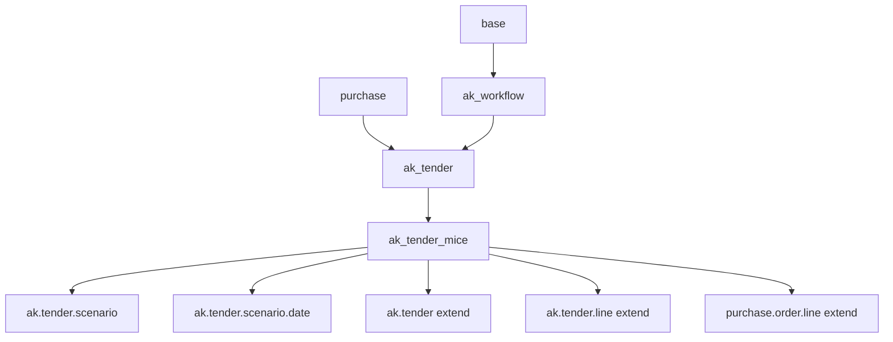
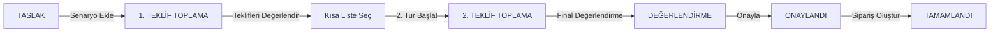
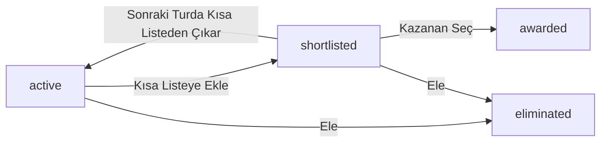

# ak_tender_mice — Tasarım ve İmplementasyon Planı

**Proje:** MICE İhale Yönetim Modülü (Meeting, Incentive, Conference, Event)  
**Temel Modül:** `ak_tender`  
**Yeni Modül:** `ak_tender_mice`  
**Platform:** Odoo 18 CE  
**Geliştirici:** Kardan.Digital  
**Versiyon:** 2.0  
**Tarih:** 2026-03-08  
**Durum:** ✅ İmplementasyona Hazır

---

## 1. Durum Analizi

### 1.1 Mevcut Çalışmalar

`plans/ak_tender copy/` dizininde yarım kalmış bir MICE implementasyonu mevcuttur:

| Dosya | Durum | Notlar |
|-------|-------|--------|
| `models/tender_scenario.py` | ✅ %90 hazır | `ak.tender.scenario` modeli |
| `models/tender_scenario_date.py` | ✅ %90 hazır | `ak.tender.scenario.date` modeli |
| `models/tender_mice_extension.py` | ✅ %80 hazır | `ak.tender` + `ak.tender.line` extend |
| `models/purchase_order_line_mice_extension.py` | ✅ %80 hazır | NPV + senaryo alanları |
| `views/tender_scenario_views.xml` | ✅ %85 hazır | Senaryo form/list/kanban |
| `views/tender_mice_views.xml` | ✅ %80 hazır | Tender form extend |
| `wizards/tender_scenario_wizard.py` | ✅ %85 hazır | Senaryo oluşturma sihirbazı |
| `wizards/tender_scenario_wizard_views.xml` | ✅ %70 hazır | Wizard view |

**Temel Sorun:** Bu çalışma `ak_tender` **içine** yazılmıştı, **ayrı bir addon değil**. `ak_tender_mice` adıyla bağımsız addon'a taşınmalıdır.

### 1.2 `ak_tender` İçindeki Mevcut MICE Altyapısı

| Model | Alan | Açıklama |
|-------|------|----------|
| `ak.tender` | `tender_type = 'mice'` | ✅ Zaten var, korunacak |
| `ak.tender` | `country_id`, `state_id`, `city` | ✅ Coğrafi filtreleme |
| `ak.tender` | `tender_template_id` | ✅ MICE şablon bağlantısı |
| `ak.tender.line` | `hotel_partner_id`, `days` | ✅ Otel ve gece alanları |
| `ak.tender.line` | `is_hotel_accommodation` | ✅ Computed flag |
| `res.partner` | `is_hotel`, `hotel_star_rating` | ✅ Otel bilgileri |
| `product.template` | `is_hotel_accommodation` | ✅ Otel ürün flag |
| `ak.tender.template` | MICE template | ✅ Kilitlenebilir şablon |

---

## 2. Mimari

### 2.1 Bağımlılık Diagramı



### 2.2 Temel Mimari Konsept

**Problem:** Mevcut `ak_tender` flat satır yapısı kullanıyor. MICE ihaleleri hiyerarşik senaryo yapısı gerektiriyor.

```
❌ MEVCUT (flat):
ak.tender → ak.tender.line (product_id, quantity, days, price)

✅ HEDEF (hiyerarşik):
ak.tender
  └── ak.tender.scenario (Otel Paketi A - Antalya HB)
        ├── ak.tender.scenario.date (2-4 Kasım)
        ├── ak.tender.scenario.date (9-11 Kasım)  
        └── ak.tender.line (Konaklama, Transfer, FnB...)
```

### 2.3 Addon Yapısı

```
ak_tender_mice/
├── __init__.py
├── __manifest__.py
├── models/
│   ├── __init__.py
│   ├── tender_scenario.py              # ak.tender.scenario (YENİ)
│   ├── tender_scenario_date.py         # ak.tender.scenario.date (YENİ)
│   ├── tender_mice_extension.py        # ak.tender + ak.tender.line extend
│   └── purchase_order_line_extension.py # purchase.order.line extend (NPV)
├── views/
│   ├── tender_scenario_views.xml       # Senaryo form/list/kanban/pivot
│   ├── tender_mice_views.xml           # ak.tender form extend (Senaryolar tab)
│   └── menu.xml                        # MICE menü öğeleri
├── wizards/
│   ├── __init__.py
│   ├── tender_scenario_wizard.py       # Senaryo oluşturma + eleme + tur sihirbazları
│   └── tender_scenario_wizard_views.xml
├── data/
│   └── mice_workflow_templates.xml     # MICE iş akışı şablonları
├── security/
│   ├── security_groups.xml             # MICE güvenlik grupları
│   ├── security_rules.xml
│   └── ir.model.access.csv
├── report/
│   └── mice_scenario_comparison_report.xml
└── static/
    └── description/icon.png
```

---

## 3. Veri Modeli (Detaylı)

### 3.1 `ak.tender.scenario` — Ana Senaryo Modeli

**Kaynak:** `plans/ak_tender copy/models/tender_scenario.py` → `ak_tender_mice/models/tender_scenario.py`

Senaryo, MICE ihalesinin temel organizasyon birimidir. Örneğin: _"Chamada Prestige 5⭐ (Antalya) - Yarım Pansiyon"_

```python
class AkTenderScenario(models.Model):
    _name = 'ak.tender.scenario'
    _description = 'İhale Alternatif Senaryosu'
    _inherit = ['mail.thread', 'mail.activity.mixin']
    _order = 'sequence, id'
```

**Temel Alanlar:**

| Alan | Tür | Açıklama |
|------|-----|----------|
| `tender_id` | Many2one (ak.tender) | Bağlı ihale (cascade) |
| `name` | Char | Senaryo adı (zorunlu) |
| `sequence` | Integer | Sıra |
| `active` | Boolean | Aktif mi |
| `scenario_type` | Selection | location_hotel / transfer / meal / technical / flight / custom |
| `location_id` | Many2one (res.country.state) | Lokasyon |
| `hotel_partner_id` | Many2one (res.partner) | Otel |
| `meal_plan` | Selection | ro / bb / hb / fb / ai / uai |
| `person_count` | Integer | Kişi sayısı |
| `vip_count` | Integer | VIP sayısı |

**Tarih Seçenekleri:**

| Alan | Tür | Açıklama |
|------|-----|----------|
| `date_option_ids` | One2many (ak.tender.scenario.date) | Alternatif tarih seçenekleri |

**Kalemler:**

| Alan | Tür | Açıklama |
|------|-----|----------|
| `line_ids` | One2many (ak.tender.line) | Bu senaryoya ait ihale kalemleri |
| `line_count` | Integer | Kalem sayısı (computed) |

**Fiyatlama:**

| Alan | Tür | Açıklama |
|------|-----|----------|
| `currency_id` | Many2one (res.currency) | related: tender_id.currency_id |
| `total_target_price` | Monetary | Toplam hedef (computed store) |
| `best_offer_round_1` | Monetary | Tur 1 en iyi teklif (computed store) |
| `best_offer_round_2` | Monetary | Tur 2 en iyi teklif (computed store) |
| `improvement_percentage` | Float | İyileştirme % (computed) |
| `best_npv_offer` | Monetary | En iyi NPV teklif (computed store) |
| `best_npv_partner_id` | Many2one (res.partner) | En iyi NPV tedarikçi |

**Senaryo Yönetimi:**

| Alan | Tür | Açıklama |
|------|-----|----------|
| `scenario_source` | Selection | buyer / supplier_counter |
| `supplier_id` | Many2one (res.partner) | Öneren tedarikçi (karşı teklifte) |
| `is_mandatory` | Boolean | Tedarikçiler zorunlu teklif vermeli mi |
| `is_shortlisted` | Boolean | Kısa listede mi |
| `shortlist_round` | Integer | Kısa listeye alınma turu |
| `shortlist_date` | Datetime | Kısa liste tarihi |
| `shortlist_by` | Many2one (res.users) | Ekleyen kullanıcı |
| `shortlist_notes` | Text | Kısa liste notları |
| `scenario_status` | Selection | active / shortlisted / eliminated / awarded |
| `elimination_reason` | Text | Eleme gerekçesi |

**Metodlar:** `action_add_to_shortlist()`, `action_eliminate()`, `action_award()`, `action_view_comparison()`, `action_view_lines()`

---

### 3.2 `ak.tender.scenario.date` — Senaryo Tarih Seçeneği

**Kaynak:** `plans/ak_tender copy/models/tender_scenario_date.py`

> ⚠️ **Kritik:** Tarih seçeneği senaryonun maliyet boyutudur! Örneğin "2-4 Kasım (düşük sezon) = 30,000€", "9-11 Kasım (yüksek sezon) = 35,000€"

```python
class AkTenderScenarioDate(models.Model):
    _name = 'ak.tender.scenario.date'
    _description = 'Senaryo Alternatif Tarihleri'
    _order = 'date_start'
```

| Alan | Tür | Açıklama |
|------|-----|----------|
| `scenario_id` | Many2one (ak.tender.scenario) | Bağlı senaryo (cascade) |
| `name` | Char | Otomatik ad: "2-4 Kas 2025" (computed store) |
| `date_start` | Date | Başlangıç tarihi (zorunlu) |
| `date_end` | Date | Bitiş tarihi (zorunlu) |
| `days` | Integer | Gün sayısı (computed: end-start+1) |
| `sequence` | Integer | Sıra |
| `is_preferred` | Boolean | Tercih edilen tarih |
| `notes` | Text | Notlar |
| `currency_id` | Many2one | related: scenario_id.currency_id |
| `estimated_total_cost` | Monetary | Tahmini toplam maliyet |
| `cost_multiplier` | Float | Sezon çarpanı (default 1.0) |
| `season_type` | Selection | low / mid / high / peak |
| `best_offer_amount` | Monetary | Bu tarih için en iyi teklif (computed) |
| `best_offer_partner_id` | Many2one (res.partner) | En iyi teklif tedarikçisi |
| `offer_count` | Integer | Teklif sayısı (computed) |

---

### 3.3 `ak.tender` Uzantısı

**Kaynak:** `plans/ak_tender copy/models/tender_mice_extension.py`

```python
class AkTender(models.Model):
    _inherit = 'ak.tender'
```

| Yeni Alan | Tür | Açıklama |
|-----------|-----|----------|
| `scenario_ids` | One2many (ak.tender.scenario) | Senaryolar |
| `scenario_count` | Integer | Senaryo sayısı (computed) |
| `total_scenarios` | Integer | Toplam senaryo sayısı (computed) |
| `shortlisted_scenarios` | Integer | Kısa liste sayısı (computed) |
| `eliminated_scenarios` | Integer | Elenen senaryo sayısı (computed) |
| `awarded_scenarios` | Integer | Kazanan senaryo sayısı (computed) |
| `total_person_count` | Integer | Toplam kişi sayısı |
| `vip_person_count` | Integer | VIP kişi sayısı |

**Yeni Metodlar:** `action_create_scenario()`, `action_start_next_round()`

---

### 3.4 `ak.tender.line` Uzantısı

**Kaynak:** `plans/ak_tender copy/models/tender_mice_extension.py`

```python
class AkTenderLine(models.Model):
    _inherit = 'ak.tender.line'
```

| Yeni Alan | Tür | Açıklama |
|-----------|-----|----------|
| `scenario_id` | Many2one (ak.tender.scenario) | Bağlı senaryo (cascade) |
| `alternative_group_id` | Integer | related: scenario_id.id (geriye uyumluluk) |
| `line_type` | Selection | accommodation / meal / transfer / technical / flight / service / package |
| `mice_room_type` | Selection | single / double / triple / suite / presidential |
| `mice_view_type` | Selection | city / sea / mountain / garden / pool |
| `mice_meal_plan` | Selection | ro / bb / hb / fb / ai / uai |
| `mice_amenities` | Char | Ekstra olanaklar |
| `mice_special_requests` | Text | Özel talepler |
| `computed_target_total` | Monetary | days × quantity × target_price (computed store) |
| `line_summary` | Char | Otomatik özet (computed: "5 gece, 2 yetişkin, HB") |

---

### 3.5 `purchase.order.line` Uzantısı

**Kaynak:** `plans/ak_tender copy/models/purchase_order_line_mice_extension.py`

```python
class PurchaseOrderLine(models.Model):
    _inherit = 'purchase.order.line'
```

| Yeni Alan | Tür | Açıklama |
|-----------|-----|----------|
| `scenario_id` | Many2one (ak.tender.scenario) | related: tender_line_id.scenario_id (computed store) |
| `scenario_date_id` | Many2one (ak.tender.scenario.date) | Tedarikçinin seçtiği tarih |
| `is_package_price` | Boolean | Paket fiyat mı (detay yerine) |
| `payment_term_days` | Integer | Vade gün sayısı (computed store) |
| `price_npv` | Monetary | NPV bazlı fiyat (computed store) |
| `npv_discount_amount` | Monetary | Vade kaynaklı iskonto tutarı |

**NPV Hesaplama Formülü:**
```python
discount_rate = 0.10  # %10 yıllık
discount_factor = 1 / ((1 + discount_rate) ** (days / 365.0))
price_npv = price_unit * product_qty * discount_factor
```

---

## 4. İş Akışları

### 4.1 MICE İhale Yaşam Döngüsü



### 4.2 Senaryo Yaşam Döngüsü



### 4.3 Multi-Round Senaryosu (Pratik Örnek)

```
İhale: "MICE 2025 Yılsonu Etkinliği - 150 kişi"

Tur 1 - 4 Senaryo:
├── Senaryo A: Titanic Beach Lara 5⭐ Antalya HB [2-4 Kas] [9-11 Kas]
├── Senaryo B: Delphin Palace 5⭐ Antalya AI [2-4 Kas]
├── Senaryo C: Crowne Plaza İstanbul [1-3 Kas]
└── Senaryo D: Hilton Kozyatağı İstanbul [30 Eki - 1 Kas]

    ↓ Teklifler alındı, NPV bazlı karşılaştırma yapıldı

Kısa Liste (2 senaryo):
├── ⭐ Senaryo A: Titanic Beach - En iyi NPV
└── ⭐ Senaryo C: Crowne Plaza - Konum avantajı
❌ Senaryo B: Elendi (bütçe aşımı)
❌ Senaryo D: Elendi (kapasite yetersiz)

Tur 2 - Sadece kısa listedekiler:
├── Senaryo A: Fiyat iyileştirme talebi
└── Senaryo C: Fiyat iyileştirme talebi

    ↓ Final teklifler alındı

🏆 Kazanan: Senaryo A - "Titanic Beach Lara 5⭐ - 2-4 Kasım - HB"
```

---

## 5. Görünüm (View) Yapısı

### 5.1 `tender_scenario_views.xml`

**Kaynak:** `plans/ak_tender copy/views/tender_scenario_views.xml` (232 satır, %85 hazır)

Şunları içerir:
- **List view:** Senaryo listesi (renk kodlamalı: yeşil=kazanan, mavi=kısa liste, soluk=elendi)
- **Form view:** Senaryo detayları + Tarih seçenekleri sekmesi + Kalemler sekmesi + Kısa Liste / Karşılaştırma / Kazanan butonları + Chatter
- **Kanban view:** Durum bazlı kanban
- **Pivot/Graph view:** Senaryo bazlı fiyat analizi
- **Action ve menü tanımları**

### 5.2 `tender_mice_views.xml`

**Kaynak:** `plans/ak_tender copy/views/tender_mice_views.xml` (95 satır, %80 hazır)

`ak_tender.ak_tender_view_form` üzerine **inherit** ile:

```xml
<!-- 1. Button Box'a Senaryo butonu -->
<button name="action_view_scenarios" 
        invisible="tender_type != 'mice'" 
        class="oe_stat_button" icon="fa-sitemap">
    <field name="scenario_count" widget="statinfo" string="Senaryolar"/>
</button>

<!-- 2. MICE Bilgileri grubu (tender_type == 'mice' koşulunda) -->
<group invisible="tender_type != 'mice'">
    <group name="mice_info">total_person_count, vip_person_count</group>
    <group name="scenario_stats">total/shortlisted/eliminated/awarded</group>
</group>

<!-- 3. Notebook'a Senaryolar sekmesi -->
<page string="Senaryolar" invisible="tender_type != 'mice'">
    <!-- Senaryo oluştur / Sonraki tur butonları -->
    <!-- Senaryo listesi tablosu -->
</page>

<!-- 4. Tender lines'a MICE alanları -->
<!-- scenario_id, line_type, mice_room_type, mice_meal_plan kolonları -->
```

### 5.3 `menu.xml`

`ak_tender_menu_root` altına yeni MICE alt menüsü:

```
İhaleler (mevcut)
└── MICE
    └── MICE Senaryoları → action_ak_tender_scenario
```

---

## 6. Sihirbazlar (Wizards)

### 6.1 `ak.tender.scenario.wizard` — Senaryo Oluşturma

**Kaynak:** `plans/ak_tender copy/wizards/tender_scenario_wizard.py` (%85 hazır)

Wizard, kullanıcıya şu adımlarda senaryo oluşturur:
1. Senaryo tipi ve adı
2. Lokasyon, otel, pansiyon tipi
3. Kişi ve VIP sayısı
4. Tarih seçenekleri (1-5 adet, sezon tipi, maliyet çarpanı)

### 6.2 `ak.tender.scenario.elimination.wizard` — Toplu Eleme

Senaryo(ları) eleme gerekçesiyle bitmap:
- Seçili senaryolar
- Eleme nedeni (text)
- `action_eliminate()` çağrısı

### 6.3 `ak.tender.next.round.wizard` — Sonraki Tur

Kısa listedeki senaryolar için yeni tur başlatır:
- Kısa listedeki senaryoları göster
- Yeni tur numarası
- Tedarikçilere bildirim gönder

---

## 7. Güvenlik

### 7.1 Güvenlik Grupları

Mevcut `ak_tender` gruplarına ek:

| Grup | Miras | Yetkiler |
|------|-------|----------|
| (Ek grup gerekmez) | `ak_tender.group_tender_user` | Senaryolar `ak_tender` izinleriyle yönetilir |

`ak.tender.scenario` ve `ak.tender.scenario.date` için `ir.model.access.csv`:

| Model | Grup | CRUD |
|-------|------|------|
| `ak.tender.scenario` | Tender User | CRUD |
| `ak.tender.scenario` | Tender Requester | R-- |
| `ak.tender.scenario.date` | Tender User | CRUD |
| `ak.tender.scenario.date` | Tender Requester | R-- |

---

## 8. `__manifest__.py`

```python
{
    'name': "MICE İhale Yönetimi",
    'summary': "Meeting, Incentive, Conference, Event ihaleleri için senaryo bazlı yönetim",
    'description': """
        ak_tender modülünü MICE organizasyon ihaleleri için genişleten modül.
        
        Özellikler:
        - Senaryo bazlı ihale yönetimi (otel + pansiyon + tarih kombinasyonları)
        - Alternatif tarih seçenekleri
        - Çok turlu kısa liste mekanizması
        - Tedarikçi karşı teklif desteği
        - NPV bazlı fiyat karşılaştırma
        - MICE özel ihale kalemleri (konaklama, transfer, FnB, teknik)
    """,
    'author': "Kardan.Digital",
    'website': "https://kardan.digital",
    'category': 'Purchases',
    'version': '1.0',
    'depends': ['ak_tender'],
    'data': [
        'security/security_groups.xml',
        'security/security_rules.xml',
        'security/ir.model.access.csv',
        'data/mice_workflow_templates.xml',
        'views/tender_scenario_views.xml',
        'views/tender_mice_views.xml',
        'wizards/tender_scenario_wizard_views.xml',
        'views/menu.xml',
    ],
    'installable': True,
    'application': False,
    'auto_install': False,
}
```

---

## 9. Uygulama Planı (Faz Bazlı)

### Faz 1 — Temel Model ve Altyapı

**Kaynak kodlar taşınır ve `ak_tender_mice` namespace'e adapte edilir:**

- [ ] `addons-custom/ak_tender_mice/__init__.py` oluştur
- [ ] `addons-custom/ak_tender_mice/__manifest__.py` oluştur
- [ ] `plans/ak_tender copy/models/tender_scenario.py` → `models/tender_scenario.py` (namespace: `ak_tender_mice`)
- [ ] `plans/ak_tender copy/models/tender_scenario_date.py` → `models/tender_scenario_date.py`
- [ ] `plans/ak_tender copy/models/tender_mice_extension.py` → `models/tender_mice_extension.py`
- [ ] `plans/ak_tender copy/models/purchase_order_line_mice_extension.py` → `models/purchase_order_line_extension.py`
- [ ] `models/__init__.py` oluştur
- [ ] `security/ir.model.access.csv` oluştur
- [ ] `security/security_groups.xml` oluştur

### Faz 2 — Görünümler ve Sihirbazlar

- [ ] `plans/ak_tender copy/views/tender_scenario_views.xml` → `views/tender_scenario_views.xml` (ref ID'leri güncelle)
- [ ] `plans/ak_tender copy/views/tender_mice_views.xml` → `views/tender_mice_views.xml` (inherit ref güncelle)
- [ ] `views/menu.xml` oluştur
- [ ] `plans/ak_tender copy/wizards/tender_scenario_wizard.py` → `wizards/tender_scenario_wizard.py`
- [ ] `plans/ak_tender copy/wizards/tender_scenario_wizard_views.xml` → `wizards/tender_scenario_wizard_views.xml`
- [ ] `wizards/__init__.py` oluştur

### Faz 3 — Veri, Test ve Doğrulama

- [ ] `data/mice_workflow_templates.xml` oluştur
- [ ] Odoo kurulumu: `ak_tender_mice` modülü yükle
- [ ] Temel işlevsellik testi: Senaryo oluşturma, tarih ekleme, kısa liste
- [ ] NPV hesaplama doğrulama testi
- [ ] Tender form görünüm testi (MICE tab, senaryo listesi)
- [ ] Wizard testi

### Faz 4 — İleri Özellikler (opsiyonel)

- [ ] MICE senaryo karşılaştırma raporu (`report/mice_scenario_comparison_report.xml`)
- [ ] Tedarikçi portal MICE view uzantısı (tarih seçeneği seçimi)
- [ ] MICE özel e-posta şablonları (opsiyon tarihi hatırlatması)
- [ ] Migrasyon scripti (eski flat yapılı MICE ihalelerini senaryolara dönüştür)

---

## 10. Kritik Teknik Notlar

### 10.1 XML ID Namespace Değişikliği

`plans/ak_tender copy/` içindeki dosyalarda view XML ID'leri `ak_tender` namespace kullanıyor. `ak_tender_mice`'e taşırken:

```xml
<!-- ESKİ (ak_tender copy içinde) -->
<field name="inherit_id" ref="ak_tender.ak_tender_view_form"/>

<!-- YENİ (ak_tender_mice içinde) - inherit ref değişmez, bu doğru! -->
<field name="inherit_id" ref="ak_tender.ak_tender_view_form"/>
```

Ancak **kendi view ID'leri** değişmeli:
```xml
<!-- ESKİ -->
<record id="view_tender_scenario_tree" model="ir.ui.view">

<!-- YENİ (implicit: ak_tender_mice.view_tender_scenario_tree) - __name__ değişir -->
<record id="view_tender_scenario_tree" model="ir.ui.view">
  <!-- module prefix otomatik olarak ak_tender_mice olur -->
```

### 10.2 `ak_tender` İçindeki MICE Kodu

`ak_tender`'daki mevcut MICE mantığı (`hotel_partner_id`, `days`, `is_hotel_accommodation`, vb.) **olduğu gibi kalır**. `ak_tender_mice` bunları **silmez**, üzerine **ekler**.

### 10.3 `models/__init__.py` Sırası

```python
from . import tender_scenario_date   # önce (bağımlılık yok)
from . import tender_scenario        # sonra (date'e bağlı)
from . import tender_mice_extension  # sonra (scenario'ya bağlı)
from . import purchase_order_line_extension  # en son
```

### 10.4 Geriye Dönük Uyumluluk / Migrasyon

`ak_tender_mice` kurulmadan önce oluşturulmuş MICE ihaleleri `scenario_ids = False` olacak — bu normal. Mevcut flat satır mantığı `ak_tender` içinde çalışmaya devam eder. İsteğe bağlı migrasyon scripti eklenebilir.

---

## 11. Dosya → İçerik Özeti

| Dosya | İçerik | Kaynak |
|-------|--------|--------|
| `models/tender_scenario.py` | `AkTenderScenario` (277 satır) | `plans/ak_tender copy/models/tender_scenario.py` |
| `models/tender_scenario_date.py` | `AkTenderScenarioDate` (155 satır) | `plans/ak_tender copy/models/tender_scenario_date.py` |
| `models/tender_mice_extension.py` | `AkTender` + `AkTenderLine` inherit (223 satır) | `plans/ak_tender copy/models/tender_mice_extension.py` |
| `models/purchase_order_line_extension.py` | `PurchaseOrderLine` inherit NPV (104 satır) | `plans/ak_tender copy/models/purchase_order_line_mice_extension.py` |
| `views/tender_scenario_views.xml` | 6 view + action (232 satır) | `plans/ak_tender copy/views/tender_scenario_views.xml` |
| `views/tender_mice_views.xml` | 2 inherit view (95 satır) | `plans/ak_tender copy/views/tender_mice_views.xml` |
| `wizards/tender_scenario_wizard.py` | 3 wizard model (178 satır) | `plans/ak_tender copy/wizards/tender_scenario_wizard.py` |
| `wizards/tender_scenario_wizard_views.xml` | Wizard views | `plans/ak_tender copy/wizards/tender_scenario_wizard_views.xml` |
