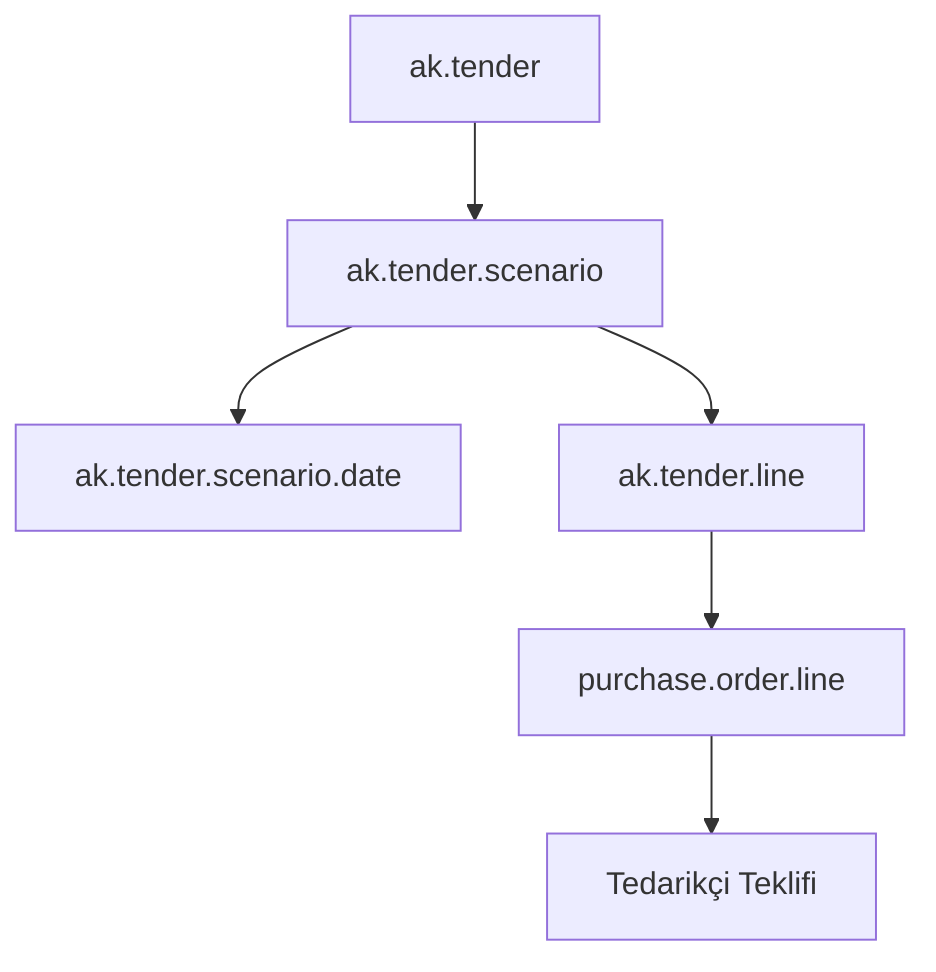
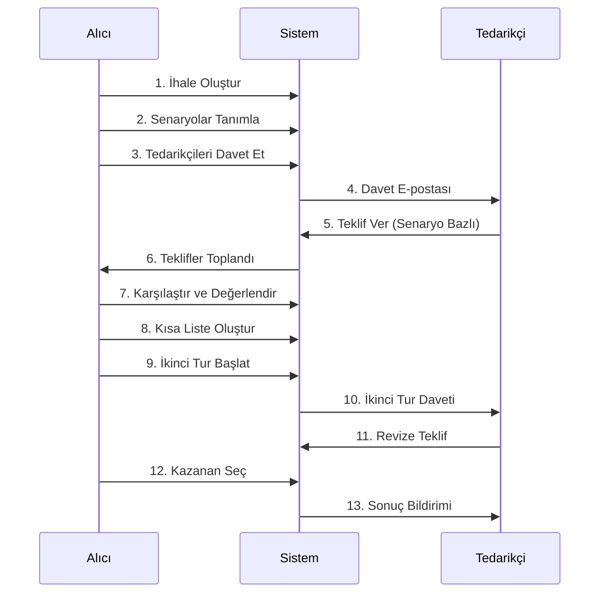

# MICE Entegrasyonu - Birleştirilmiş Tasarım ve İmplementasyon Planı

**Versiyon:** 2.1 Final
**Tarih:** 23 Ocak 2026
**Durum:** ✅ İmplementasyona Hazır
**Hazırlayan:** Roo AI Architect

> **ÖNEMLİ NOT:** Tarih seçeneği senaryonun kritik bir boyutudur. `total_target_price` her tarih seçeneği için farklı olabilir (sezon farkı, müsaitlik, vb.). Bu nedenle maliyet hesaplamaları tarih bazlı yapılmalıdır.

---

## İçindekiler

1. [Yönetici Özeti](#1-yönetici-özeti)
2. [Mimari Tasarım](#2-mimari-tasarım)
3. [Veri Modeli](#3-veri-modeli)
4. [İş Akışları](#4-iş-akışları)
5. [Kullanıcı Arayüzü](#5-kullanıcı-arayüzü)
6. [İmplementasyon Planı](#6-implementasyon-planı)
7. [Risk Yönetimi](#7-risk-yönetimi)
8. [Test Stratejisi](#8-test-stratejisi)
9. [Başarı Kriterleri](#9-başarı-kriterleri)

---

## 1. Yönetici Özeti

### 1.1. Proje Hedefi

MICE (Meeting, Incentive, Conference, Event) ihalelerini mevcut `ak_tender` modülüne entegre ederek:
- ✅ **Senaryo bazlı** teklif alma ve karşılaştırma
- ✅ **Çok turlu** ihale süreci
- ✅ **Tedarikçi karşı teklifleri** 
- ✅ **NPV bazlı** finansal analiz
- ✅ **Ergonomik** kullanıcı deneyimi

### 1.2. Temel Sorun

Mevcut sistem **flat satır yapısı** kullanıyor. MICE ihaleleri ise **hiyerarşik senaryo yapısı** gerektiriyor:

```
❌ MEVCUT: Flat Yapı
İhale → Satırlar (product_id, quantity, days, price)

✅ HEDEF: Hiyerarşik Yapı
İhale → Senaryolar → Tarih Seçenekleri → Satırlar
```

### 1.3. Çözüm Yaklaşımı

**Hibrit Model:** Mevcut sistemi bozmadan, üzerine senaryo katmanı eklemek.



### 1.4. Beklenen Faydalar

| Metrik | Mevcut | Hedef | İyileştirme |
|--------|--------|-------|-------------|
| İhale hazırlama süresi | 4 saat | 1 saat | %75 ↓ |
| Teklif toplama süresi | 3 gün | 1 gün | %66 ↓ |
| Karşılaştırma süresi | 6 saat | 30 dk | %92 ↓ |
| Hata oranı | %15-20 | %2-3 | %90 ↓ |
| Tedarikçi memnuniyeti | Orta | Yüksek | +40% |

---

## 2. Mimari Tasarım

### 2.1. Sistem Mimarisi

```
┌─────────────────────────────────────────────────────────────────┐
│                        PRESENTATION LAYER                        │
├─────────────────────────────────────────────────────────────────┤
│  İhale Formu  │  Tedarikçi Portal  │  Karşılaştırma  │  Raporlar │
└─────────────────────────────────────────────────────────────────┘
                              ↓
┌─────────────────────────────────────────────────────────────────┐
│                        BUSINESS LOGIC LAYER                      │
├─────────────────────────────────────────────────────────────────┤
│  Senaryo Yönetimi  │  Teklif İşleme  │  NPV Hesaplama  │  Kısa Liste │
└─────────────────────────────────────────────────────────────────┘
                              ↓
┌─────────────────────────────────────────────────────────────────┐
│                          DATA LAYER                              │
├─────────────────────────────────────────────────────────────────┤
│  ak.tender.scenario  │  ak.tender.scenario.date  │  ak.tender.line │
└─────────────────────────────────────────────────────────────────┘
```

### 2.2. Entegrasyon Noktaları

| Mevcut Model | Yeni İlişki | Açıklama |
|--------------|-------------|----------|
| `ak.tender` | `scenario_ids` One2many | İhale senaryoları |
| `ak.tender.line` | `scenario_id` Many2one | Satır hangi senaryoya ait? |
| `purchase.order` | `tender_round` Integer | Hangi tur? (mevcut) |
| `purchase.order.line` | `scenario_date_id` Many2one | Hangi tarih seçeneği? |
| `ak.tender.economic.data` | NPV hesaplama | Vade farkı analizi (mevcut) |

### 2.3. Geriye Dönük Uyumluluk

```python
# Eski MICE ihaleleri için migration
def migrate_old_mice_tenders():
    """
    Mevcut MICE ihalelerini yeni yapıya taşı:
    1. Her ihale için default senaryo oluştur
    2. Tüm satırları bu senaryoya bağla
    3. alternative_group_id'leri senaryolara dönüştür
    """
    old_mice_tenders = env['ak.tender'].search([
        ('tender_type', '=', 'mice'),
        ('scenario_ids', '=', False)
    ])
    
    for tender in old_mice_tenders:
        # Default senaryo oluştur
        scenario = env['ak.tender.scenario'].create({
            'tender_id': tender.id,
            'name': f"{tender.name} - Mevcut Yapı",
            'scenario_type': 'location_hotel',
            'is_mandatory': True
        })
        
        # Satırları senaryoya bağla
        tender.tender_lines.write({'scenario_id': scenario.id})
```

---

## 3. Veri Modeli

### 3.1. Yeni Modeller

#### 3.1.1. `ak.tender.scenario` (İhale Senaryosu)

```python
class AkTenderScenario(models.Model):
    _name = 'ak.tender.scenario'
    _description = 'İhale Alternatif Senaryosu'
    _order = 'sequence, id'
    
    # ===== TEMEL BİLGİLER =====
    tender_id = fields.Many2one('ak.tender', required=True, ondelete='cascade')
    name = fields.Char(string='Senaryo Adı', required=True)
    # Örn: "Chamada Prestige 5⭐ (Antalya) - Yarım Pansiyon"
    
    sequence = fields.Integer(default=10)
    active = fields.Boolean(default=True)
    
    scenario_type = fields.Selection([
        ('location_hotel', 'Lokasyon-Otel Paketi'),
        ('transfer', 'Transfer Paketi'),
        ('meal', 'Yemek Paketi'),
        ('technical', 'Teknik Paket'),
        ('flight', 'Uçuş Paketi'),
        ('custom', 'Özel Paket')
    ], string='Senaryo Tipi', default='location_hotel')
    
    # ===== LOKASYON VE OTEL =====
    location_id = fields.Many2one('res.country.state', string='Lokasyon')
    hotel_partner_id = fields.Many2one('res.partner', string='Otel',
                                       domain=[('is_company', '=', True)])
    
    # ===== MICE ÖZEL ALANLAR =====
    meal_plan = fields.Selection([
        ('ro', 'Room Only'),
        ('bb', 'Bed & Breakfast'),
        ('hb', 'Half Board'),
        ('fb', 'Full Board'),
        ('ai', 'All Inclusive'),
        ('uai', 'Ultra All Inclusive')
    ], string='Pansiyon Tipi')
    
    person_count = fields.Integer(string='Kişi Sayısı')
    vip_count = fields.Integer(string='VIP Sayısı')
    
    # ===== TARİH SEÇENEKLERİ =====
    date_option_ids = fields.One2many(
        'ak.tender.scenario.date',
        'scenario_id',
        string='Alternatif Tarihler'
    )
    
    # ===== KALEMLER =====
    line_ids = fields.One2many('ak.tender.line', 'scenario_id', string='Kalemler')
    line_count = fields.Integer(compute='_compute_line_count', string='Kalem Sayısı')
    
    # ===== FİYATLANDIRMA =====
    currency_id = fields.Many2one(related='tender_id.currency_id')
    total_target_price = fields.Monetary(
        compute='_compute_total_target',
        store=True,
        string='Toplam Hedef Fiyat'
    )
    
    # ===== SENARYO KAYNAĞI =====
    scenario_source = fields.Selection([
        ('buyer', 'Alıcı Talebi'),
        ('supplier_counter', 'Tedarikçi Karşı Teklifi')
    ], default='buyer', string='Kaynak')
    
    supplier_id = fields.Many2one('res.partner', string='Öneren Tedarikçi',
                                  help='Karşı teklif ise hangi tedarikçi önerdi?')
    
    # ===== ZORUNLULUK =====
    is_mandatory = fields.Boolean(
        string='Zorunlu Senaryo',
        default=False,
        help='Tedarikçiler bu senaryoya mutlaka teklif vermeli mi?'
    )
    
    # ===== KISA LİSTE MEKANİZMASI =====
    is_shortlisted = fields.Boolean(string='Kısa Listede', default=False)
    shortlist_round = fields.Integer(string='Kısa Listeye Alınma Turu')
    shortlist_date = fields.Datetime(string='Kısa Liste Tarihi', readonly=True)
    shortlist_by = fields.Many2one('res.users', string='Kısa Listeye Ekleyen', readonly=True)
    shortlist_notes = fields.Text(string='Kısa Liste Notları')
    
    scenario_status = fields.Selection([
        ('active', 'Aktif - Teklif Alınıyor'),
        ('shortlisted', 'Kısa Listede'),
        ('eliminated', 'Elendi'),
        ('awarded', 'Kazanan')
    ], default='active', string='Durum', required=True)
    
    elimination_reason = fields.Text(string='Eleme Gerekçesi')
    
    # ===== TUR BAZLI EN İYİ TEKLİFLER =====
    best_offer_round_1 = fields.Monetary(
        compute='_compute_best_offers',
        store=True,
        string='Tur 1 En İyi Teklif'
    )
    
    best_offer_round_2 = fields.Monetary(
        compute='_compute_best_offers',
        store=True,
        string='Tur 2 En İyi Teklif'
    )
    
    improvement_percentage = fields.Float(
        compute='_compute_improvement',
        store=True,
        string='İyileştirme %',
        help='Tur 2 vs Tur 1 fiyat iyileştirmesi'
    )
    
    # ===== COMPUTED FIELDS =====
    @api.depends('line_ids')
    def _compute_line_count(self):
        for scenario in self:
            scenario.line_count = len(scenario.line_ids)
    
    @api.depends('line_ids.computed_target_total')
    def _compute_total_target(self):
        for scenario in self:
            scenario.total_target_price = sum(scenario.line_ids.mapped('computed_target_total'))
    
    @api.depends('tender_id.purchase_order_ids.order_line.tender_line_id.scenario_id')
    def _compute_best_offers(self):
        """Her tur için en düşük NPV'li teklifi hesapla"""
        for scenario in self:
            po_lines = self.env['purchase.order.line'].search([
                ('tender_line_id.scenario_id', '=', scenario.id),
                ('order_id.state', 'in', ['draft', 'sent', 'to approve', 'purchase', 'done'])
            ])
            
            round_1_lines = po_lines.filtered(lambda l: l.order_id.tender_round == 1)
            round_2_lines = po_lines.filtered(lambda l: l.order_id.tender_round == 2)
            
            if round_1_lines:
                # NPV bazlı en düşük fiyat
                scenario.best_offer_round_1 = min(round_1_lines.mapped('price_subtotal'))
            
            if round_2_lines:
                scenario.best_offer_round_2 = min(round_2_lines.mapped('price_subtotal'))
    
    @api.depends('best_offer_round_1', 'best_offer_round_2')
    def _compute_improvement(self):
        for scenario in self:
            if scenario.best_offer_round_1 and scenario.best_offer_round_2:
                improvement = scenario.best_offer_round_1 - scenario.best_offer_round_2
                scenario.improvement_percentage = (improvement / scenario.best_offer_round_1) * 100
            else:
                scenario.improvement_percentage = 0.0
    
    # ===== ACTIONS =====
    def action_add_to_shortlist(self):
        """Senaryoyu kısa listeye ekle"""
        self.ensure_one()
        self.write({
            'is_shortlisted': True,
            'scenario_status': 'shortlisted',
            'shortlist_round': self.tender_id.tender_round,
            'shortlist_date': fields.Datetime.now(),
            'shortlist_by': self.env.user.id
        })
        return True
    
    def action_eliminate_scenario(self):
        """Senaryoyu elenle"""
        self.ensure_one()
        return {
            'name': 'Senaryo Eleme',
            'type': 'ir.actions.act_window',
            'res_model': 'ak.tender.scenario.eliminate.wizard',
            'view_mode': 'form',
            'target': 'new',
            'context': {'default_scenario_id': self.id}
        }
    
    def action_view_comparison(self):
        """Senaryo detaylı karşılaştırma"""
        self.ensure_one()
        return {
            'name': f'Karşılaştırma: {self.name}',
            'type': 'ir.actions.act_window',
            'res_model': 'purchase.order.line',
            'view_mode': 'tree',
            'domain': [('tender_line_id.scenario_id', '=', self.id)],
            'context': {'group_by': 'order_id'}
        }
```

#### 3.1.2. `ak.tender.scenario.date` (Senaryo Tarih Seçenekleri)

```python
class AkTenderScenarioDate(models.Model):
    _name = 'ak.tender.scenario.date'
    _description = 'Senaryo Alternatif Tarihleri'
    _order = 'date_start'
    
    scenario_id = fields.Many2one('ak.tender.scenario', required=True, ondelete='cascade')
    
    name = fields.Char(string='Tarih Açıklaması', compute='_compute_name', store=True)
    # Örn: "2-4 Kasım 2025"
    
    date_start = fields.Date(string='Başlangıç', required=True)
    date_end = fields.Date(string='Bitiş', required=True)
    
    days = fields.Integer(compute='_compute_days', store=True, string='Gün Sayısı')
    
    sequence = fields.Integer(default=10)
    
    is_preferred = fields.Boolean(
        string='Tercih Edilen Tarih',
        help='Bu tarih aralığı tercih edilen seçenektir'
    )
    
    notes = fields.Text(string='Notlar')
    
    # ===== MALİYET BOYUTU (KRİTİK!) =====
    # ⚠️ ÖNEMLİ: Tarih seçeneği senaryonun maliyet boyutudur!
    # Örn: 2-4 Kasım düşük sezon = 30,000€
    #      9-11 Kasım yüksek sezon = 35,000€
    
    currency_id = fields.Many2one(related='scenario_id.currency_id')
    
    estimated_total_cost = fields.Monetary(
        string='Tahmini Toplam Maliyet',
        help='Bu tarih için beklenen toplam maliyet (sezon farkı, müsaitlik vb.)',
        currency_field='currency_id'
    )
    
    cost_multiplier = fields.Float(
        string='Maliyet Çarpanı',
        default=1.0,
        help='Sezon farkı çarpanı (1.0 = normal, 1.2 = %20 artış, 0.9 = %10 indirim)'
    )
    
    season_type = fields.Selection([
        ('low', 'Düşük Sezon'),
        ('mid', 'Orta Sezon'),
        ('high', 'Yüksek Sezon'),
        ('peak', 'Pik Sezon')
    ], string='Sezon Tipi')
    
    # Tarih bazlı en iyi teklifler
    best_offer_amount = fields.Monetary(
        compute='_compute_best_offer',
        store=True,
        string='En İyi Teklif'
    )
    
    best_offer_partner_id = fields.Many2one(
        'res.partner',
        compute='_compute_best_offer',
        store=True,
        string='En İyi Teklif Veren'
    )
    
    offer_count = fields.Integer(
        compute='_compute_offer_count',
        string='Teklif Sayısı'
    )
    
    def _compute_best_offer(self):
        """Bu tarih için en iyi teklifi hesapla"""
        for date_option in self:
            po_lines = self.env['purchase.order.line'].search([
                ('scenario_date_id', '=', date_option.id),
                ('order_id.state', 'in', ['draft', 'sent', 'to approve', 'purchase', 'done'])
            ])
            
            if po_lines:
                best_line = min(po_lines, key=lambda l: l.price_subtotal)
                date_option.best_offer_amount = best_line.price_subtotal
                date_option.best_offer_partner_id = best_line.order_id.partner_id
            else:
                date_option.best_offer_amount = 0
                date_option.best_offer_partner_id = False
    
    def _compute_offer_count(self):
        """Bu tarih için kaç teklif alındığını say"""
        for date_option in self:
            date_option.offer_count = self.env['purchase.order.line'].search_count([
                ('scenario_date_id', '=', date_option.id),
                ('order_id.state', 'in', ['draft', 'sent', 'to approve', 'purchase', 'done'])
            ])
    
    @api.depends('date_start', 'date_end')
    def _compute_name(self):
        for record in self:
            if record.date_start and record.date_end:
                start_str = record.date_start.strftime('%d %b')
                end_str = record.date_end.strftime('%d %b %Y')
                record.name = f"{start_str} - {end_str}"
            else:
                record.name = "Tarih Belirtilmedi"
    
    @api.depends('date_start', 'date_end')
    def _compute_days(self):
        for record in self:
            if record.date_start and record.date_end:
                delta = record.date_end - record.date_start
                record.days = delta.days + 1  # +1 çünkü başlangıç günü dahil
            else:
                record.days = 0
    
    @api.constrains('date_start', 'date_end')
    def _check_dates(self):
        for record in self:
            if record.date_start and record.date_end and record.date_start > record.date_end:
                raise ValidationError(_('Başlangıç tarihi bitiş tarihinden sonra olamaz!'))
```

### 3.2. Mevcut Model Uzantıları

#### 3.2.1. `ak.tender` Uzantısı

```python
class AkTender(models.Model):
    _inherit = 'ak.tender'
    
    # ===== SENARYO İLİŞKİSİ =====
    scenario_ids = fields.One2many('ak.tender.scenario', 'tender_id', string='Senaryolar')
    scenario_count = fields.Integer(compute='_compute_scenario_count', string='Senaryo Sayısı')
    
    # ===== SENARYO İSTATİSTİKLERİ =====
    total_scenarios = fields.Integer(compute='_compute_scenario_stats', string='Toplam Senaryo')
    shortlisted_scenarios = fields.Integer(compute='_compute_scenario_stats', string='Kısa Liste')
    eliminated_scenarios = fields.Integer(compute='_compute_scenario_stats', string='Elenen')
    awarded_scenarios = fields.Integer(compute='_compute_scenario_stats', string='Kazanan')
    
    # ===== MICE ÖZEL ALANLAR =====
    total_person_count = fields.Integer(string='Toplam Kişi Sayısı')
    vip_person_count = fields.Integer(string='VIP Kişi Sayısı')
    
    @api.depends('scenario_ids')
    def _compute_scenario_count(self):
        for tender in self:
            tender.scenario_count = len(tender.scenario_ids)
    
    @api.depends('scenario_ids.scenario_status')
    def _compute_scenario_stats(self):
        for tender in self:
            tender.total_scenarios = len(tender.scenario_ids)
            tender.shortlisted_scenarios = len(
                tender.scenario_ids.filtered(lambda s: s.is_shortlisted)
            )
            tender.eliminated_scenarios = len(
                tender.scenario_ids.filtered(lambda s: s.scenario_status == 'eliminated')
            )
            tender.awarded_scenarios = len(
                tender.scenario_ids.filtered(lambda s: s.scenario_status == 'awarded')
            )
    
    def action_start_next_round(self):
        """Sonraki turu başlat (sadece kısa listedeki senaryolar için)"""
        self.ensure_one()
        
        shortlisted = self.scenario_ids.filtered(lambda s: s.is_shortlisted)
        
        if not shortlisted:
            raise UserError(_("Kısa listeye alınmış senaryo yok!"))
        
        return {
            'name': 'Yeni Tur Başlat',
            'type': 'ir.actions.act_window',
            'res_model': 'ak.tender.next.round.wizard',
            'view_mode': 'form',
            'target': 'new',
            'context': {
                'default_tender_id': self.id,
                'default_next_round': self.tender_round + 1,
                'default_shortlisted_scenario_ids': shortlisted.ids
            }
        }
    
    def action_view_scenarios(self):
        """Senaryoları görüntüle"""
        self.ensure_one()
        return {
            'name': f'{self.name} - Senaryolar',
            'type': 'ir.actions.act_window',
            'res_model': 'ak.tender.scenario',
            'view_mode': 'tree,form',
            'domain': [('tender_id', '=', self.id)],
            'context': {'default_tender_id': self.id}
        }
```

#### 3.2.2. `ak.tender.line` Uzantısı

```python
class AkTenderLine(models.Model):
    _inherit = 'ak.tender.line'
    
    # ===== SENARYO İLİŞKİSİ =====
    scenario_id = fields.Many2one('ak.tender.scenario', string='Senaryo', ondelete='cascade')
    
    # Geriye dönük uyumluluk için
    alternative_group_id = fields.Integer(
        related='scenario_id.id',
        store=True,
        string='Alternatif Grup ID'
    )
    
    # ===== SATIR TİPİ =====
    line_type = fields.Selection([
        ('accommodation', 'Konaklama'),
        ('meal', 'Yemek'),
        ('transfer', 'Transfer'),
        ('technical', 'Teknik Hizmet'),
        ('flight', 'Uçuş'),
        ('service', 'Diğer Hizmet'),
        ('package', 'Paket')
    ], string='Satır Tipi')
    
    # ===== MICE ÖZEL ALANLAR (JSON'a taşınabilir) =====
    mice_room_type = fields.Selection([
        ('single', 'Single'),
        ('double', 'Double'),
        ('triple', 'Triple'),
        ('suite', 'Suite')
    ], string='Oda Tipi')
    
    mice_meal_plan = fields.Selection([
        ('ro', 'Room Only'),
        ('bb', 'Bed & Breakfast'),
        ('hb', 'Half Board'),
        ('fb', 'Full Board'),
        ('ai', 'All Inclusive'),
        ('uai', 'Ultra All Inclusive')
    ], string='Pansiyon Tipi')
    
    # ===== HESAPLANAN TOPLAM =====
    computed_target_total = fields.Monetary(
        compute='_compute_target_total',
        store=True,
        string='Toplam Hedef',
        help='Miktar × Gün × Birim Fiyat'
    )
    
    @api.depends('quantity', 'days', 'target_price')
    def _compute_target_total(self):
        for line in self:
            line.computed_target_total = line.quantity * line.days * line.target_price
```

#### 3.2.3. `purchase.order.line` Uzantısı

```python
class PurchaseOrderLine(models.Model):
    _inherit = 'purchase.order.line'
    
    # ===== SENARYO İLİŞKİSİ =====
    scenario_id = fields.Many2one(
        'ak.tender.scenario',
        compute='_compute_scenario_id',
        store=True,
        string='Senaryo'
    )
    
    scenario_date_id = fields.Many2one(
        'ak.tender.scenario.date',
        string='Seçilen Tarih',
        help='Tedarikçi hangi tarih seçeneğini seçti?'
    )
    
    # ===== PAKET FİYAT =====
    is_package_price = fields.Boolean(
        string='Paket Fiyat',
        help='Tedarikçi detay yerine paket fiyat verdi mi?'
    )
    
    @api.depends('tender_line_id.scenario_id')
    def _compute_scenario_id(self):
        for line in self:
            line.scenario_id = line.tender_line_id.scenario_id if line.tender_line_id else False
```

---

### 3.3. JSON Field UI İmplementasyonu

MICE özel alanları için kullanıcı dostu arayüz sağlamak amacıyla JSON alanları computed field'lar ile yönetilir.

#### 3.3.1. `ak.tender.line` JSON Field Uzantısı

```python
class AkTenderLine(models.Model):
    _inherit = 'ak.tender.line'
    
    # ===== JSON ALAN (Mevcut) =====
    # line_spec_data = fields.Json('Özel Veriler')
    
    # ===== MICE COMPUTED FIELDS =====
    # Bu alanlar JSON'a yazılır/okunur, kullanıcı dostu arayüz sağlar
    
    mice_room_type = fields.Selection([
        ('single', 'Single'),
        ('double', 'Double'),
        ('triple', 'Triple'),
        ('suite', 'Suite'),
        ('presidential', 'Presidential Suite')
    ], string='Oda Tipi',
       compute='_compute_mice_fields',
       inverse='_inverse_mice_fields',
       store=False,
       help='Oda tipi seçimi')
    
    mice_view_type = fields.Selection([
        ('city', 'Şehir Manzarası'),
        ('sea', 'Deniz Manzarası'),
        ('mountain', 'Dağ Manzarası'),
        ('garden', 'Bahçe Manzarası'),
        ('pool', 'Havuz Manzarası')
    ], string='Manzara',
       compute='_compute_mice_fields',
       inverse='_inverse_mice_fields',
       store=False)
    
    mice_amenities = fields.Char(
        'Özel Hizmetler',
        compute='_compute_mice_fields',
        inverse='_inverse_mice_fields',
        store=False,
        help='Virgülle ayrılmış: WiFi, Havuz, Spa, Butler, Minibar'
    )
    
    mice_special_requests = fields.Text(
        'Özel İstekler',
        compute='_compute_mice_fields',
        inverse='_inverse_mice_fields',
        store=False,
        help='Özel talepler ve notlar'
    )
    
    # ===== ÖZET BİLGİ =====
    line_summary = fields.Text(
        'Özet Bilgi',
        compute='_compute_line_summary',
        store=True,
        help='Otomatik oluşturulan kullanıcı dostu özet'
    )
    
    # ===== COMPUTE METHODS =====
    
    @api.depends('line_spec_data')
    def _compute_mice_fields(self):
        """JSON'dan MICE alanlarını oku"""
        for line in self:
            if line.line_spec_data and isinstance(line.line_spec_data, dict):
                data = line.line_spec_data
                line.mice_room_type = data.get('room_type', False)
                line.mice_view_type = data.get('view', False)
                amenities_list = data.get('amenities', [])
                line.mice_amenities = ', '.join(amenities_list) if amenities_list else ''
                line.mice_special_requests = data.get('special_requests', '')
            else:
                line.mice_room_type = False
                line.mice_view_type = False
                line.mice_amenities = ''
                line.mice_special_requests = ''
    
    def _inverse_mice_fields(self):
        """MICE alanlarını JSON'a yaz"""
        for line in self:
            # Mevcut JSON verisini al veya yeni dict oluştur
            data = {}
            if line.line_spec_data and isinstance(line.line_spec_data, dict):
                data = line.line_spec_data.copy()
            
            # MICE alanlarını JSON'a yaz
            if line.mice_room_type:
                data['room_type'] = line.mice_room_type
            elif 'room_type' in data:
                del data['room_type']
                
            if line.mice_view_type:
                data['view'] = line.mice_view_type
            elif 'view' in data:
                del data['view']
                
            if line.mice_amenities:
                # Virgülle ayrılmış string'i listeye çevir
                amenities = [a.strip() for a in line.mice_amenities.split(',') if a.strip()]
                data['amenities'] = amenities
            elif 'amenities' in data:
                del data['amenities']
                
            if line.mice_special_requests:
                data['special_requests'] = line.mice_special_requests
            elif 'special_requests' in data:
                del data['special_requests']
            
            line.line_spec_data = data if data else None
    
    @api.depends('mice_room_type', 'mice_view_type', 'mice_amenities',
                 'scenario_id.meal_plan', 'scenario_id.hotel_partner_id')
    def _compute_line_summary(self):
        """Otomatik özet oluştur"""
        for line in self:
            if line.scenario_id and line.scenario_id.tender_id.tender_type == 'mice':
                summary_parts = []
                
                # Otel bilgisi
                if line.scenario_id.hotel_partner_id:
                    summary_parts.append(line.scenario_id.hotel_partner_id.name)
                
                # Oda tipi
                if line.mice_room_type:
                    room_dict = dict(line._fields['mice_room_type'].selection)
                    summary_parts.append(room_dict.get(line.mice_room_type, ''))
                
                # Pansiyon (senaryodan)
                if line.scenario_id.meal_plan:
                    meal_dict = dict(line.scenario_id._fields['meal_plan'].selection)
                    summary_parts.append(meal_dict.get(line.scenario_id.meal_plan, ''))
                
                # Manzara
                if line.mice_view_type:
                    view_dict = dict(line._fields['mice_view_type'].selection)
                    summary_parts.append(view_dict.get(line.mice_view_type, ''))
                
                # Özellikler (ilk 3 tanesini göster)
                if line.mice_amenities:
                    amenities = line.mice_amenities.split(',')[:3]
                    summary_parts.append(f"({', '.join([a.strip() for a in amenities])})")
                
                line.line_summary = ' | '.join(summary_parts)
            else:
                line.line_summary = line.name or ''
    
    @api.onchange('mice_room_type', 'mice_view_type', 'mice_amenities')
    def _onchange_mice_fields(self):
        """MICE alanları değiştiğinde özet güncelle"""
        # Compute method otomatik çalışacak
        pass
```

**View Örneği:**
```xml
<!-- views/tender_line_views.xml -->
<record id="view_tender_line_form_mice" model="ir.ui.view">
    <field name="name">ak.tender.line.form.mice</field>
    <field name="model">ak.tender.line</field>
    <field name="inherit_id" ref="ak_tender.view_tender_line_form"/>
    <field name="arch" type="xml">
        <notebook position="inside">
            <page string="MICE Detayları"
                  attrs="{'invisible': [('scenario_id.tender_id.tender_type', '!=', 'mice')]}">
                <group>
                    <group string="Oda Bilgileri">
                        <field name="mice_room_type"/>
                        <field name="mice_view_type"/>
                    </group>
                    <group string="Özellikler">
                        <field name="mice_amenities"
                               placeholder="WiFi, Havuz, Spa, Butler"/>
                        <field name="mice_special_requests"
                               placeholder="Özel talepler..."/>
                    </group>
                </group>
                <group>
                    <field name="line_summary" readonly="1"/>
                </group>
            </page>
        </notebook>
    </field>
</record>
```

---

### 3.4. NPV (Net Bugünkü Değer) Hesaplama Entegrasyonu

Mevcut [`ak.tender.economic.data`](addons-custom/ak_tender/models/economic_data.py:5) modeli kullanılarak NPV hesaplamaları yapılır.

#### 3.4.1. `purchase.order.line` NPV Uzantısı

```python
class PurchaseOrderLine(models.Model):
    _inherit = 'purchase.order.line'
    
    # ===== NPV ALANLARI =====
    
    payment_term_days = fields.Integer(
        'Vade (Gün)',
        compute='_compute_payment_term_days',
        store=True,
        help='Ödeme vadesi gün sayısı'
    )
    
    price_npv = fields.Monetary(
        'NPV Fiyat',
        compute='_compute_price_npv',
        store=True,
        currency_field='currency_id',
        help='Net Bugünkü Değer bazlı fiyat'
    )
    
    npv_discount_amount = fields.Monetary(
        'NPV İskonto Tutarı',
        compute='_compute_price_npv',
        store=True,
        currency_field='currency_id',
        help='Vade farkından kaynaklanan iskonto'
    )
    
    @api.depends('order_id.payment_term_id')
    def _compute_payment_term_days(self):
        """Ödeme vadesi gün sayısını hesapla"""
        for line in self:
            if line.order_id.payment_term_id:
                # Payment term'den ortalama vade gününü hesapla
                terms = line.order_id.payment_term_id.line_ids
                if terms:
                    # Ağırlıklı ortalama hesapla
                    total_days = sum(term.days * term.value_amount for term in terms)
                    line.payment_term_days = int(total_days / 100)
                else:
                    line.payment_term_days = 0
            else:
                line.payment_term_days = 0  # Peşin ödeme
    
    @api.depends('price_unit', 'product_qty', 'payment_term_days', 'currency_id')
    def _compute_price_npv(self):
        """NPV bazlı fiyat hesapla"""
        for line in self:
            if line.payment_term_days > 0 and line.currency_id:
                # Gelecekteki toplam değer
                future_value = line.price_unit * line.product_qty
                
                # Mevcut economic data modelinden NPV oranını al
                economic_data = self.env['ak.tender.economic.data']
                npv_rate = economic_data.get_default_npv_rate(line.currency_id.id)
                
                # NPV hesapla: PV = FV / (1 + r)^t
                # r = günlük oran, t = gün sayısı
                daily_rate = npv_rate / 100 / 365
                npv_value = future_value / ((1 + daily_rate) ** line.payment_term_days)
                
                line.price_npv = npv_value
                line.npv_discount_amount = future_value - npv_value
            else:
                # Peşin ödeme - NPV = nominal değer
                line.price_npv = line.price_unit * line.product_qty
                line.npv_discount_amount = 0.0
```

#### 3.4.2. Senaryo Bazlı NPV Karşılaştırması

```python
class AkTenderScenario(models.Model):
    _inherit = 'ak.tender.scenario'
    
    # ===== NPV BAZLI EN İYİ TEKLİFLER =====
    
    best_npv_offer = fields.Monetary(
        'En İyi NPV Teklif',
        compute='_compute_best_npv_offer',
        store=True,
        currency_field='currency_id',
        help='NPV bazında en düşük teklif'
    )
    
    best_npv_partner_id = fields.Many2one(
        'res.partner',
        'En İyi NPV Tedarikçi',
        compute='_compute_best_npv_offer',
        store=True
    )
    
    @api.depends('line_ids.tender_line_id')
    def _compute_best_npv_offer(self):
        """Bu senaryo için NPV bazında en iyi teklifi bul"""
        for scenario in self:
            # Bu senaryoya ait tüm PO line'ları bul
            po_lines = self.env['purchase.order.line'].search([
                ('tender_line_id.scenario_id', '=', scenario.id),
                ('order_id.state', 'in', ['draft', 'sent', 'to approve', 'purchase', 'done'])
            ])
            
            if po_lines:
                # Tedarikçi bazında NPV toplamlarını hesapla
                partner_npv = {}
                for line in po_lines:
                    partner_id = line.order_id.partner_id.id
                    if partner_id not in partner_npv:
                        partner_npv[partner_id] = {
                            'total_npv': 0.0,
                            'partner': line.order_id.partner_id
                        }
                    partner_npv[partner_id]['total_npv'] += line.price_npv
                
                # En düşük NPV'yi bul
                if partner_npv:
                    best = min(partner_npv.values(), key=lambda x: x['total_npv'])
                    scenario.best_npv_offer = best['total_npv']
                    scenario.best_npv_partner_id = best['partner']
                else:
                    scenario.best_npv_offer = 0.0
                    scenario.best_npv_partner_id = False
            else:
                scenario.best_npv_offer = 0.0
                scenario.best_npv_partner_id = False
```

#### 3.4.3. NPV Karşılaştırma Örneği

```python
"""
ÖRNEK: NPV Karşılaştırması

Senaryo: Chamada Prestige 5⭐ (Antalya) - HB

Tedarikçi Teklifleri:
┌──────────────┬─────────────┬──────────┬─────────────┬──────────────┐
│ Tedarikçi    │ Nominal     │ Vade     │ NPV Oranı   │ NPV Değer    │
├──────────────┼─────────────┼──────────┼─────────────┼──────────────┤
│ ABC Turizm   │ 32,000€     │ 60 gün   │ 45% yıllık  │ 30,800€      │
│ DEF Tourism  │ 31,500€     │ 90 gün   │ 45% yıllık  │ 29,200€ ⭐   │
│ XYZ Otel     │ 34,500€     │ 30 gün   │ 45% yıllık  │ 34,150€      │
└──────────────┴─────────────┴──────────┴─────────────┴──────────────┘

Hesaplama (DEF Tourism):
- Future Value (FV) = 31,500€
- Vade = 90 gün
- NPV Oranı = 45% yıllık = 0.45/365 = 0.001233 günlük
- NPV = 31,500 / (1 + 0.001233)^90
- NPV = 31,500 / 1.1178
- NPV = 29,200€

Sonuç: DEF Tourism nominal fiyatı ortada olsa da,
       NPV bazında en avantajlı teklifi vermiştir.
       
Tasarruf: 32,000€ (ABC peşin benzeri) - 29,200€ = 2,800€
"""
```

---

## 4. İş Akışları

### 4.1. End-to-End İhale Süreci



### 4.2. Senaryo Oluşturma Akışı

```
1. İhale Formu → Senaryolar Tab
2. [➕ Yeni Senaryo] butonu
3. Senaryo Wizard açılır:
   - Senaryo adı
   - Tip (Lokasyon-Otel, Transfer, vb.)
   - Lokasyon ve otel seçimi
   - Pansiyon tipi
   - Tarih seçenekleri ekleme
   - Zorunlu mu?
4. [Kaydet ve Kalem Ekle]
5. Kalem ekleme ekranı:
   - Ürün/hizmet seçimi
   - Miktar, gün, hedef fiyat
   - MICE özel alanlar
6. [Kaydet]
```

### 4.3. Tedarikçi Teklif Verme Akışı

```
1. Tedarikçi portala giriş
2. İhale listesi → İhale seç
3. Senaryo listesi görünür:
   ┌─────────────────────────────────────┐
   │ ☐ SENARYO 1: Chamada - HB [ZORUNLU]│
   │   📅 2-4 Kas veya 9-11 Kas         │
   │   [Detay Fiyatlandır] [Paket Fiyat]│
   └─────────────────────────────────────┘
4. Fiyatlandırma modu seçimi:
   a) Detaylı: Her satır için fiyat
   b) Paket: Toplam tek fiyat
5. Tarih seçimi (opsiyonel)
6. Vade seçimi
7. [Kaydet]
8. Diğer senaryolar için tekrar
9. [Karşı Senaryo Ekle] (opsiyonel)
10. [Teklifi Gönder]
```

### 4.4. Kısa Liste ve Çok Tur Akışı

```
TUR 1:
1. Tüm teklifler toplandı
2. Alıcı senaryo bazlı değerlendirme yapar
3. Her senaryo için:
   - En iyi teklifler görüntülenir
   - NPV hesaplaması yapılır
   - [✅ Kısa Listeye Ekle] veya [❌ Elenle]
4. Kısa liste tamamlandı

TUR 2:
5. [🚀 İkinci Turu Başlat]
6. Wizard:
   - Hangi senaryolar? (Kısa listedekiler)
   - Kimleri davet et? (Tümü/Sadece teklif verenler)
   - Süre? (5 gün)
7. Tedarikçilere bildirim
8. Revize teklifler toplanır
9.