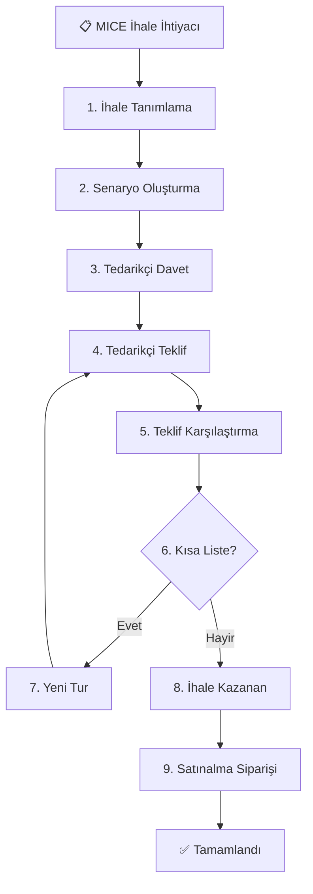

# MICE Entegrasyon - Gap Analizi ve Geliştirme Planı

## İçindekiler

1. [End-to-End İş Akışı](#end-to-end-iş-akışı)
2. [Gap Analizi - Süreç Bazlı](#gap-analizi)
3. [Geliştirme Planı](#geliştirme-planı)
4. [Risk Matrisi](#risk-matrisi)
5. [Başarı Kriterleri](#başarı-kriterleri)

---

## 1. End-to-End İş Akışı

### Genel Akış Diyagramı



---

## 2. Gap Analizi - Süreç Bazlı

### 2.1. İHALE TANIMLAMA

#### Mevcut Durum (AS-IS)

```python
# ak.tender modeli
- name: İhale adı
- tender_type: Selection ['direct', 'indirect', 'mice', 'promotion']
- tender_lines: One2many - Flat satır yapısı
  └─ product_id, quantity, days, target_price, hotel_partner_id
- invited_partners: Many2many
- tender_round: Integer (var)
- start_date, end_date
```

**Sorunlar:**
❌ Senaryo kavramı yok (lokasyo + Otel + Pansiyon + Tarih kombinasyonları)
❌ Alternatif tarihler yönetilemez
❌ Pansiyon tipi ayrı senaryo olarak işaretlenemez
❌ Senaryo bazlı toplam hesaplama yok
❌ Kısa liste mekanizması yok

#### Hedef Durum (TO-BE)

```python
# ak.tender modeli (güncellenmiş)
- scenario_ids: One2many('ak.tender.scenario')
  └─ Senaryolar hiyerarşik
  
# ak.tender.scenario (YENİ)
- name: "Chamada Prestige 5⭐ (Antalya) - HB - 2-4 Kas"
- hotel_partner_id
- meal_plan: Selection ['ro', 'bb', 'hb', 'fb', 'ai', 'uai']
- date_option_ids: One2many('ak.tender.scenario.date')
- line_ids: One2many('ak.tender.line')
- scenario_source: 'buyer' / 'supplier_counter'
- is_shortlisted: Boolean
- scenario_status: 'active' / 'shortlisted' / 'eliminated' / 'awarded'

# ak.tender.scenario.date (YENİ)
- scenario_id
- date_start, date_end
- is_preferred: Boolean

# ak.tender.line (güncellenmiş)
- scenario_id: Many2one (YENİ - ihale satırı hangi senaryoya ait?)
- line_type: Selection (YENİ)
- computed_target_total: Monetary (otomatik hesaplama)
```

**Gerekli Geliştirmeler:**

| # | Geliştirme | Öncelik | Süre |
|---|------------|---------|------|
| 1.1 | `ak.tender.scenario` modeli oluştur | 🔴 Kritik | 1 gün |
| 1.2 | `ak.tender.scenario.date` modeli oluştur | 🔴 Kritik | 0.5 gün |
| 1.3 | `ak.tender.line` model extend (scenario_id ekle) | 🔴 Kritik | 0.5 gün |
| 1.4 | İhale formu senaryo tab'ı ekleme | 🔴 Kritik | 1 gün |
| 1.5 | Senaryo oluşturma wizard'ı | 🟡 Önemli | 1 gün |
| 1.6 | Senaryo şablonları (template) | 🟢 Opsiyonel | 1 gün |
| 1.7 | Migration script (eski MICE ihaleleri) | 🟡 Önemli | 0.5 gün |

**UI Mockup - İhale Formu:**

```
┌──────────────────────────────────────────────────────────────────────────┐
│ İHALE FORMU                                                              │
├──────────────────────────────────────────────────────────────────────────┤
│ [Genel Bilgiler] [Senaryolar] [Tedarikçiler] [Teklifler] [İş Akışı]    │
└──────────────────────────────────────────────────────────────────────────┘

┌──────────────────────────────────────────────────────────────────────────┐
│ 📋 SENARYOLAR                                                            │
│                                                                          │
│ [➕ Senaryo Ekle] [📋 Şablondan Yükle] [📊 Özet Görünüm]               │
│                                                                          │
│ ┌────────────────────────────────────────────────────────────────────┐  │
│ │ SENARYO 1: Chamada Prestige 5⭐ (Antalya) - HB          [⚙️][🗑️]  │  │
│ │ Durum: ✅ Aktif | Kaynak: Alıcı | Toplam: 35,000€                  │  │
│ │                                                                    │  │
│ │ 📅 Tarih Seçenekleri:                                              │  │
│ │   • 2-4 Kasım 2025 ⭐ (Tercih edilen)                             │  │
│ │   • 9-11 Kasım 2025                                               │  │
│ │                                                                    │  │
│ │ 📋 Kalemler (15 adet):                                             │  │
│ │   • Single Room (65 × 3 gün) - 29,250€                           │  │
│ │   • Double Room (1 × 3 gün) - 600€                               │  │
│ │   • Gala Yemeği (65 × 1) - 3,575€                                │  │
│ │   • ...                                                            │  │
│ │                                                                    │  │
│ │ [📝 Düzenle] [📋 Detayları Gör] [➕ Kalem Ekle]                   │  │
│ └────────────────────────────────────────────────────────────────────┘  │
│                                                                          │
│ ┌────────────────────────────────────────────────────────────────────┐  │
│ │ SENARYO 2: Flexus Hotel 4⭐ (Antalya) - HB              [⚙️][🗑️]  │  │
│ │ Durum: ✅ Aktif | Kaynak: Alıcı | Toplam: 28,000€                  │  │
│ │ ...                                                                │  │
│ └────────────────────────────────────────────────────────────────────┘  │
└──────────────────────────────────────────────────────────────────────────┘
```

---

### 2.2. TEDARİKÇİ SAT (PURCHASE ORDER) OLUŞTURMA

#### Mevcut Durum (AS-IS)

```python
# Tedarikçiye otomatik PO oluşturma
tender.action_create_purchase_orders()
  └─ Her davetli tedarikçi için 1 PO
  └─ PO lines = tender.tender_lines kopyası
```

**Sorunlar:**
❌ Senaryo yapısını bilmiyor
❌ Tedarikçi hangi senaryolara teklif verebileceğini seçemiyor
❌ Alternatif tarihler için ayrı satırlar oluşturulmuyor
❌ Karşı senaryo ekleyemiyor

#### Hedef Durum (TO-BE)

```python
# Senaryo bazlı PO oluşturma
tender.action_create_purchase_orders_from_scenarios()
  └─ Her tedarikçi için 1 PO
  └─ PO içinde SENARYOLAR gösterilir
  └─ Tedarikçi senaryoları seçebilir
  └─ Tarih seçeneklerini görebilir
  
# purchase.order.line (güncellenmiş)
- tender_line_id: Many2one (mevcut)
- scenario_id: Many2one (YENİ - computed from tender_line_id)
- scenario_date_id: Many2one (YENİ - hangi tarih opsiyonu?)
- is_counter_scenario: Boolean (YENİ)
```

**Gerekli Geliştirmeler:**

| # | Geliştirme | Öncelik | Süre |
|---|------------|---------|------|
| 2.1 | PO oluşturma mantığını senaryoya adaptSyonlu yap | 🔴 Kritik | 1 gün |
| 2.2 | PO line'a `scenario_id` ve `scenario_date_id` ekle | 🔴 Kritik | 0.5 gün |
| 2.3 | Senaryo gruplandırma görünümü (PO formu) | 🔴 Kritik | 1 gün |
| 2.4 | Toplu fiyatlandırma modu (paket fiyat) | 🟡 Önemli | 1 gün |

---

### 2.3. TEDARİKÇİ PORTAL - TEKLİF GİRİŞİ

#### Mevcut Durum (AS-IS)

```
/my/purchase_orders/:id
  └─ Flat ürün listesi
  └─ Her satır için fiyat girişi
  └─ Validasyon ve submit
```

**Sorunlar:**
❌ Senaryo konsepti yok
❌ Paket fiyat verme seçeneği yok
❌ Karşı senaryo öneremez
❌ Tarih bazlı fiyatlandırma yok

#### Hedef Durum (TO-BE)

```
Tedarikçi Portal - Senaryo Bazlı Teklif

SEKMEs:
1. Talep Edilen Senaryolar
   └─ Senaryo kartları (接受expand/collapse)
   └─ Her senaryo için: [Detay Fiyatlandır] [Paket Fiyat Ver]
   └─ Tarih seçenekleri gösterilir
   
2. Karşı Tekliflerim
   └─ Kendi önerdiği senaryolar
   └─ [➕ Yeni Karşı Senaryo]
   
3. Teklif Özeti
   └─ Tüm tekliflerin özeti
   └─ [📤 Gönder] butonu
```

**Gerekli Geliştirmeler:**

| # | Geliştirme | Öncelik | Süre |
|---|------------|---------|------|
| 3.1 | Portal senaryo listesi view | 🔴 Kritik | 1.5 gün |
| 3.2 | Detaylı fiyatlandırma modu | 🔴 Kritik | 1 gün |
| 3.3 | Paket fiyat verme modu | 🟡 Önemli | 1 gün |
| 3.4 | Karşı senaryo oluşturma formu | 🟡 Önemli | 1.5 gün |
| 3.5 | Tarih bazlı fiyatlandırma | 🟡 Önemli | 1 gün |
| 3.6 | Teklif özeti ve submit | 🔴 Kritik | 0.5 gün |

**UI Mockup:**

```
┌──────────────────────────────────────────────────────────────────────────┐
│ TEKLİF VER: Yıllık Satış Toplantısı 2026 - MICE                         │
│ Son Tarih: 30 Kasım 2025, 17:00 | Kalan: 5 gün 3 saat                   │
└──────────────────────────────────────────────────────────────────────────┘

[📋 Talep Edilen] [🆕 Karşı Tekliflerim] [📊 Özet]

─────────────────────────────────────────────────────────────────────────────

🏨 TALEP EDİLEN SENARYOLAR (3 adet)

▼ SENARYO 1: Chamada Prestige 5⭐ (Antalya) - Yarım Pansiyon [ZORUNLU] ✅
  
  📅 Tarih Seçenekleri (birini veya ikisini de fiyatlandırın):
  
  ┌────────────────────────────────────────────────────────────────────┐
  │ ☑ 2-4 Kasım 2025 (3 gece) ⭐ Tercih edilen                        │
  │                                                                    │
  │ Fiyatlandırma Modu:                                                │
  │ ● Detaylı Fiyatlandırma  ○ Paket Fiyat                            │
  │                                                                    │
  │ | Hizmet           | Miktar | Gün | Birim Fiyat | Toplam    |     │
  │ |------------------|--------|-----|-------------|-----------|     │
  │ | Single Room (HB) | 65     | 3   | [__150€__]  | 29,250€   |     │
  │ | Double Room (HB) | 1      | 3   | [__200€__]  | 600€      |     │
  │ | Gala Yemeği      | 65     | 1   | [__55€__]   | 3,575€    |     │
  │ | Toplantı Salonu  | 1      | 3   | [__0€__]    | Ücretsiz  |     │
  │ |------------------|--------|-----|-------------|-----------|     │
  │ | TOPLAM           |        |     |             | 32,425€   |     │
  │                                                                    │
  │ Vade: [60 gün ▼] | NPV: 31,200€ (hesaplanan)                      │
  │                                                                    │
  │ [💾 Kaydet]                                                        │
  └────────────────────────────────────────────────────────────────────┘
  
  ┌────────────────────────────────────────────────────────────────────┐
  │ ☐ 9-11 Kasım 2025 (3 gece)                                        │
  │                                                                    │
  │ ⚠️ Bu tarih için henüz fiyat girmediniz                           │
  │ [+ Fiyat Ekle]                                                     │
  └────────────────────────────────────────────────────────────────────┘

▶ SENARYO 2: Flexus Hotel 4⭐ (Antalya) - Yarım Pansiyon [Opsiyonel]
  ⚠️ Bu senaryoya henüz teklif vermediniz
  [+ Teklif Ver]

─────────────────────────────────────────────────────────────────────────────

💡 KENDİ ALTERNATİFİNİZİ ÖNERİN

[➕ Yeni Karşı Senaryo Ekle]

─────────────────────────────────────────────────────────────────────────────

📊 TEKLİF ÖZETİ:
- Fiyatlandırılan Senaryolar: 1/3
- Toplam Teklif Tutarı: 32,425€
- Durum: ⚠️ Eksik (Zorunlu senaryo 1 tamamlandı)

[⬅️ Kaydet ve Çık] [📤 Teklifi Gönder]
```

---

### 2.4. TEKLİF KARŞILAŞTIRMA

#### Mevcut Durum (AS-IS)

```python
# Teklif karşılaştırma
- Tüm PO line'lar listelenir
- Ürün bazlı gruplama
- Fiyat, lead time, vade
```

**Sorunlar:**
❌ Senaryo bazlı gruplama yok
❌ Paket fiyatlar görünmüyor
❌ NPV otomatik hesaplanmıyor
❌ Kısa liste mekanizması yok
❌ Çok turlu karşılaştırma yok

#### Hedef Durum (TO-BE)

```
İki Seviyeli Karşılaştırma:

SEVIYE 1: Senaryo Özetleri
└─ Her senaryo için en iyi teklifler
└─ NPV bazlı sıralama
└─ Kısa liste işaretleme
└─ Tur bazlı iyileştirme görünümü

SEVIYE 2: Satır Detayları
└─ Senaryo içi satır satır karşılaştırma
└─ Paket vs Detay gösterimi
└─ Tarih bazlı fiyat farklılıkları
```

**Gerekli Geliştirmeler:**

| # | Geliştirme | Öncelik | Süre |
|---|------------|---------|------|
| 4.1 | Senaryo bazlı karşılaştırma view (Seviye 1) | 🔴 Kritik | 2 gün |
| 4.2 | Satır detayı karşılaştırma (Seviye 2) | 🔴 Kritik | 1.5 gün |
| 4.3 | NPV otomatik hesaplama entegrasyonu | 🔴 Kritik | 1 gün |
| 4.4 | Kısa liste işaretleme UI | 🟡 Önemli | 1 gün |
| 4.5 | Çok turlu karşılaştırma (Tur 1 vs Tur 2) | 🟡 Önemli | 1.5 gün |
| 4.6 | Senaryo durumu bulk update | 🟡 Önemli | 0.5 gün |
| 4.7 | Kazanan senaryo seçimi ve onay | 🔴 Kritik | 1 gün |

**UI Mockup - Seviye 1:**

```
┌──────────────────────────────────────────────────────────────────────────┐
│ TEKLİF KARŞILAŞTIRMA: Yıllık Satış Toplantısı 2026                      │
│ Tur: 1 | Senaryolar: 3 | Teklif Alan: 3/3 | Durum: Değerlendirme        │
└──────────────────────────────────────────────────────────────────────────┘

[📊 Senaryo Özeti] [📋 Detaylı Görünüm] [📈 Grafik] [📄 Rapor]

─────────────────────────────────────────────────────────────────────────────

🎯 SENARYO BAZLI KARŞILAŞTIRMA

Filtre: [✓ Tümü] [☐ Kısa Liste] [☐ Elenenler]
Sırala: [NPV (Düşük→Yüksek) ▼]

┌──────────────────────────────────────────────────────────────────────────┐
│ ☐ SENARYO 1: Chamada Prestige 5⭐ (Antalya) - HB                        │
│    📅 2-4 Kas, 9-11 Kas | 👥 65 kişi | 🍽️ Yarım Pansiyon               │
├────────────┬──────────────┬──────────────┬──────────────┬──────────────┤
│ Tedarikçi  │ Toplam Fiyat │ Vade         │ NPV          │ Durum        │
├────────────┼──────────────┼──────────────┼──────────────┼──────────────┤
│ DEF Tourism│ 31,500€      │ 90 gün       │ 29,200€ ⭐   │ [📋][✅][❌]│
│ ABC Turizm │ 32,000€      │ 60 gün       │ 30,800€      │ [📋][✅][❌]│
│ XYZ Otel   │ 34,500€      │ 30 gün       │ 34,150€      │ [📋][✅][❌]│
├────────────┴──────────────┴──────────────┴──────────────┴──────────────┤
│ 💰 Hedef: 35,000€ | En İyi: 29,200€ | Tasarruf: 16.6%                  │
│ 📊 Ortalama: 31,933€ | Standart Sapma: 2,202€                          │
│                                                                          │
│ Değerlendirme Notu:                                                      │
│ [Rekabetçi fiyatlar, kısa listeye alınabilir___________________]        │
│                                                                          │
│ [✅ Kısa Listeye Ekle] [❌ Elenle] [📊 Detaylı Karşılaştır]            │
└──────────────────────────────────────────────────────────────────────────┘

┌──────────────────────────────────────────────────────────────────────────┐
│ ☐ SENARYO 2: Flexus Hotel 4⭐ (Antalya) - HB                            │
│    📅 2-4 Kas, 9-11 Kas | 👥 65 kişi | 🍽️ Yarım Pansiyon               │
├────────────┬──────────────┬──────────────┬──────────────┬──────────────┤
│ XYZ Otel   │ 28,500€      │ 60 gün       │ 27,450€ ⭐   │ [📋][✅][❌]│
│ JKL Hotels │ 27,800€      │ Peşin        │ 27,800€      │ [📋][✅][❌]│
│ DEF Tourism│ 29,000€      │ 90 gün       │ 28,710€      │ [📋][✅][❌]│
├────────────┴──────────────┴──────────────┴──────────────┴──────────────┤
│ 💰 Hedef: 28,000€ | En İyi: 27,450€ | Tasarruf: 2.0%                   │
│                                                                          │
│ [✅ Kısa Listeye Ekle] [❌ Elenle] [📊 Detaylı Karşılaştır]            │
└──────────────────────────────────────────────────────────────────────────┘

─────────────────────────────────────────────────────────────────────────────

TOPLU İŞLEM:
[✓ Seçilenleri Kısa Listeye Ekle] [Seçilenleri Elenle]

─────────────────────────────────────────────────────────────────────────────

Kısa Liste: 0 senaryo | Elenen: 0 senaryo

[🚀 İkinci Turu Başlat] (Kısa liste dolunca aktif olur)
```

---

## 3. Geliştirme Planı

### 3.1. Faz Bazlı Planlama

#### FAZ 1: Temel Altyapı (5-6 Gün) 🔴

**Hedef:** Senaryo veri modelini oluştur ve temel işlevselliği kur

| Gün | Görev | Deliverable | Bağımlılık |
|-----|-------|-------------|------------|
| 1 | **Model Oluşturma** | | |
| | - `ak.tender.scenario` | ✅ Model + fields | - |
| | - `ak.tender.scenario.date` | ✅ Model + fields | - |
| | - `ak.tender.line` extend | ✅ scenario_id eklendi | - |
| | | | |
| 2 | **Temel Mantık** | | |
| | - Senaryo totalları hesaplama | ✅ Computed fields | Gün 1 |
| | - NPV entegrasyonu | ✅ NPV hesaplama | Gün 1 |
| | - Validasyonlar | ✅ Constraints | Gün 1 |
| | | | |
| 3-4 | **İhale Formu UI** | | |
| | - Senaryo tab ekleme | ✅ XML view | Gün 1 |
| | - Senaryo oluşturma wizard | ✅ Wizard model + view | Gün 1 |
| | - Kalem ekleme/düzenleme | ✅ One2many widget | Gün 1 |
| | | | |
| 5 | **PO Oluşturma Adaptasyonu** | | |
| | - Senaryo bazlı PO oluşturma | ✅ Method güncelleme | Gün 1 |
| | - PO line scenario_id | ✅ Field eklendi | Gün 1 |
| | | | |
| 6 | **Migration & Test** | | |
| | - Migration script | ✅ Eski data taşıma | Gün 1-5 |
| | - Unit testler | ✅ Test coverage %80+ | Tümü |

**Kritik Çıktılar:**
- ✅ Senaryo modeli çalışıyor
- ✅ İhale formunda senaryo oluşturulabiliyor
- ✅ PO'lar senaryo bazlı oluşuyor

---

#### FAZ 2: Tedarikçi Portal (4-5 Gün) 🟡

**Hedef:** Tedarikçi senaryo bazlı teklif verebilsin

| Gün | Görev | Deliverable |
|-----|-------|-------------|
| 7-8 | **Portal Senaryo Listesi** | |
| | - Senaryo kartları view | ✅ HTML/JS template |
| | - Expand/collapse mekanizması | ✅ Widget |
| | - Tarih seçenekleri gösterimi | ✅ View |
| | | |
| 9 | **Detaylı Fiyatlandırma** | |
| | - Satır satır fiyat girişi | ✅ Editable tree |
| | - Otomatik toplam hesaplama | ✅ JS compute |
| | - Vade ve NPV gösterimi | ✅ Preview |
| | | |
| 10 | **Paket Fiyat & Karşı Senaryo** | |
| | - Paket fiyat verme modu | ✅ Toggle switch |
| | - Karşı senaryo formu | ✅ Wizard |
| | | |
| 11 | **Teklif Özeti & Submit** | |
| | - Özet ekranı | ✅ Summary view |
| | - Validasyon ve submit | ✅ Action |
| | - Email bildirimleri | ✅ Template |

**Kritik Çıktılar:**
- ✅ Tedarikçi portalde senaryoları görüyor
- ✅ Senaryo bazlı teklif verebiliyor
- ✅ Karşı senaryo önerebiliyor

---

#### FAZ 3: Karşılaştırma & Kısa Liste (4-5 Gün) 🟡

**Hedef:** Senaryo bazlı karşılaştırma ve çok turlu ihale

| Gün | Görev | Deliverable |
|-----|-------|-------------|
| 12-13 | **Seviye 1: Senaryo Özetleri** | |
| | - Senaryo bazlı gruplama | ✅ SQL query opt |
| | - NPV otomatik hesaplama | ✅ Computed |
| | - Sıralama ve filtreleme | ✅ UI controls |
| | | |
| 14 | **Seviye 2: Satır Detayları** | |
| | - Detaylı karşılaştırma view | ✅ Pivot view |
| | - Paket vs Detay gösterimi | ✅ Conditional |
| | | |
| 15 | **Kısa Liste Mekanizması** | |
| | - Kısa liste işaretleme UI | ✅ Checkbox + action |
| | - Bulk operations | ✅ Mass action |
| | - Eleme gerekçesi | ✅ Wizard |
| | | |
| 16 | **Çok Turlu İhale** | |
| | - Yeni tur başlatma wizard | ✅ Wizard model |
| | - Tur bazlı karşılaştırma | ✅ View |
| | - İyileştirme % hesaplama | ✅ Computed |

**Kritik Çıktılar:**
- ✅ Senaryo bazlı karşılaştırma çalışıyor
- ✅ Kısa liste mekanizması aktif
- ✅ İkinci tur başlatılabiliyor

---

#### FAZ 4: Raporlama & İyileştirmeler (2-3 Gün) 🟢

**Hedef:** Raporlar ve kullanıcı deneyimi iyileştirmeleri

| Gün | Görev | Deliverable |
|-----|-------|-------------|
| 17 | **Raporlar** | |
| | - Senaryo karşılaştırma raporu (PDF) | ✅ QWeb report |
| | - Excel export | ✅ XLSX report |
| | - Dashboard widgets | ✅ Widgets |
| | | |
| 18 | **İyileştirmeler** | |
| | - Performance optimization | ✅ Index, cache |
| | - UX iyileştirmeleri | ✅ Feedback impl |
| | - Hata mesajları düzeltme | ✅ User friendly |
| | | |
| 19 | **Dokümantasyon & Eğitim** | |
| | - Kullanım klavuzu | ✅ PDF doküman |
| | - Video eğitim | ✅ 15 dk video |
| | - Admin guide | ✅ Technical doc |

**Kritik Çıktılar:**
- ✅ Raporlar hazır
- ✅ Sistem optimize
- ✅ Dokümantasyon tamamlandı

---

### 3.2. Sprint Yapısı (Agile)

**Sprint 1 (Hafta 1):** Faz 1 - Temel Altyapı
- Daily standup: Her gün 9:00
- Sprint review: Cuma 16:00
- Demo: Senaryo oluşturma

**Sprint 2 (Hafta 2):** Faz 2 - Tedarikçi Portal
- Daily standup: Her gün 9:00
- Sprint review: Cuma 16:00
- Demo: Tedarikçi teklif verme

**Sprint 3 (Hafta 3):** Faz 3 - Karşılaştırma
- Daily standup: Her gün 9:00
- Sprint review: Cuma 16:00
- Demo: Çok turlu ihale

**Sprint 4 (Hafta 4):** Faz 4 - Finalize
- Daily standup: Her gün 9:00
- Final review: Cuma
- Production deploy

---

## 4. Risk Matrisi

| Risk | Olasılık | Etki | Azaltma | Sahip |
|------|----------|------|---------|-------|
| **Migration hataları** | Orta | Yüksek | Kapsamlı test, rollback planı | Dev Team |
| **Performance sorunları** (çok senaryo) | Düşük | Orta | Lazy loading, pagination, cache | Tech Lead |
| **Kullanıcı adaptasyon zorluğu** | Orta | Yüksek | Eğitim, basit UI, wizard'lar | UX Team |
| **Tedarikçi portal kullanım hatası** | Orta | Orta | Video tutorial, inline help | Support |
| **NPV hesaplama hataları** | Düşük | Yüksek | Unit test, manuel doğrulama | QA |
| **Geriye dönük uyumsuzluk** | Orta | Orta | Migration script, fallback mode | Dev Team |
| **Scope creep** | Yüksek | Yüksek | Change request process | PM |

---

## 5. Başarı Kriterleri

### 5.1. Teknik Kriterler

- [ ] Tüm unit testler geçiyor (%90+ coverage)
- [ ] Performance: 100 senaryolu ihale < 3 sn load time
- [ ] Migration: Eski MICE ihaleleri %100 taşınıyor
- [ ] API compatibility: Mevcut entegrasyonlar çalışıyor

### 5.2. Fonksiyonel Kriterler

- [ ] Senaryo oluşturma: 5 dk'dan kısa
- [ ] Tedarikçi teklif verme: 10 dk'dan kısa (10 senaryo için)
- [ ] Karşılaştırma: Tüm senaryolar 1 ekranda
- [ ] Kısa liste: 1 tık ile işaretleme
- [ ] İkinci tur: 5 dk'da başlatılabiliyor

### 5.3. İş Kriterleri

- [ ] Satın alma ekibi eğitimi tamamlandı (%100 katılım)
- [ ] En az 1 pilot MICE ihalesi başarıyla tamamlandı
- [ ] Tedarikçi memnuniyeti: 4/5 üzeri
- [ ] İhale süresi: %50 azalma (ortalama)
- [ ] Hata oranı: %80 azalma

---

## 6. Ekler

### 6.1. İlgili Dokümanlar

1. [`mice_integration_evaluation.md`](mice_integration_evaluation.md) - Detaylı analiz
2. [`mice_scenario_keys_clarification.md`](mice_scenario_keys_clarification.md) - Senaryo anahtarları
3. [`mice_supplier_counter_scenarios.md`](mice_supplier_counter_scenarios.md) - Karşı teklif
4. [`mice_multi_round_shortlisting.md`](mice_multi_round_shortlisting.md) - Çok turlu ihale

### 6.2. Teknik Spesifikasyonlar

**Database Changes:**
```sql
-- Yeni tablolar
CREATE TABLE ak_tender_scenario (...);
CREATE TABLE ak_tender_scenario_date (...);

-- Mevcut tablo güncellemeleri
ALTER TABLE ak_tender_line ADD COLUMN scenario_id INTEGER;
ALTER TABLE purchase_order_line ADD COLUMN scenario_id INTEGER;
ALTER TABLE purchase_order_line ADD COLUMN scenario_date_id INTEGER;

-- İndexler
CREATE INDEX idx_tender_line_scenario ON ak_tender_line(scenario_id);
CREATE INDEX idx_po_line_scenario ON purchase_order_line(scenario_id);
```

**API Changes:**
```python
# Yeni API endpoints
/api/v1/tenders/{id}/scenarios
/api/v1/scenarios/{id}/dates
/api/v1/scenarios/{id}/shortlist
/api/v1/tenders/{id}/next_round

# Breaking changes: YOK
# Deprecated: tender_lines direkt erişimi (scenario üzerinden erişilmeli)
```

---

## ÖZET

### Toplam Süre: 19 iş günü (~4 hafta)

### Kritik Bağımlılıklar:
1. Senaryo modeli (Faz 1) → Diğer tüm fazlar
2. NPV hesaplama entegrasyonu → Karşılaştırma
3. Portal UI → Tedarikçi testleri

### Öncelik Sırası:
1. 🔴 Faz 1: Temel altyapı (MUTLAKA)
2. 🔴 Faz 2: Tedarikçi portal (MUTLAKA)
3. 🟡 Faz 3: Karşılaştırma (ÖNEMLİ)
4. 🟢 Faz 4: Raporlar (GÜZEL OLUR)

### Ekip İhtiyacı:
- 2 Backend Developer (Python/Odoo)
- 1 Frontend Developer (JS/OWL)
- 1 QA Engineer
- 1 Technical Writer
- 0.5 PM/Scrum Master

**Başlangıç Tarihi:** TBD
**Hedef Go-Live:** TBD + 4 hafta
**Pilot Test:** Go-Live - 1 hafta

---

**Hazırlayan:** Roo (AI Architect)  
**Tarih:** 15 Ocak 2026  
**Versiyon:** 1.0 - Final  
**Durum:** ✅ Review Hazır
