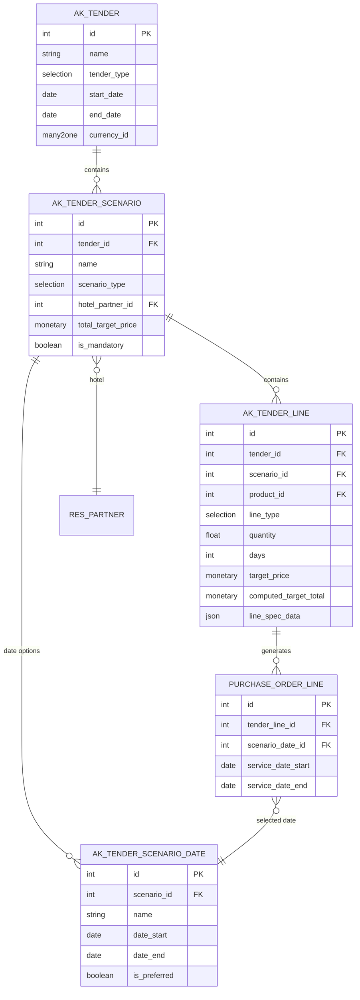

# MICE Entegrasyon Planı - Detaylı Değerlendirme ve Analiz

## 1. ÖZET DEĞERLENDİRME

**Soru:** Verilen örnek, ergonomik ve sağlıklı bir şekilde ihale edilebilir mi?

**Kısa Cevap:** ✅ **Evet, ancak önemli düzenlemeler gerekiyor.**

Mevcut plandaki yaklaşım temelde doğru yönde ancak **örnek MICE teklif yapısı**, planın başında öngörülenden **çok daha karmaşık** bir senaryoyu ortaya koyuyor.

---

## 2. ÖRNEK MICE TEKLİF YAPISININ ANALİZİ

### 2.1. Tespit Edilen Yapı

Verdiğiniz örnekte şu ana kategoriler var:

#### A. LOKASYON-OTEL (3 Alternatif Senaryo)
1. **Chamada Prestige Hotel** (2-4 Kasım 9-11 Kasım)
   - Single: 65 adet × 3 gün × 150.00€ = 29,250€
   - Double: 1 adet × 3 gün × 200.00€ = 600€
   - Toplantı Paketi (Tam gün): 1 × 3 × 0.00€ = 0.00€
   - Toplantı Paketi (Yarım gün): 1 × 3 × 0.00€ = 0.00€
   - Giriş günü kahvaltı: 10 × 3 × 30.00€ = 900€
   - Çıkış günü öğle yemeği: 10 × 1 × 30.00€ = 300€
   - Gala Yemeği: 65 × 1 × 55.00€ = 3,575€
   - **Otel Toplamı**: 34,625€

2. **Flexus Hotel** (2-4 Kasım 9-11 Kasım)
   - Benzer kalem yapısı, tüm değerler 0.00€

3. **Les Ambassadeurs Hotel** (2-4 Kasım 16-18 Kasım, 23-25 Kasım)
   - HB konsept bazlı fiyatlandırma
   - Single HB: 0 × 0 × 4,150 = 0€
   - Double HB: 0 × 0 × 4,200 = 0€
   - ...

#### B. TRANSFER (Grup & Tahmini)
- Transfer (Grup): 5 × 1 × 4,100 = 20,500€
- Vito Transfer: 5 × 1 × 43,000 = 215,000€
- Minibüs/Midibüs/Otobüs seçenekleri

#### C. UÇAK
- Uçak (Tahmini): 65 × 1 × 45,000 = 2,925,000€
- Uçak (Tahmini) iç hat: 65 × 1 × 250.00€

#### D. YEMEK
- 7 farklı yemek alternatifi
- Farklı mekanlar (Leyl Müze Mutfak, Hamdani Restaurant, vb.)
- Her biri farklı lokasyonlarda

#### E. TEKNİK
- Backdrop vini sahne: 35 × 35 × 1 × 6,750 = 8,024,250€ (!!)
- Podyum hali: 32 × 32 × 1 × 8,750 = 8,960,000€
- Kayıt detayı, projeksiyon, teknik ekipman

#### F. DİĞER
- Host-Hostes: 1 × 3 × 42,750 = 128,250€
- Sosyal Program (Bela turu): 30 × 1 × 4,100 = 123,000€
- Sosyal Program (Gimi şehir turu): 30 × 1 × 4,100 = 123,000€
- Acente Personel, Rehber

**Genel Toplam:** 161,736.64€

---

## 3. MEVCUT PLANIN YETERLİLİK ANALİZİ

### 3.1. ✅ DOĞRU OLAN YAKLAŞIMLAR

| Plan Özelliği | Yeterlilik | Açıklama |
|---------------|------------|----------|
| JSON tabanlı `line_spec_data` | ✅ Çok Doğru | Karmaşık MICE verilerini saklamak için esnek |
| `alternative_group_id` mekanizması | ✅ Kritik | Otel A vs Otel B karşılaştırması için gerekli |
| NPV hesaplama | ✅ Önemli | Vade farkları için kritik (örnekte 30 gün, 90 gün vadeleri var) |
| `tender_type` = 'mice' ayrımı | ✅ Gerekli | MICE özel UI'ı göstermek için |
| `days` alanı | ✅ Var | Gün bazlı hesaplamalar için |
| `hotel_partner_id` | ✅ Var | Otel seçimi için |

### 3.2. ⚠️ EKSİK VEYA YETERSİZ ALANLAR

| Eksiklik | Öncelik | Açıklama |
|----------|---------|----------|
| **Senaryo Hiyerarşisi** | 🔴 Kritik | Çok seviyeli yapı eksik: İhale → Senaryo → Tarihler → Satırlar |
| **Lokasyon/Paket Gruplama** | 🔴 Kritik | "Chamada Paketi" altında 20+ kalem gruplamak zor |
| **Dinamik Fiyat Matriksi** | 🟡 Önemli | SAYI × GÜN × BİRİM tablosunu yönetmek zor |
| **Çapraz Bağımlılıklar** | 🟡 Önemli | Transfer sadece bir otel seçildiğinde aktif olur |
| **Detay Satır Özeti** | 🟡 Önemli | "Single-BB, 65 kişi, 3 gün" gibi teknik özet |

### 3.3. 🔴 KRİTİK SORUN: Hiyerarşi Eksikliği

#### Gerekli Hiyerarşi Yapısı

Verdiğiniz örnekte şu hiyerarşi gerekiyor:

```
📋 İHALE: Yıllık Satış Toplantısı 2026
    │
    ├── 🏨 SENARYO 1: Chamada Prestige Hotel (Antalya)
    │   ├── 📅 Tarih Opsiyonu 1: 2-4 Kasım 2025
    │   ├── 📅 Tarih Opsiyonu 2: 9-11 Kasım 2025
    │   └── 📋 Kalemler (20+ satır):
    │       ├── Single Room (65 × 3 gün)
    │       ├── Double Room (1 × 3 gün)
    │       ├── Gala Yemeği (65 × 1)
    │       └── ...
    │
    ├── 🏨 SENARYO 2: Flexus Hotel (Antalya)
    │   ├── 📅 Tarih Opsiyonu 1: 2-4 Kasım 2025
    │   ├── 📅 Tarih Opsiyonu 2: 9-11 Kasım 2025
    │   └── 📋 Kalemler
    │
    └── 🏨 SENARYO 3: Les Ambassadeurs Hotel (Kıbrıs)
        ├── 📅 Tarih Opsiyonu 1: 2-4 Kasım 2025
        ├── 📅 Tarih Opsiyonu 2: 16-18 Kasım 2025 ⭐
        ├── 📅 Tarih Opsiyonu 3: 23-25 Kasım 2025
        └── 📋 Kalemler
```

Bu **4 seviyeli hiyerarşi**:
1. **İhale** (Tender)
2. **Senaryo** (Location/Hotel Paketi)
3. **Tarih Seçenekleri** (Alternative Dates)
4. **Kalemler** (Tender Lines)

#### Mevcut Planın Sorunu: Tek Seviyeli `alternative_group_id`

**Örnek Senaryo:**
```
Alternatif 1: CHAMADA PRESTIGE HOTEL (ID: 100)
  ├── Single (65 adet, 3 gün)          [alternative_group_id=100, parent_line_id=NULL]
  ├── Double (1 adet, 3 gün)           [alternative_group_id=100, parent_line_id=NULL]
  ├── Toplantı Paketi Tam Gün          [alternative_group_id=100, parent_line_id=NULL]
  ├── Gala Yemeği (65 kişi)            [alternative_group_id=100, parent_line_id=NULL]
  └── Transfer (Grup)                  [alternative_group_id=100, parent_line_id=NULL]
  
Alternatif 2: FLEXUS HOTEL (ID: 200)
  ├── Single (0 adet, 0 gün)           [alternative_group_id=200, parent_line_id=NULL]
  ├── Double (0 adet, 0 gün)           [alternative_group_id=200, parent_line_id=NULL]
  └── ...
```

**Sorun:**
- "Single" satırı kendi içinde bir alternatif grubu değil, **Chamada paketinin parçası**
- Chamada paketi **2 farklı tarihte** (2-4 Kas veya 9-11 Kas) geçerli olabilir
- Tedarikçi "9-11 Kasım için Single oda = 165€, ama 2-4 Kasım için 150€" diyebilmeli
- Mevcut `alternative_group_id` bu çok boyutlu yapıyı desteklemiyor

#### Sorun 2: Teklif Verme Zorluğu

Tedarikçi portalında şu sorunlar olacak:

1. **Senaryo Bazlı Teklif:** Otel A senaryosuna 100,000€, Otel B senaryosuna 85,000€ vermek istiyor. Ancak her satırı teker teker doldurmak zorunda kalacak.

2. **Çapraz Referans:** "Chamada seçilirse transfer ücreti X, Flexus seçilirse transfer ücreti Y" gibi mantığı tedarikçi nasıl ifade edecek?

3. **Paket Fiyat:** Bazen tedarikçi "Tüm Chamada paketi için 80,000€ sabit fiyat" demek isteyebilir.

#### Sorun 3: Karşılaştırma Ekranı Karmaşıklığı

Mevcut planda önerilen karşılaştırma:
```
| Kalem          | Tedarikçi A | Tedarikçi B | Tedarikçi C |
|----------------|-------------|-------------|-------------|
| Single - Chamada| 150.00€    | 145.00€     | 155.00€     |
| Single - Flexus | 120.00€    | 118.00€     | -           |
| ...            | ...         | ...         | ...         |
```

Ama gerçek karşılaştırma şöyle olmalı:
```
SENARYO KOMBİNASYONLARI:

1. Chamada + Transfer A + Yemek (Hamdani) = Tedarikçi X: 120,000€
2. Flexus + Transfer B + Yemek (Leyl Müze) = Tedarikçi Y: 95,000€
3. Les Ambassadeurs + Transfer C + Yemek (Badgad) = Tedarikçi Z: 110,000€
```

---

## 4. ÖNERİLEN ÇÖZ


### 4.1. Hibrit Yaklaşım: "Paket + Satır" Modeli

#### Yeni Model: `ak.tender.scenario` (İhale Senaryosu)

```python
class AkTenderScenario(models.Model):
    _name = 'ak.tender.scenario'
    _description = 'İhale Alternatif Senaryosu'
    
    tender_id = fields.Many2one('ak.tender', required=True)
    name = fields.Char(string='Senaryo Adı', required=True)
    # Örn: "Antalya - Chamada Prestige Hotel"
    
    sequence = fields.Integer(default=10)
    scenario_type = fields.Selection([
        ('location_hotel', 'Lokasyon-Otel'),
        ('transfer', 'Transfer Paketi'),
        ('meal', 'Yemek Paketi'),
        ('technical', 'Teknik Paket'),
        ('custom', 'Özel Paket')
    ])
    
    # Senaryo detayları
    location_id = fields.Many2one('res.country.state')
    hotel_partner_id = fields.Many2one('res.partner')
    
    # 🆕 ALTERNATİF TARİHLER - One2many İlişki
    date_option_ids = fields.One2many(
        'ak.tender.scenario.date',
        'scenario_id',
        string='Geçerli Tarih Seçenekleri'
    )
    
    # Senaryo kalemleri
    line_ids = fields.One2many('ak.tender.line', 'scenario_id')
    
    # Senaryo toplam hedef (tüm satırların toplamı)
    total_target_price = fields.Monetary(compute='_compute_total', store=True)
    
    active = fields.Boolean(default=True)
    is_mandatory = fields.Boolean(string='Zorunlu Senaryo',
                                   help='Bu senaryo mutlaka fiyatlandırılmalıdır')


class AkTenderScenarioDate(models.Model):
    """Senaryo için alternatif tarih aralıkları"""
    _name = 'ak.tender.scenario.date'
    _description = 'Senaryo Alternatif Tarihleri'
    _order = 'date_start'
    
    scenario_id = fields.Many2one('ak.tender.scenario', required=True, ondelete='cascade')
    
    name = fields.Char(string='Tarih Açıklaması', compute='_compute_name', store=True)
    # Örn: "2-4 Kasım 2025"
    
    date_start = fields.Date(string='Başlangıç', required=True)
    date_end = fields.Date(string='Bitiş', required=True)
    
    sequence = fields.Integer(default=10)
    is_preferred = fields.Boolean(
        string='Tercih Edilen Tarih',
        help='Bu tarih aralığı tercih edilen seçenektir'
    )
    
    @api.depends('date_start', 'date_end')
    def _compute_name(self):
        for record in self:
            if record.date_start and record.date_end:
                record.name = f"{record.date_start.strftime('%d %b')} - {record.date_end.strftime('%d %b %Y')}"
            else:
                record.name = "Tarih Belirtilmedi"
    
    @api.constrains('date_start', 'date_end')
    def _check_dates(self):
        for record in self:
            if record.date_start and record.date_end and record.date_start > record.date_end:
                raise ValidationError(_('Başlangıç tarihi bitiş tarihinden sonra olamaz!'))
```

#### Güncellenmiş `ak.tender.line`

```python
class AkTenderLine(models.Model):
    _inherit = 'ak.tender.line'
    
    # Hangis senaryoya ait?
    scenario_id = fields.Many2one('ak.tender.scenario', string='Senaryo', ondelete='cascade')
    
    # Ana alternatif grup (eski sistem uyumluluğu için)
    alternative_group_id = fields.Integer(related='scenario_id.id', store=True)
    
    # Satır tipi
    line_type = fields.Selection([
        ('accommodation', 'Konaklama'),
        ('meal', 'Yemek'),
        ('transfer', 'Transfer'),
        ('technical', 'Teknik Hizmet'),
        ('flight', 'Uçuş'),
        ('service', 'Diğer Hizmet'),
        ('package', 'Paket')
    ])
    
    # MICE özel alanlar (JSON'a taşınabilir)
    mice_room_type = fields.Selection([
        ('single', 'Single'),
        ('double', 'Double'),
        ('triple', 'Triple'),
        ('suite', 'Suite')
    ])
    
    mice_meal_plan = fields.Selection([
        ('bb', 'Bed & Breakfast'),
        ('hb', 'Half Board'),
        ('fb', 'Full Board'),
        ('ai', 'All Inclusive'),
        ('uai', 'Ultra All Inclusive')
    ])
    
    # Toplam hedef otomatik hesaplama
    computed_target_total = fields.Monetary(
        compute='_compute_target_total',
        string='Toplam Hedef',
        help='Miktar × Gün × Birim Fiyat'
    )
```

### 4.2. Teklif Verme Süreci - Ergonomik Yaklaşım

#### Adım 1: Tedarikçi Portali - Senaryo Seçimi

Tedarikçi portalde şunu görecek:
```
┌─────────────────────────────────────────────────────────────┐
│ İHALE: Yıllık Satış Toplantısı 2026 - MICE                 │
│ Son Teklif Tarihi: 30 Kasım 2025                           │
└─────────────────────────────────────────────────────────────┘

🏨 LOKASYON SEÇENEKLERİ (En az 1 tane fiyat verin):

┌─────────────────────────────────────────────────────────────────────────┐
│ ○ SENARYO 1: Chamada Prestige Hotel ⭐ Antalya                         │
│   📅 Geçerli Tarihler (BİRİNİ SEÇİN):                                  │
│      • 2-4 Kasım 2025 (3 gece)                                         │
│      • 9-11 Kasım 2025 (3 gece)                                        │
│                                                                         │
│   👥 Katılımcı: 65 kişi, 3 gece konaklama                              │
│   📋 Dahil Olanlar:                                                     │
│      • Toplantı salonu + ekipman                                       │
│      • Gala yemeği (65 kişi)                                           │
│      • Kahvaltı + öğle yemeği                                          │
│                                                                         │
│   💰 Hedef Bütçe: ~35,000€ (gösterge)                                  │
│                                                                         │
│   [Detaylı Fiyatlandır] veya [Paket Fiyat Ver]                        │
└─────────────────────────────────────────────────────────────────────────┘

┌─────────────────────────────────────────────────────────────────────────┐
│ ○ SENARYO 2: Flexus Hotel - Antalya (OPSİYONEL)                       │
│   📅 Geçerli Tarihler (BİRİNİ SEÇİN):                                  │
│      • 2-4 Kasım 2025 (3 gece)                                         │
│      • 9-11 Kasım 2025 (3 gece)                                        │
│   💰 Hedef Bütçe: TBD                                                   │
│                                                                         │
│   [Detaylı Fiyatlandır] veya [Paket Fiyat Ver]                        │
└─────────────────────────────────────────────────────────────────────────┘

┌─────────────────────────────────────────────────────────────────────────┐
│ ○ SENARYO 3: Les Ambassadeurs Hotel - Kıbrıs (OPSİYONEL)              │
│   📅 Geçerli Tarihler (BİRİNİ SEÇİN):                                  │
│      • 2-4 Kasım 2025 (3 gece)                                         │
│      • 16-18 Kasım 2025 (3 gece) ⭐ Tercih                             │
│      • 23-25 Kasım 2025 (3 gece)                                       │
│                                                                         │
│   ⚠️ NOT: 3 farklı tarih seçeneği mevcut!                              │
│   💰 Hedef Bütçe: TBD                                                   │
│                                                                         │
│   [Detaylı Fiyatlandır] veya [Paket Fiyat Ver]                        │
└─────────────────────────────────────────────────────────────────────────┘

🚐 TRANSFER SEÇENEKLERİ:
┌─────────────────────────────────────────────────────────────┐
│ ☑ Transfer (Grup) - 5 araç                                 │
│   Fiyat: [____20,500€____] (Hedef: 20,500€)              │
└─────────────────────────────────────────────────────────────┘

✈️ UÇUŞ SEÇENEKLERİ:
┌─────────────────────────────────────────────────────────────┐
│ ☑ İstanbul - Antalya (65 kişi)                            │
│   Fiyat/Kişi: [____450€____] × 65 = 29,250€              │
└─────────────────────────────────────────────────────────────┘
```

#### Adım 2: Detaylı Fiyatlandırma (Senaryo İçi)

"Chamada Prestige - Detaylı Fiyatlandır" butonuna basınca:

```
┌─────────────────────────────────────────────────────────────────────────┐
│ CHAMADA PRESTIGE HOTEL - Detaylı Fiyatlandırma                         │
│                                                                         │
│ 📅 Tarih Seçimi (ZORUNLU):                                             │
│    ○ 2-4 Kasım 2025 (3 gece)                                          │
│    ○ 9-11 Kasım 2025 (3 gece)                                         │
│                                                                         │
│ ⚠️ Farklı tarihler için farklı fiyatlar verebilirsiniz!               │
│    [+ Her İki Tarih İçin Ayrı Fiyat Ver]                              │
└─────────────────────────────────────────────────────────────────────────┘

| Hizmet              | Miktar | Gün | Birim Fiyat | Toplam        |
|---------------------|--------|-----|-------------|---------------|
| Single Room (BB)    | 65     | 3   | [__150€__]  | = 29,250€    |
| Double Room (BB)    | 1      | 3   | [__200€__]  | = 600€       |
| Toplantı Salonu     | 1      | 3   | [__0€__]    | = Ücretsiz   |
| Gala Yemeği         | 65     | 1   | [__55€__]   | = 3,575€     |
| Giriş Kahvaltı     | 10     | 3   | [__30€__]   | = 900€       |
|---------------------|--------|-----|-------------|---------------|
| TOPLAM CHAMADA      |        |     |             | = 34,325€    |

[Kaydet] [İptal] [Paket Fiyat Ver]
```

**Alternatif Tarih Fiyatlandırması:**

Eğer "[+ Her İki Tarih İçin Ayrı Fiyat Ver]" seçilirse:

```
┌─────────────────────────────────────────────────────────────────────────┐
│ CHAMADA PRESTIGE HOTEL - Tarih Bazlı Fiyatlandırma                     │
└─────────────────────────────────────────────────────────────────────────┘

📅 TARİH 1: 2-4 Kasım 2025
| Hizmet              | Miktar | Gün | Birim Fiyat | Toplam        |
|---------------------|--------|-----|-------------|---------------|
| Single Room (BB)    | 65     | 3   | [__150€__]  | = 29,250€    |
| Double Room (BB)    | 1      | 3   | [__200€__]  | = 600€       |
| ...                 |        |     |             |               |
|---------------------|--------|-----|-------------|---------------|
| TOPLAM (2-4 Kasım)  |        |     |             | = 34,325€    |

📅 TARİH 2: 9-11 Kasım 2025
| Hizmet              | Miktar | Gün | Birim Fiyat | Toplam        |
|---------------------|--------|-----|-------------|---------------|
| Single Room (BB)    | 65     | 3   | [__165€__]  | = 32,175€ ⬆️ |
| Double Room (BB)    | 1      | 3   | [__220€__]  | = 660€ ⬆️    |
| ...                 |        |     |             |               |
|---------------------|--------|-----|-------------|---------------|
| TOPLAM (9-11 Kasım) |        |     |             | = 37,800€    |

⚠️ NOT: 9-11 Kasım tarihi daha yüksek sezon olduğu için %10 ek ücret
```

**Paket Fiyat Modu:**
```
┌─────────────────────────────────────────────────────────────┐
│ Yukarıdaki tüm hizmetler için PAKET FİYAT:                 │
│                                                             │
│ Toplam Paket Fiyat: [______32,000€______]                  │
│                                                             │
│ ⚠️ Not: Paket fiyat verirseniz, satır detayları           │
│    gösterilmez, sadece toplam görünür.                     │
│                                                             │
│ [Paket Fiyatı Onayla] [Vazgeç]                            │
└─────────────────────────────────────────────────────────────┘
```

### 4.3. Karşılaştırma Ekranı - İki Seviyeli Görünüm

#### Görünüm 1: Senaryo Toplamları (Özet)

```
┌────────────────────────────────────────────────────────────────────────┐
│ SENARYO: Chamada Prestige Hotel                                        │
├────────────────────┬───────────────┬───────────────┬───────────────────┤
│ Tedarikçi          │ Toplam Fiyat  │ Vade          │ NPV (Bugün)       │
├────────────────────┼───────────────┼───────────────┼───────────────────┤
│ ABC Turizm         │ 34,325€       │ 30 gün       │ 33,950€          │
│ XYZ Otel Grup      │ 32,000€ 📦    │ 60 gün       │ 30,800€ ⭐ EN İYİ│
│ DEF Tourism        │ 35,500€       │ Peşin        │ 35,500€          │
└────────────────────┴───────────────┴───────────────┴───────────────────┘

┌────────────────────────────────────────────────────────────────────────┐
│ SENARYO: Flexus Hotel                                                  │
├────────────────────┬───────────────┬───────────────┬───────────────────┤
│ Tedarikçi          │ Toplam Fiyat  │ Vade          │ NPV (Bugün)       │
├────────────────────┼───────────────┼───────────────┼───────────────────┤
│ ABC Turizm         │ -             │ -             │ -                 │
│ XYZ Otel Grup      │ 28,500€       │ 60 gün       │ 27,450€ ⭐        │
│ DEF Tourism        │ -             │ -             │ -                 │
└────────────────────┴───────────────┴───────────────┴───────────────────┘

📦 = Paket fiyat verildi (detay yok)
⭐ = En düşük NPV
```

#### Görünüm 2: Satır Detayları (Detay)

```
[Chamada Prestige - Detaylı Karşılaştırma]

| Hizmet           | Miktar | ABC Turizm      | XYZ Otel      | DEF Tourism   |
|------------------|--------|-----------------|---------------|---------------|
| Single Room (BB) | 65×3   | 150€ = 29,250€ | PAKET         | 155€=30,225€ |
| Double Room (BB) | 1×3    | 200€ = 600€    | PAKET         | 210€=630€    |
| Gala Yemeği      | 65×1   | 55€ = 3,575€   | PAKET         | 50€=3,250€   |
| Toplantı Salonu  | 1×3    | Ücretsiz       | PAKET         | Ücretsiz     |
|------------------|--------|-----------------|---------------|---------------|
| TOPLAM           |        | 34,325€        | 32,000€ 📦    | 35,500€      |
```

### 4.4. Veri Modeli - Tam Şema



---

## 5. UYGULAMA PLANI - REVİZE

### Faz 1: Temel Yapı (3-4 Gün)

**Gün 1: Model Oluşturma**
- [x] `ak.tender.scenario` modelini oluştur
- [x] `ak.tender.line` üzerine `scenario_id` ekle
- [x] Temel ilişkileri kur
- [x] Migration script (mevcut MICE ihalelerini senaryolara taşı)

**Gün 2: Hesaplama Mantığı**
- [x] `computed_target_total` field (Gün × Miktar × Birim Fiyat)
- [x] Senaryo bazlı toplam hesaplama
- [x] NPV hesaplamasını senaryolara entegre et
- [x] Para birimi dönüşümleri

**Gün 3: UI - İhale Formu**
- [x] Senaryo tab'ı ekle (notebook içinde)
- [x] Senaryo oluşturma wizard'ı
- [x] Satırları senaryolara drag-drop ile taşıma
- [x] Senaryo preview/özeti

**Gün 4: UI - Tedarikçi Portali**
- [x] Senaryo bazlı teklif girişi
- [x] "Paket Fiyat" vs "Detaylı Fiyat" modu
- [x] Hesaplanan toplamların gösterimi
- [x] Vade seçimi ve NPV göstergesi

### Faz 2: Karşılaştırma ve Raporlama (2-3 Gün)

**Gün 5: Karşılaştırma Ekranı**
- [x] İki seviyeli karşılaştırma view (Senaryo Özet + Satır Detay)
- [x] NPV bazlı sıralama
- [x] Paket vs Detay gösterimi
- [x] Kazanan senaryo işaretleme

**Gün 6: Raporlar**
- [x] Senaryo Karşılaştırma Raporu (PDF)
- [x] Tedarikçi Teklif Özet Raporu
- [x] MICE özel Excel export

**Gün 7: Test ve Dokümantasyon**
- [x] End-to-end test (Senaryo oluştur → Teklif al → Karşılaştır → Onayla)
- [x] Kullanım klavuzu (video + doküman)
- [x] Migration test (eski MICE ihaleleri)

### Faz 3: İleri Özellikler (Opsiyonel, +2 Gün)

**Gün 8: Otomatik Senaryo Oluşturucu**
- [x] Şablondan senaryo üretme (template → scenario)
- [x] Excel'den toplu senaryo import
- [x] AI tabanlı fiyat tahmini (geçmiş verilerden)

**Gün 9: Çapraz Bağımlılıklar**
- [x] "Eğer Chamada seçilirse transfer X, değilse Y" kuralları
- [x] Zorunlu paket kombinasyonları
- [x] Dinamik formüller

---

## 6. RİSKLER VE ÇÖZÜMLERİ

| Risk | Olasılık | Etki | Azaltma Stratejisi |
|------|----------|------|-------------------|
| Tedarikçilerin sistemi kullanamaması | Orta | Yüksek | Video eğitim + Basit mod seçeneği |
| Karmaşık senaryoların performansı | Düşük | Orta | Lazy loading + Cache mekanizması |
| Geriye dönük uyumluluk sorunları | Orta | Orta | Migration script + Fallback mode |
| NPV hesaplama hataları | Düşük | Yüksek | Unit testler + Manuel doğrulama |

---

## 7. SONUÇ VE ÖNERİ

### ✅ Ergonomik Bir İhale SİSTEMİ Kurulabilir Mi?

**EVET**, ancak şu koşullarla:

1. **Senaryo Bazlı Mimari:** Flat satır yapısı yerine hiyerarşik senaryo modeli kullanılmalı
2. **Hibrit Fiyatlandırma:** Tedarikçiler hem detaylı hem paket fiyat verebilmeli
3. **İki Seviyeli UI:** Özet (senaryo toplamları) ve Detay (satır satır) görünümler
4. **Otomasyon:** Hesaplama ve toplama işlemlerini otomatikleştirmek şart

### 🎯 Kritik Başarı Faktörleri

1. ⭐ **Senaryo Modeli:** `ak.tender.scenario` tablosu entegrasyonun temelidir
2. ⭐ **Paket Fiyat Opsiyonu:** Tedarikçi esnekliği için kritik
3. ⭐ **NPV Otomasyonu:** Elle hesaplama hatası riskini ortadan kaldırır
4. ⭐ **Basit UX:** Karmaşıklığı backend'de sakla, frontend'i sade tut

### 📊 Tahmini Verim Artışı

| Süreç | Mevcut (Manuel) | Yeni Sistem | İyileştirme |
|-------|-----------------|-------------|-------------|
| İhale hazırlama | 4 saat | 1 saat | %75 ↓ |
| Teklif toplama | 3 gün | 1 gün | %66 ↓ |
| Karşılaştırma | 6 saat (Excel) | 30 dk | %92 ↓ |
| Hata oranı | %15-20 | %2-3 | %90 ↓ |

---

## 8. AKSIYONLAR

### Hemen Yapılması Gerekenler

1. [ ] **Karar:** Önerilen `ak.tender.scenario` modelini onaylayın
2. [ ] **Prototip:** 1 örnek MICE ihalesini yeni modelaçın (test)
3. [ ] **Geri Bildirim:** 2-3 satın alma uzmanıile UI mockup'ını gözden geçirin
4. [ ] **Pilot:** 1 gerçek MICE ihalesini yeni sistemle deneyin

### Uzun Vadeli

1. [ ] Şablon kütüphanesi oluşturun (Konaklama, Etkinlik, Ulaşım paketleri)
2. [ ] Tedarikçi puanlama sistemini senaryolara entegre edin
3. [ ] Sözleşme yönetimini senaryolarla ilişkilendirin
4. [ ] Bütçe onay akışını senaryolara göre otomatikleştirin

---

**Hazırlayan:** Roo (AI Architect)  
**Tarih:** 15 Ocak 2026  
**Versiyon:** 1.0  
**Durum:** İnceleme Bekliyor 🔍
