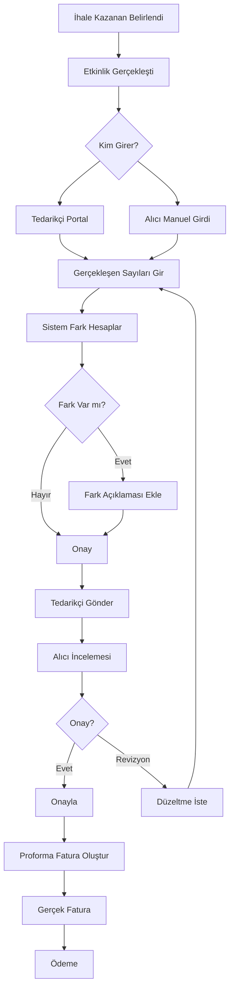

# MICE İhale Sonrası Gerçekleşme ve Proforma Fatura

## İhtiyaç

İhale kazanan tedarikçi, **teklif edilen** (projected) rakamlar yerine **gerçekleşen** (actual) sayıları girerek:

1. Gerçekleşen maliyet hesaplansın
2. Teklif vs Gerçekleşme farkı görülsün
3. Bu veriler proforma fatura olarak kullanılsın

## Kullanım Senaryosu

### Örnek: Chamada Prestige - HB Senaryosu

**İhale Kazanan Teklif (Projected):**
```
CHAMADA PRESTIGE (Antalya) - Yarım Pansiyon
Tarih: 2-4 Kasım 2025

| Hizmet           | Teklif Miktar | Gün | Birim Fiyat | Teklif Toplam |
|------------------|---------------|-----|-------------|---------------|
| Single Room (HB) | 65            | 3   | 150€        | 29,250€       |
| Double Room (HB) | 1             | 3   | 200€        | 600€          |
| Gala Yemeği      | 65            | 1   | 55€         | 3,575€        |
| Toplantı Salonu  | 1             | 3   | Ücretsiz    | 0€            |
|------------------|---------------|-----|-------------|---------------|
| TEKLİF TOPLAMI   |               |     |             | 33,425€       |
```

**Etkinlik Sonrası Gerçekleşen (Actual):**
```
| Hizmet           | Gerçekleşen | Gün | Birim Fiyat | Gerçekleşen Toplam | Fark      |
|------------------|-------------|-----|-------------|--------------------|-----------|
| Single Room (HB) | 63 ⬇️       | 3   | 150€        | 28,350€            | -900€     |
| Double Room (HB) | 2 ⬆️        | 3   | 200€        | 1,200€             | +600€     |
| Gala Yemeği      | 68 ⬆️       | 1   | 55€         | 3,740€             | +165€     |
| Toplantı Salonu  | 1           | 3   | Ücretsiz    | 0€                 | 0€        |
| Ek Servis ⭐     | 2 🆕        | 1   | 120€        | 240€               | +240€ 🆕  |
|------------------|-------------|-----|-------------|--------------------|-----------| 
| GERÇEKLEŞEN TOP. |             |     |             | 33,530€            | +105€     |

📊 ÖZET:
- Teklif Tutarı: 33,425€
- Gerçekleşen: 33,530€
- Fark: +105€ (+0.3%)
- Neden: 2 kişi iptal, 3 kişi ek katılım, ek servis
```

**Proforma Fatura:**
```
═══════════════════════════════════════════════════════════════════
                        PROFORMA FATURA
═══════════════════════════════════════════════════════════════════

Müşteri: ABC Şirket
Tedarikçi: DEF Tourism
Etkinlik: Yıllık Satış Toplantısı 2026
Lokasyon: Chamada Prestige Hotel, Antalya
Tarih: 2-4 Kasım 2025

───────────────────────────────────────────────────────────────────
Kalem                      Miktar  Gün  Fiyat    Tutar
───────────────────────────────────────────────────────────────────
Single Room (Yarım Pan.)      63    3   150€    28,350€
Double Room (Yarım Pan.)       2    3   200€     1,200€
Gala Yemeği                   68    1    55€     3,740€
Toplantı Salonu                1    3     -          0€
Ek Servis (Araç Kiralama)      2    1   120€       240€
───────────────────────────────────────────────────────────────────
ARAÇ TOPLAM                                       33,530€
KDV (%20)                                          6,706€
───────────────────────────────────────────────────────────────────
GENEL TOPLAM                                      40,236€
═══════════════════════════════════════════════════════════════════

Ödeme Vadesi: 60 gün
Banka: ________
IBAN: ________

Onay: _____________                 Tarih: __________
```

## Veri Modeli

### Yeni Model: `ak.tender.actual` (İhale Gerçekleşme)

```python
class AkTenderActual(models.Model):
    """İhale sonrası gerçekleşen değerler"""
    _name = 'ak.tender.actual'
    _description = 'İhale Gerçekleşme Kayıtları'
    
    tender_id = fields.Many2one('ak.tender', required=True, ondelete='cascade')
    scenario_id = fields.Many2one('ak.tender.scenario', string='Senaryo', required=True)
    
    # Kazanan tedarikçi ve PO
    winning_partner_id = fields.Many2one('res.partner', string='Kazanan Tedarikçi')
    purchase_order_id = fields.Many2one('purchase.order', string='Satınalma Siparişi')
    
    # Gerçekleşme tarihleri
    actual_date_start = fields.Date(string='Gerçekleşen Başlangıç', required=True)
    actual_date_end = fields.Date(string='Gerçekleşen Bitiş', required=True)
    
    # Gerçekleşme kalemleri
    line_ids = fields.One2many('ak.tender.actual.line', 'actual_id', string='Gerçekleşen Kalemler')
    
    # Tutarlar
    projected_total = fields.Monetary(
        string='Teklif Tutarı',
        compute='_compute_totals',
        store=True,
        currency_field='currency_id'
    )
    
    actual_total = fields.Monetary(
        string='Gerçekleşen Tutarı',
        compute='_compute_totals',
        store=True,
        currency_field='currency_id'
    )
    
    variance_amount = fields.Monetary(
        string='Fark (Tutar)',
        compute='_compute_totals',
        store=True,
        currency_field='currency_id',
        help='Gerçekleşen - Teklif'
    )
    
    variance_percentage = fields.Float(
        string='Fark (%)',
        compute='_compute_totals',
        store=True,
        help='(Gerçekleşen - Teklif) / Teklif * 100'
    )
    
    currency_id = fields.Many2one('res.currency', related='tender_id.currency_id', store=True)
    
    # Durum
    state = fields.Selection([
        ('draft', 'Taslak'),
        ('submitted', 'Tedarikçi Gönderdi'),
        ('validated', 'Onaylandı'),
        ('invoiced', 'Faturalandı')
    ], default='draft', string='Durum', required=True)
    
    # Notlar
    variance_notes = fields.Text(string='Fark Açıklaması')
    
    # Proforma fatura
    proforma_invoice_id = fields.Many2one('account.move', string='Proforma Fatura', readonly=True)
    
    @api.depends('line_ids.projected_total', 'line_ids.actual_total')
    def _compute_totals(self):
        for record in self:
            record.projected_total = sum(record.line_ids.mapped('projected_total'))
            record.actual_total = sum(record.line_ids.mapped('actual_total'))
            record.variance_amount = record.actual_total - record.projected_total
            
            if record.projected_total:
                record.variance_percentage = (record.variance_amount / record.projected_total) * 100
            else:
                record.variance_percentage = 0.0
    
    def action_create_proforma_invoice(self):
        """Proforma fatura oluştur"""
        self.ensure_one()
        
        # Account.move (invoice) oluştur
        invoice = self.env['account.move'].create({
            'move_type': 'out_invoice',
            'partner_id': self.winning_partner_id.id,
            'invoice_date': fields.Date.today(),
            'ref': f"Proforma - {self.tender_id.name} - {self.scenario_id.name}",
            'narration': self.variance_notes,
            'is_proforma': True,  # Custom field (opsiyonel)
        })
        
        # Invoice lines oluştur (gerçekleşen miktarlarla)
        for line in self.line_ids:
            if line.actual_quantity > 0:
                self.env['account.move.line'].create({
                    'move_id': invoice.id,
                    'product_id': line.product_id.id,
                    'name': line.description,
                    'quantity': line.actual_quantity,
                    'price_unit': line.unit_price,
                    'tender_actual_line_id': line.id,  # Reference
                })
        
        self.proforma_invoice_id = invoice.id
        return {
            'type': 'ir.actions.act_window',
            'res_model': 'account.move',
            'res_id': invoice.id,
            'view_mode': 'form',
            'target': 'current',
        }
    
    def action_submit_to_buyer(self):
        """Tedarikçi gerçekleşmeyi gönderir"""
        self.ensure_one()
        self.state = 'submitted'
        
        # Alıcıya bildirim
        self.tender_id.message_post(
            body=f"Tedarikçi {self.winning_partner_id.name} gerçekleşme verilerini gönderdi.",
            subject="Gerçekleşme Verileri",
            subtype_xmlid='mail.mt_note'
        )


class AkTenderActualLine(models.Model):
    """İhale gerçekleşme kalemleri"""
    _name = 'ak.tender.actual.line'
    _description = 'İhale Gerçekleşme Kalemi'
    
    actual_id = fields.Many2one('ak.tender.actual', required=True, ondelete='cascade')
    
    # Orijinal tender line referansı
    tender_line_id = fields.Many2one('ak.tender.line', string='İhale Kalemi')
    product_id = fields.Many2one('product.product', related='tender_line_id.product_id', store=True)
    description = fields.Text(string='Açıklama')
    
    # Teklif edilen (projected)
    projected_quantity = fields.Float(string='Teklif Miktar', digits='Product Unit of Measure')
    projected_days = fields.Integer(string='Teklif Gün')
    unit_price = fields.Monetary(string='Birim Fiyat', currency_field='currency_id')
    projected_total = fields.Monetary(
        string='Teklif Toplam',
        compute='_compute_projected_total',
        store=True,
        currency_field='currency_id'
    )
    
    # Gerçekleşen (actual)
    actual_quantity = fields.Float(string='Gerçekleşen Miktar', digits='Product Unit of Measure')
    actual_days = fields.Integer(string='Gerçekleşen Gün')
    actual_total = fields.Monetary(
        string='Gerçekleşen Toplam',
        compute='_compute_actual_total',
        store=True,
        currency_field='currency_id'
    )
    
    # Fark
    variance_quantity = fields.Float(
        string='Fark (Miktar)',
        compute='_compute_variance',
        store=True
    )
    variance_total = fields.Monetary(
        string='Fark (Tutar)',
        compute='_compute_variance',
        store=True,
        currency_field='currency_id'
    )
    
    currency_id = fields.Many2one('res.currency', related='actual_id.currency_id', store=True)
    
    # Ek satır mı?
    is_additional = fields.Boolean(
        string='Ek Hizmet',
        help='Teklifte yoktu, sonradan eklendi',
        default=False
    )
    
    additional_reason = fields.Text(string='Ek Hizmet Nedeni')
    
    @api.depends('projected_quantity', 'projected_days', 'unit_price')
    def _compute_projected_total(self):
        for line in self:
            line.projected_total = line.projected_quantity * (line.projected_days or 1) * line.unit_price
    
    @api.depends('actual_quantity', 'actual_days', 'unit_price')
    def _compute_actual_total(self):
        for line in self:
            line.actual_total = line.actual_quantity * (line.actual_days or 1) * line.unit_price
    
    @api.depends('actual_quantity', 'projected_quantity', 'actual_total', 'projected_total')
    def _compute_variance(self):
        for line in self:
            line.variance_quantity = line.actual_quantity - line.projected_quantity
            line.variance_total = line.actual_total - line.projected_total
```

## İş Akışı



## UI Tasarımları

### Tedarikçi Portal - Gerçekleşme Girişi

```
┌──────────────────────────────────────────────────────────────────────────┐
│ GERÇEKLEŞMERETİ: Yıllık Satış Toplantısı 2026                           │
│ Senaryo: Chamada Prestige 5⭐ (Antalya) - HB                            │
│ Etkinlik Tarihi: 2-4 Kasım 2025                                         │
└──────────────────────────────────────────────────────────────────────────┘

📋 GERÇEKLEŞEN MİKTARLARI GİRİN

┌──────────────────────────────────────────────────────────────────────────┐
│ Hizmet          │ Teklif │ Gerçekleşen │ Gün │ Birim│ Teklif  │Gerçek  │
│                 │        │             │     │ Fiyat│ Toplam  │Toplam  │
├─────────────────┼────────┼─────────────┼─────┼──────┼─────────┼────────┤
│ Single Room HB  │ 65     │ [__63___]⚠️│  3  │ 150€ │29,250€  │28,350€││
│ Double Room HB  │ 1      │ [___2___]⚠️│  3  │ 200€ │  600€   │ 1,200€││
│ Gala Yemeği     │ 65     │ [__68___]⚠️│  1  │  55€ │ 3,575€  │ 3,740€││
│ Toplantı Salonu │ 1      │ [___1___]   │  3  │  0€  │    0€   │    0€ ││
├─────────────────┼────────┼─────────────┼─────┼──────┼─────────┼────────┤
│ TOPLAM          │        │             │     │      │33,425€  │33,290€││
└──────────────────────────────────────────────────────────────────────────┘

⚠️ = Fark var (açıklama gerekli)

─────────────────────────────────────────────────────────────────────────────

💬 FARK AÇIKLAMASI (Zorunlu):

┌──────────────────────────────────────────────────────────────────────────┐
│ [ ✓ Single Room: 2 kişi hastalık nedeniyle katılamadı                  │
│   ✓ Double Room: 1 ek yönetici son dakika katıldı                      │
│   ✓ Gala Yemeği: 3 davetli ekstra katıldı                              │
│ ]                                                                        │
└──────────────────────────────────────────────────────────────────────────┘

─────────────────────────────────────────────────────────────────────────────

➕ EK HİZMETLER (Teklifte olmayan ek kalemler)

[+ Ek Hizmet Ekle]

┌──────────────────────────────────────────────────────────────────────────┐
│ Ek Hizmet: [Araç Kiralama (VIP Transfer)        ▼]                     │
│ Miktar:    [2] × Gün:[1] × Birim Fiyat:[120€] = 240€                   │
│ Açıklama:  [2 üst düzey yönetici için havalimanı transferi_______]     │
│ [🗑️ Sil] [💾 Kaydet]                                                    │
└──────────────────────────────────────────────────────────────────────────┘

─────────────────────────────────────────────────────────────────────────────

📊 ÖZET
- Teklif Tutarı:     33,425€
- Ek Hizmetler:         240€
- Gerçekleşen Toplam: 33,530€
- Fark:               +105€ (+0.3%)

[💾 Taslak Kaydet] [📤 Alıcıya Gönder]
```

### Alıcı Görünümü - Gerçekleşme Onayı

```
┌──────────────────────────────────────────────────────────────────────────┐
│ GERÇEKLEŞMERETİ İNCELEME                                                 │
│ İhale: Yıllık Satış Toplantısı 2026                                     │
│ Tedarikçi: DEF Tourism | Gönderim: 5 Kasım 2025                         │
└──────────────────────────────────────────────────────────────────────────┘

[📋 Detay] [📊 Grafik] [📄 Proforma Önizleme]

─────────────────────────────────────────────────────────────────────────────

KARŞILAŞTIRMA TABİLO

| Kalem           | Teklif | Gerçekleşen | Fark     | Fark %   | Tutar Fark |
|-----------------|--------|-------------|----------|----------|------------|
| Single Room HB  | 65     | 63 ⬇️       | -2       | -3.1%    | -900€ ✅   |
| Double Room HB  | 1      | 2 ⬆️        | +1       | +100%    | +600€ ⚠️   |
| Gala Yemeği     | 65     | 68 ⬆️       | +3       | +4.6%    | +165€ ⚠️   |
| Toplantı Salonu | 1      | 1           | 0        | 0%       | 0€ ✅      |
| VIP Transfer 🆕 | 0      | 2 🆕        | +2       | NEW      | +240€ ⚠️   |
|-----------------|--------|-------------|----------|----------|------------|
| TOPLAM          |        |             |          |          | +105€      |

✅ = Kabul edilebilir
⚠️ = İnceleme gerekli
🆕 = Yeni eklenen

─────────────────────────────────────────────────────────────────────────────

TEDARİKÇİ AÇIKLAMASI:
"2 kişi hastalık nedeniyle katılamadı. 1 ek yönetici son dakika katıldı.
Gala yemeğine 3 davetli ekstra katıldı. 2 üst düzey yönetici için 
havalimanı VIP transferi talep edildi."

─────────────────────────────────────────────────────────────────────────────

İNCELEME NOTU:
┌──────────────────────────────────────────────────────────────────────────┐
│ [Açıklamalar makul. Ek transfer onaylanmıştı._____________________]     │
└──────────────────────────────────────────────────────────────────────────┘

─────────────────────────────────────────────────────────────────────────────

AKSİYONLAR:

[✅ Onayla ve Proforma Oluştur] [📝 Düzeltme İste] [❌ Reddet]
```

### Proforma Fatura Önizleme

```
┌──────────────────────────────────────────────────────────────────────────┐
│ PROFORMA FATURA ÖNİZLEME                                                 │
└──────────────────────────────────────────────────────────────────────────┘

═══════════════════════════════════════════════════════════════════
                      PROFORMA FATURA
                     #PF-2025-00123
═══════════════════════════════════════════════════════════════════

Fatura Tarihi: 5 Kasım 2025
Vade Tarihi:   4 Ocak 2026 (60 gün)

Müşteri:                          Tedarikçi:
ABC Şirket A.Ş.                   DEF Tourism Ltd.
Maslak Mah. No:123                Lara Cad. No:45
İstanbul, Türkiye                 Antalya, Türkiye
VKN: 1234567890                   VKN: 0987654321

───────────────────────────────────────────────────────────────────
Referans: Yıllık Satış Toplantısı 2026 - MICE İhalesi
Etkinlik: 2-4 Kasım 2025, Chamada Prestige Hotel, Antalya
───────────────────────────────────────────────────────────────────

Kalem                          Miktar  Gün  Fiyat    Tutar
───────────────────────────────────────────────────────────────────
Single Room (Yarım Pansiyon)      63    3   150€    28,350.00€
Double Room (Yarım Pansiyon)       2    3   200€     1,200.00€
Gala Yemeği                       68    1    55€     3,740.00€
Toplantı Salonu                    1    3     -          0.00€
VIP Transfer (Ek Hizmet)           2    1   120€       240.00€
───────────────────────────────────────────────────────────────────
ARA TOPLAM                                           33,530.00€
KDV (%20)                                             6,706.00€
───────────────────────────────────────────────────────────────────
GENEL TOPLAM                                         40,236.00€
═══════════════════════════════════════════════════════════════════

Ödeme Bilgileri:
Banka: XYZ Bankası
IBAN: TR12 3456 7890 1234 5678 9012 34
Swift: XYZTRX

───────────────────────────────────────────────────────────────────
Not: Bu proforma fatura muhasebe kaydı oluşturmaz.
Kesin fatura ayrıca gönderilecektir.
───────────────────────────────────────────────────────────────────

[📄 PDF İndir] [📧 Email Gönder] [✅ Gerçek Faturaya Dönüştür]
```

## Gap Analizi - İhale Sonrası

### Mevcut Durum (AS-IS)

❌ İhale sonrası gerçekleşme takibi YOK
❌ Teklif vs gerçekleşen karşılaştırması YOK
❌ Proforma fatura otomatik oluşturma YOK
❌ Tedarikçi gerçekleşme girişi YOK

### Hedef Durum (TO-BE)

✅ `ak.tender.actual` modeli (gerçekleşme kayıtları)
✅ `ak.tender.actual.line` (satır bazlı gerçekleşme)
✅ Tedarikçi portal gerçekleşme girişi
✅ Otomatik fark hesaplama
✅ Proforma fatura oluşturma (account.move)
✅ Onay akışı (workflow entegrasyonu)

## Geliştirme Planı Eklentisi

**Faz 5: İhale Sonrası ve Proforma (2-3 Gün)**

| Gün | Görev | Deliverable |
|-----|-------|-------------|
| 20 | **Model Geliştirme** | |
| | - `ak.tender.actual` modeli | ✅ Model + fields |
| | - `ak.tender.actual.line` | ✅ Model + fields |
| | - Hesaplama mantığı | ✅ Computed fields |
| | | |
| 21 | **Tedarikçi Portal - Gerçekleşme** | |
| | - Gerçekleşme girişi formu | ✅ View |
| | - Ek hizmet ekleme | ✅ Widget |
| | - Fark açıklaması | ✅ Mandatory text |
| | | |
| 22 | **Proforma Fatura** | |
| | - Proforma oluşturma | ✅ account.move create |
| | - PDF template | ✅ QWeb report |
| | - Email gönderimi | ✅ Template |
| | | |
| 23 | **Onay ve Entegrasyon** | |
| | - Workflow entegrasyonu | ✅ ak_workflow |
| | - Alıcı onay ekranı | ✅ View |
| | - Bildirimler | ✅ Notifications |

**Toplam Geliştirme Süresi:** 19 + 4 = **23 iş günü (~5 hafta)**

## Avantajlar

### Alıcı (Şirket) İçin
✅ **Maliyet Şeffaflığı:** Teklif vs gerçekleşen net görülür
✅ **Bütçe Kontrolü:** Aşımlar anında tespit edilir
✅ **Audit Trail:** Tüm değişiklikler kayıtlı
✅ **Hızlı Faturalandırma:** Proforma otomatik oluşur

### Tedarikçi İçin
✅ **Güven:** Gerçekleşen sayılar mutabakat altında
✅ **Hak Ediş:** Ek hizmetler faturalanabilir
✅ **Hızlı Ödeme:** Proforma onaylanınca fatura hızlıca kesilir

### Finansal Kontrol
✅ **Varyans Analizi:** Hangi kalemlerde fark oluyor?
✅ **Trend Analizi:** Gelecek ihaleler için insight
✅ **Tedarikçi Performansı:** Teklif vs gerçekleşme doğruluğu

## Örnek Raporlar

### Varyans Raporu

```
┌──────────────────────────────────────────────────────────────────────────┐
│ VARYANS RAPORU: 2025 Q4 MICE İhaleleri                                  │
└──────────────────────────────────────────────────────────────────────────┘

| İhale           | Teklif    | Gerçekleşen | Fark     | Fark %  | Durum |
|-----------------|-----------|-------------|----------|---------|-------|
| Satış Toplantısı| 33,425€   | 33,530€     | +105€    | +0.3%   | ✅ OK |
| Yıl Sonu Gala   | 58,000€   | 62,400€     | +4,400€  | +7.6%   | ⚠️    |
| Dealer Meeting  | 42,500€   | 41,200€     | -1,300€  | -3.1%   | ✅ OK |
|-----------------|-----------|-------------|----------|---------|-------|
| TOPLAM          | 133,925€  | 137,130€    | +3,205€  | +2.4%   |       |

Ortalama Varyans: +2.4%
En Yüksek Fark: Yıl Sonu Gala (+7.6%)
En Doğru Teklif: Satış Toplantısı (+0.3%)
```

### Tedarikçi Doğruluk Skoru

```
┌──────────────────────────────────────────────────────────────────────────┐
│ TEDARİKÇİ PERFORMANS - Teklif Doğruluğu                                 │
└──────────────────────────────────────────────────────────────────────────┘

| Tedarikçi     | İhale Sayısı | Ort. Varyans | Doğruluk Skoru | Rating |
|---------------|--------------|--------------|----------------|--------|
| DEF Tourism   | 8            | +1.2%        | 96.8/100       | ⭐⭐⭐⭐⭐|
| ABC Hotels    | 5            | +5.8%        | 89.2/100       | ⭐⭐⭐⭐  |
| XYZ Events    | 3            | -3.2%        | 93.1/100       | ⭐⭐⭐⭐  |

Not: Doğruluk skoru = 100 - |Ortalama Varyans %| × 2
```

## Özet

İhale sonrası gerçekleşme takibi:

1. **Tedarikçi** gerçekleşen sayıları girer
2. **Sistem** otomatik fark hesaplar
3. **Tedarikçi** farkları açıklar
4. **Alıcı** inceler ve onaylar
5. **Sistem** proforma fatura oluşturur
6. **Muhasebe** gerçek faturaya dönüştürür

Bu mekanizma **tam döngü MICE ihale yönetimi** sağlar: Talep → Teklif → Kazanan → Gerçekleşme → Fatura → Ödeme

---

**Kritik:** Bu özellik olmadan MICE ihaleleri tam kapatılamaz! Gerçekleşme mutabakatı için şart.
