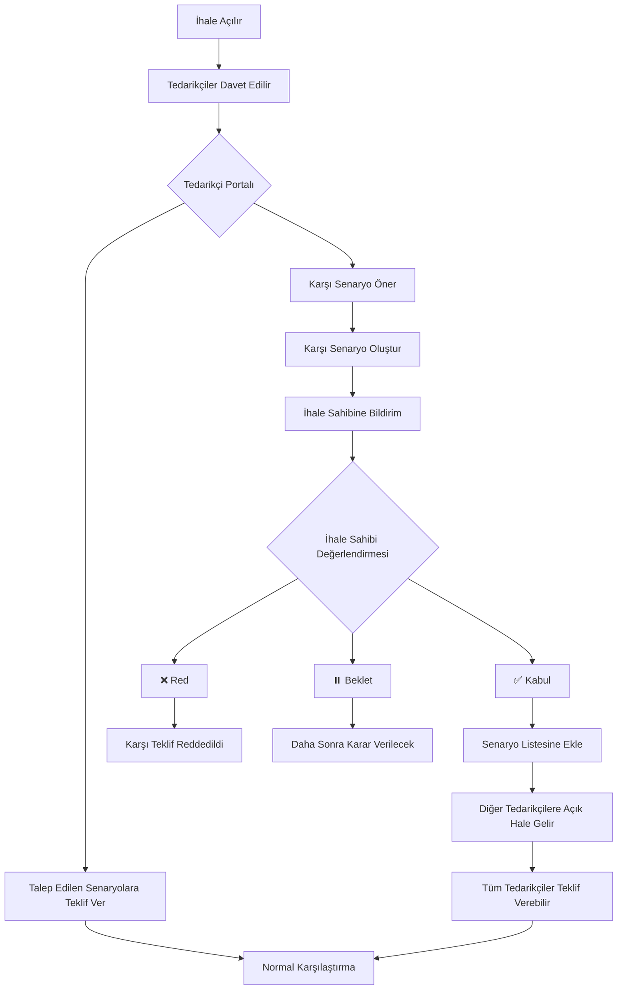

# Tedarikçi Karşı Senaryo (Counter-Offer) Mekanizması

## İhtiyaç

Tedarikçiler sadece hazır senaryolara teklif vermekle sınırlı kalmamalı. Kendi **alternatif senaryolarını** önerebilmelidirler:

- Farklı otel
- Farklı tarih aralığı
- Farklı lokasyon
- Farklı pansiyon tipi
- veya tümü

## Örnek Kullanım Senaryoları

### Senaryo 1: Farklı Otel Önerisi
```
İhale Sahibi İstedi:
  ✓ Chamada Prestige (Antalya) - HB - 2-4 Kas
  
Tedarikçi Yanıtı:
  ✓ Chamada Prestige - HB - 2-4 Kas → 32,000€ (talep edilen)
  🆕 Rixos Downtown (Antalya) - HB - 2-4 Kas → 29,500€ (karşı teklif!)
     "Aynı sınıf otel, daha merkezi konum, %8 daha ucuz"
```

### Senaryo 2: Farklı Tarih Önerisi
```
İhale Sahibi İstedi:
  ✓ Chamada Prestige - HB - 2-4 Kas
  
Tedarikçi Yanıtı:
  ✓ Chamada Prestige - HB - 2-4 Kas → 34,000€ (yüksek sezon)
  🆕 Chamada Prestige - HB - 15-17 Kas → 28,000€ (karşı teklif!)
     "Düşük sezonda %18 tasarruf"
```

### Senaryo 3: Farklı Lokasyon Önerisi
```
İhale Sahibi İstedi:
  ✓ Chamada Prestige (Antalya) - HB - 2-4 Kas
  
Tedarikçi Yanıtı:
  ✓ Chamada Prestige (Antalya) - HB - 2-4 Kas → 32,000€
  🆕 Titanic Beach (Belek) - HB - 2-4 Kas → 30,500€ (karşı teklif!)
     "Antalya'ya 30 km, özel plaj + golf sahası"
```

### Senaryo 4: Upgrade Önerisi
```
İhale Sahibi İstedi:
  ✓ Flexus Hotel (Antalya) - HB - 2-4 Kas
  
Tedarikçi Yanıtı:
  ✓ Flexus Hotel - HB - 2-4 Kas → 28,000€
  🆕 Flexus Hotel - AI - 2-4 Kas → 32,500€ (karşı teklif!)
     "Sadece +16% ile All Inclusive upgrade"
```

## Veri Modeli Güncellemesi

### `ak.tender.scenario` - Yeni Alanlar

```python
class AkTenderScenario(models.Model):
    _name = 'ak.tender.scenario'
    # ... mevcut alanlar ...
    
    # Senaryo kaynağı
    scenario_source = fields.Selection([
        ('buyer', 'İhale Sahibi'),
        ('supplier_counter', 'Tedarikçi Karşı Teklifi')
    ], default='buyer', required=True, string='Senaryo Kaynağı')
    
    # Karşı teklif veren tedarikçi
    supplier_partner_id = fields.Many2one(
        'res.partner',
        string='Öneren Tedarikçi',
        help='Bu senaryoyu öneren tedarikçi (counter-offer için)'
    )
    
    # Baz senaryo (counter-offer için)
    base_scenario_id = fields.Many2one(
        'ak.tender.scenario',
        string='Referans Senaryo',
        help='Bu karşı teklifin alternatifi olan orijinal senaryo'
    )
    
    # Karşı teklif açıklaması
    counter_offer_reason = fields.Text(
        string='Karşı Teklif Gerekçesi',
        help='Tedarikçinin bu alternatifi neden önerdiği'
    )
    
    # Onay durumu
    counter_offer_status = fields.Selection([
        ('pending', 'Değerlendiriliyor'),
        ('accepted', 'Kabul Edildi'),
        ('rejected', 'Reddedildi')
    ], default='pending', string='Karşı Teklif Durumu')
    
    # Counter-offer'ı kim değerlendirdi?
    counter_offer_reviewed_by = fields.Many2one('res.users', string='Değerlendiren')
    counter_offer_review_date = fields.Datetime(string='Değerlendirme Tarihi')
    counter_offer_review_note = fields.Text(string='Değerlendirme Notu')
```

## UI/UX Akışı

### Adım 1: Tedarikçi Portali - Ana Ekran

```
┌─────────────────────────────────────────────────────────────────────────┐
│ İHALE: Yıllık Satış Toplantısı 2026 - MICE                             │
│ Son Teklif Tarihi: 30 Kasım 2025                                       │
└─────────────────────────────────────────────────────────────────────────┘

🏨 TALEP EDİLEN SENARYOLAR:

┌──────────────────────────────────────────────────────────────────────────┐
│ ☑ SENARYO 1: Chamada Prestige 5⭐ (Antalya) - HB ⭐ ZORUNLU            │
│   📅 2-4 Kasım 2025 veya 9-11 Kasım 2025                                │
│   👥 65 kişi, 3 gece                                                     │
│   💰 Hedef: ~35,000€                                                     │
│                                                                          │
│   [✅ Teklif Ver] [➕ Alternatif Öner]                                  │
└──────────────────────────────────────────────────────────────────────────┘

┌──────────────────────────────────────────────────────────────────────────┐
│ ○ SENARYO 2: Flexus Hotel 4⭐ (Antalya) - HB (Opsiyonel)               │
│   📅 2-4 Kasım 2025 veya 9-11 Kasım 2025                                │
│   👥 65 kişi, 3 gece                                                     │
│   💰 Hedef: ~28,000€                                                     │
│                                                                          │
│   [Teklif Ver] [➕ Alternatif Öner]                                     │
└──────────────────────────────────────────────────────────────────────────┘

─────────────────────────────────────────────────────────────────────────────

💡 KENDİ ALTERNATİFİNİZİ ÖNERİN:

[➕ Yeni Karşı Senaryo Ekle]
```

### Adım 2: Karşı Senaryo Oluşturma Formu

"Alternatif Öner" veya "Yeni Karşı Senaryo Ekle" butonuna tıklanınca:

```
┌──────────────────────────────────────────────────────────────────────────┐
│ 🆕 KARŞI TEKLİF SENARYOSU OLUŞTUR                                       │
└──────────────────────────────────────────────────────────────────────────┘

📋 Referans Senaryo (Opsiyonel):
   [Senaryo 1: Chamada Prestige HB ▼]
   
   ℹ️ Bu, hangi senaryonun alternatifi? (Boş bırakılırsa tamamen yeni teklif)

─────────────────────────────────────────────────────────────────────────────

🏨 OTEL BİLGİLERİ:

Ülke:              [Türkiye                    ▼]
Şehir/Bölge:       [Antalya                    ▼]
Otel:              [Rixos Downtown Antalya     ▼] [🔍 Ara] [➕ Yeni Ekle]
Yıldız:            ⭐⭐⭐⭐⭐ (5 yıldız)

─────────────────────────────────────────────────────────────────────────────

🍽️ PANSİYON TİPİ:

   ○ Room Only
   ○ Bed & Breakfast
   ● Half Board (Yarım Pansiyon)
   ○ Full Board
   ○ All Inclusive
   ○ Ultra All Inclusive

─────────────────────────────────────────────────────────────────────────────

📅 GEÇERLİ TARİHLER:

[➕ Tarih Ekle]

Tarih 1:  [2025-11-02] - [2025-11-04]  ☑ Tercih edilen  [🗑️]
Tarih 2:  [2025-11-15] - [2025-11-17]  ☐ Tercih edilen  [🗑️]

─────────────────────────────────────────────────────────────────────────────

👥 KATILIMCI BİLGİSİ:

Katılımcı Sayısı:  [65  ]
VIP Katılımcı:     [5   ]
Gece:              [3   ]

─────────────────────────────────────────────────────────────────────────────

💬 KARŞI TEKLİF GEREKÇESİ:

┌──────────────────────────────────────────────────────────────────────────┐
│ Bu alternatifi neden öneriyorsunuz?                                      │
│                                                                          │
│ [Rixos Downtown, Chamada Prestige ile aynı sınıf bir oteldir.          │
│  Şehir merkezine daha yakın konumuyla transfer maliyetlerini            │
│  azaltır. Aynı hizmet kalitesinde %8 daha uygun fiyat                   │
│  sunabiliyoruz.]                                                         │
│                                                                          │
└──────────────────────────────────────────────────────────────────────────┘

─────────────────────────────────────────────────────────────────────────────

📋 KALEMLER:

[İhale sahibinin kalemlerini kopyala] [Sıfırdan başla]

| Hizmet           | Miktar | Gün | Birim Fiyat | Toplam     |
|------------------|--------|-----|-------------|------------|
| Single Room (HB) | 60     | 3   | 145€        | 26,100€    |
| Double Room (HB) | 3      | 3   | 180€        | 1,620€     |
| Gala Yemeği      | 65     | 1   | 48€         | 3,120€     |
| Toplantı Salonu  | 1      | 3   | Ücretsiz    | 0€         |
|------------------|--------|-----|-------------|------------|
| TOPLAM           |        |     |             | 30,840€    |

[+ Kalem Ekle]

─────────────────────────────────────────────────────────────────────────────

💰 TAHMINI TOPLAM: 30,840€

[💾 Kaydet ve Teklif Gönder] [❌ İptal]
```

### Adım 3: İhale Sahibi - Karşı Teklifleri İnceleme

Satın alma ekibi portal ekranında:

```
┌──────────────────────────────────────────────────────────────────────────┐
│ İHALE: Yıllık Satış Toplantısı 2026 - MICE                              │
│ Durum: Teklif Toplama - 5 gün kaldı                                     │
└──────────────────────────────────────────────────────────────────────────┘

📊 TEKLIF DURUMU:

Toplam Senaryo: 2 (Sizin) + 3 (Tedarikçi Karşı Teklifleri) = 5
Teklif Alan Senaryo: 2/2 (Sizin senaryolar)
Karşı Teklif: 3 adet (⚠️ Değerlendirme bekliyor)

─────────────────────────────────────────────────────────────────────────────

🆕 TEDARİKÇİ KARŞI TEKLİFLERİ (3 adet):

┌──────────────────────────────────────────────────────────────────────────┐
│ 1️⃣ ABC Turizm - Karşı Teklif                                           │
│    🏨 Rixos Downtown 5⭐ (Antalya) - HB                                 │
│    📅 2-4 Kas veya 15-17 Kas                                            │
│    💰 30,840€ (Chamada'dan %8 ucuz)                                     │
│    💬 "Şehir merkezine yakın, transfer tasarrufu"                       │
│                                                                          │
│    [🔍 Detayları Gör] [✅ Kabul Et] [❌ Reddet] [⏸️ Sonra Karar Ver]   │
└──────────────────────────────────────────────────────────────────────────┘

┌──────────────────────────────────────────────────────────────────────────┐
│ 2️⃣ XYZ Otel Grup - Karşı Teklif                                        │
│    🏨 Titanic Beach 5⭐ (Belek) - AI                                    │
│    📅 5-7 Kasım                                                          │
│    💰 42,500€ (All Inclusive upgrade)                                   │
│    💬 "Golf sahası + özel plaj, sadece %21 fark"                        │
│                                                                          │
│    [🔍 Detayları Gör] [✅ Kabul Et] [❌ Reddet] [⏸️ Sonra Karar Ver]   │
└──────────────────────────────────────────────────────────────────────────┘

┌──────────────────────────────────────────────────────────────────────────┐
│ 3️⃣ DEF Tourism - Karşı Teklif                                          │
│    🏨 Chamada Prestige 5⭐ (Antalya) - FB                               │
│    📅 2-4 Kas                                                            │
│    💰 38,900€ (Tam pansiyon alternative)                                │
│    💬 "3 öğün yemek + ek toplantı coffee break'leri dahil"              │
│                                                                          │
│    [🔍 Detayları Gör] [✅ Kabul Et] [❌ Reddet] [⏸️ Sonra Karar Ver]   │
└──────────────────────────────────────────────────────────────────────────┘
```

### Adım 4: Karşı Teklif Onay/Red İşlemi

"Kabul Et" butonuna basınca:

```
┌──────────────────────────────────────────────────────────────────────────┐
│ KARŞI TEKLİF ONAY                                                        │
└──────────────────────────────────────────────────────────────────────────┘

✅ Bu karşı teklifi onaylıyorsunuz:

Tedarikçi: ABC Turizm
Senaryo: Rixos Downtown 5⭐ (Antalya) - HB
Tutar: 30,840€

─────────────────────────────────────────────────────────────────────────────

Bu karşı teklif onaylandığında:

✓ Resmi senaryo listesine eklenecek
✓ Diğer tedarikçiler bu senaryoya da teklif verebilecek
✓ Karşılaştırma tablosunda görünecek

─────────────────────────────────────────────────────────────────────────────

Onay Notu (Opsiyonel):
┌──────────────────────────────────────────────────────────────────────────┐
│ [Rixos Downtown alternatifi makul, diğer tedarikçilere de açalım]      │
└──────────────────────────────────────────────────────────────────────────┘

[✅ Onayla ve Diğer Tedarikçilere Aç] [❌ Vazgeç]
```

## İş Akışı



## Avantajlar

### Tedarikçi İçin
✅ Kendi uzmanlık alanında teklif verebilir
✅ Farklı tarihlerde daha iyi fiyatlar sunabilir
✅ Stokta/anlaşmalı olan otelleri önerebilir
✅ Rekabet avantajı oluşturabilir

### İhale Sahibi İçin
✅ Daha fazla seçenek
✅ Daha iyi fiyat alternatifleri
✅ Piyasa bilgisi artar
✅ Esnek karar verme

### Sistem İçin
✅ Dinamik senaryo havuzu
✅ Gerçek piyasa fiyatları
✅ Tedarikçi engagement artar
✅ İhale kalitesi yükselir

## Kısıtlamalar ve Kurallar

1. **Karşı Teklif Limiti**
   - Her tedarikçi max 3 karşı senaryo önerebilir
   - Spam/gereksiz teklifler için koruma

2. **Onay Süreci**
   - Karşı teklifler otomatik olarak senaryolara eklenmez
   - İhale sahibi onayı gerekir
   - Red gerekçesi tedarikçiye bildirilir

3. **Tedarikçi Görünürlüğü**
   - Tedarikçi kendi karşı teklifini görür
   - Başkalarının karşı tekliflerini görmez
   - Onaylanan karşı teklifler herkese açılır

4. **Fiyat Koruma**
   - Karşı teklif verirken fiyat belirtilmeli
   - Sonradan değiştirilemez (revizyon için yeni versiyon)

## Teknik Implementasyon Notları

### Security
```python
# Sadece davet edilen tedarikçiler karşı teklif verebilir
@api.constrains('scenario_source', 'supplier_partner_id')
def _check_counter_offer_permission(self):
    if self.scenario_source == 'supplier_counter':
        if self.supplier_partner_id not in self.tender_id.invited_partners:
            raise ValidationError("Bu ihaleye davet edilmediniz!")
```

### Bildirimler
```python
def action_create_counter_scenario(self):
    # Karşı senaryo oluşturulunca
    self.tender_id.message_post(
        body=f"🆕 {self.supplier_partner_id.name} yeni bir karşı senaryo önerdi: {self.name}",
        subtype_xmlid='mail.mt_note',
        partner_ids=[self.tender_id.buyer_id.id]
    )
```

### Raporlama
- Karşı teklifler ayrı bir sekme/raporda gösterilebilir
- Acceptance rate tracking (kabul oranı)
- En çok karşı teklif veren tedarikçiler
